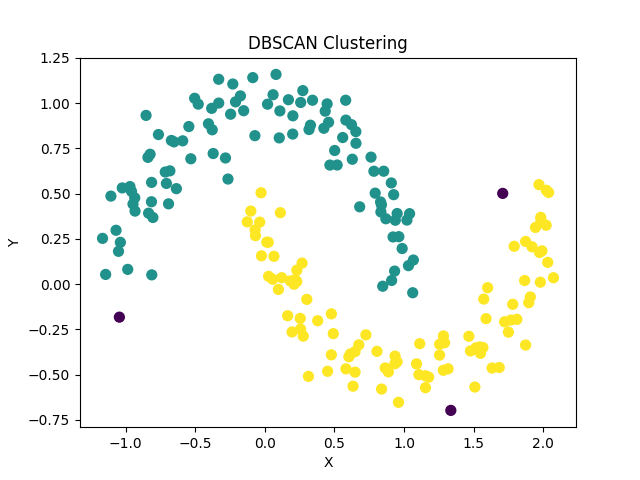

# DESCAN

DBSCAN（Density-Based Spatial Clustering of Applications with Noise）是一种密度聚类算法，它基于数据点的密度来发现任意形状的簇，并能够识别噪声数据点。DBSCAN 将密度定义为某个点周围的邻域内的数据点的数量，通过探索数据点之间的密度连接来确定簇的边界。

### 工作原理
DBSCAN 算法的主要思想是将数据点分为三类：核心点、边界点和噪声点。具体步骤如下：

1. **核心点（Core Point）**：如果一个数据点的邻域内至少包含指定数量（MinPts）的数据点，则该数据点被视为核心点。

2. **边界点（Border Point）**：如果一个数据点的邻域内包含少于 MinPts 个数据点，但该点是某个核心点的邻居，则该数据点被视为边界点。

3. **密度可达（Density-Reachable）**：如果存在一个核心点的序列，使得序列中的每个点都是其前一个点的邻居，并且最后一个点是目标点的邻居，则目标点是密度可达的。

4. **密度连接（Density-Connected）**：如果存在一个核心点，使得两个数据点都是该核心点的密度可达的，则这两个数据点是密度连接的。

DBSCAN 算法的主要步骤是：

1. 随机选择一个未被访问的数据点作为起始点。
2. 如果起始点是核心点，则通过密度连接找到该核心点的所有密度可达的数据点，形成一个簇。
3. 重复上述步骤，直到所有的数据点都被访问过。

### 优点
- 能够发现任意形状的簇，并且对噪声数据点具有鲁棒性。
- 不需要用户指定簇的数量。
- 适用于处理高维数据和大规模数据集。

### 缺点
- 对于数据密度不均匀或具有变化密度的数据集可能表现不佳。
- 对于高维数据集，由于“维度灾难”的影响，算法的性能可能会下降。

### 示例
以下是一个使用 Python 和 Scikit-learn 库实现 DBSCAN 算法的简单示例：
::: code-group
```python
import numpy as np
import matplotlib.pyplot as plt
from sklearn.datasets import make_moons
from sklearn.cluster import DBSCAN

# 生成示例数据
X, _ = make_moons(n_samples=200, noise=0.1, random_state=0)

# 使用 DBSCAN 算法
dbscan = DBSCAN(eps=0.2, min_samples=5)
y_dbscan = dbscan.fit_predict(X)

# 绘制聚类结果
plt.scatter(X[:, 0], X[:, 1], c=y_dbscan, s=50, cmap='viridis')
plt.xlabel('X')
plt.ylabel('Y')
plt.title('DBSCAN Clustering')
plt.show()
```
:::



在这个示例中，我们使用 `make_moons` 函数生成了一个月牙形状的数据集。然后，我们使用 `DBSCAN` 类初始化了一个 DBSCAN 聚类器，并将参数 `eps` 设置为 0.2，`min_samples` 设置为 5。最后，我们绘制了聚类结果，其中不同的颜色代表不同的簇。