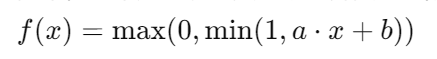
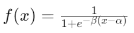
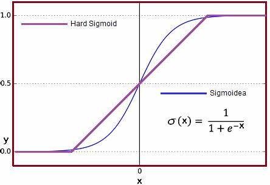

# Hard sigmoid和soft sigmoid

Hard sigmoid 和 soft sigmoid 是两种不同的激活函数，它们在神经网络中常被用作替代的激活函数。

1. **Hard Sigmoid（硬 Sigmoid）：**
   Hard sigmoid 是一种简化版本的 Sigmoid 函数，它的输出范围在 [0, 1] 之间，但是其计算方式更加简单，通常用于硬件实现或计算资源有限的情况下。Hard sigmoid 的数学表达式如下：
   
   其中，a 和 b 是硬 Sigmoid 函数的参数，通常被设置为预先定义的常数值。

2. **Soft Sigmoid（软 Sigmoid）：**
   Soft sigmoid 是一种光滑版本的 Sigmoid 函数，其形状类似于标准的 Sigmoid 函数，但计算量更小，因此更适合在计算资源有限的环境中使用。Soft sigmoid 的数学表达式如下：
   
   其中，α 和 β 是参数，控制了函数的形状。通常情况下，α 和 β 可以被调整以控制 Soft sigmoid 的斜率和平滑度。

总的来说，Hard sigmoid 和 Soft sigmoid 都是 Sigmoid 函数的变种，它们在计算方式和形状上有所不同，但都被用作神经网络中的激活函数。Hard sigmoid 更加简单和高效，适合于资源受限的环境，而 Soft sigmoid 则更加平滑，具有更好的数学性质，通常用于一般情况下的神经网络训练。

