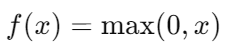

# Rectified Linear Unit

Rectified Linear Unit (ReLU) 是一种常用的神经网络激活函数，它在深度学习中被广泛应用。

ReLU 函数定义为：

这意味着当输入 x 大于 0 时，ReLU 返回输入值 x；当输入 x 小于或等于 0 时，ReLU 返回 0。

ReLU 函数的优点包括：

1. **非线性特性：** ReLU 是一个非线性函数，可以帮助神经网络模型学习非线性关系，提高模型的表达能力。

2. **稀疏性：** 当输入 x 为负时，ReLU 的输出为 0，这意味着部分神经元处于非激活状态，从而引入了稀疏性，有助于减少过拟合。

3. **计算效率：** ReLU 的计算非常简单，只需比较输入是否大于零，因此在训练和推理过程中的计算效率都很高。

然而，ReLU 函数也存在一些缺点：

1. **神经元死亡问题（Dying ReLU Problem）：** 当输入 x 小于等于 0 时，ReLU 的梯度为 0，导致神经元的权重更新停滞，称为神经元死亡问题。

2. **不对称性：** ReLU 在负数输入时输出固定为 0，可能导致神经元输出的不对称性，对称性的破坏可能会影响模型的性能。

为了缓解 ReLU 函数的缺点，出现了一些变种，如 Leaky ReLU、Parametric ReLU、ELU（Exponential Linear Unit）等。这些变种通过引入一些调整参数或修改激活函数的形式来改善 ReLU 的性能。