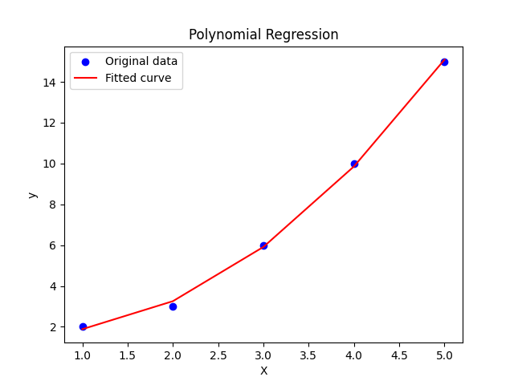
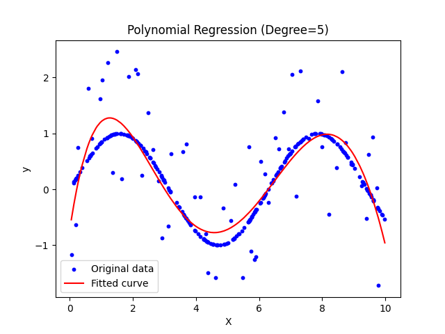

# 多项式回归

### 多项式回归的概念

多项式回归是一种非线性回归方法，它通过拟合数据与多项式函数的关系来建立模型。与线性回归不同，多项式回归的模型假设不再是线性的，而是一个多项式函数。

多项式回归的一般形式为：

$y = \theta_0 + \theta_1 x + \theta_2 x^2 + ... + \theta_n x^n$
其中，$( x )$ 是特征变量，$( y )$ 是目标变量，$( \theta_0, \theta_1, ..., \theta_n )$ 是模型参数，$( n )$ 是多项式的阶数。

### 为什么需要多项式回归？

在一些实际问题中，数据的关系可能不是线性的，而是呈现出曲线或曲面的特征。这时候，使用多项式回归可以更好地拟合数据的非线性关系，从而提高模型的预测精度。

### 示例：多项式回归的应用

假设有一个简单的数据集，包含自变量 $( x )$ 和因变量 $( y )$。使用多项式回归来拟合这个数据集，并进行预测。

::: code-group
```python
import numpy as np
import matplotlib.pyplot as plt
from sklearn.preprocessing import PolynomialFeatures
from sklearn.linear_model import LinearRegression

# 准备数据
X = np.array([1, 2, 3, 4, 5]).reshape(-1, 1)
y = np.array([2, 3, 6, 10, 15])

# 创建多项式特征
poly = PolynomialFeatures(degree=2)  # 选择二次多项式
X_poly = poly.fit_transform(X)

# 创建并拟合多项式回归模型
model = LinearRegression()
model.fit(X_poly, y)

# 在训练数据上进行预测
y_pred = model.predict(X_poly)

# 绘制原始数据和拟合曲线
plt.scatter(X, y, color='blue', label='Original data')
plt.plot(X, y_pred, color='red', label='Fitted curve')
plt.xlabel('X')
plt.ylabel('y')
plt.title('Polynomial Regression')
plt.legend()
plt.show()
```
:::

在这个例子中，我们首先准备了一个简单的数据集，包含自变量 $( x )$ 和因变量 $( y )$。然后，我们使用`PolynomialFeatures`类来创建二次多项式特征。接下来，我们使用`LinearRegression`类来拟合多项式回归模型，并在训练数据上进行预测。最后，将原始数据和拟合曲线绘制在同一张图上，以可视化拟合效果。



上面的数据比较少，很难模拟真实状况

::: code-group
``` python
import numpy as np
import matplotlib.pyplot as plt
from sklearn.preprocessing import PolynomialFeatures
from sklearn.linear_model import LinearRegression

# 生成数据
np.random.seed(0)
X = np.sort(10 * np.random.rand(300, 1), axis=0)
y = np.sin(X).ravel()

# 添加噪声
y[::5] += 3 * (0.5 - np.random.rand(60))

# 创建多项式特征
poly = PolynomialFeatures(degree=5)  # 选择五次多项式
X_poly = poly.fit_transform(X)

# 创建并拟合多项式回归模型
model = LinearRegression()
model.fit(X_poly, y)

# 在训练数据上进行预测
y_pred = model.predict(X_poly)

# 绘制原始数据和拟合曲线
plt.scatter(X, y, color='blue', label='Original data', s=10)
plt.plot(X, y_pred, color='red', label='Fitted curve')
plt.xlabel('X')
plt.ylabel('y')
plt.title('Polynomial Regression (Degree=5)')
plt.legend()
plt.show()

```
:::


