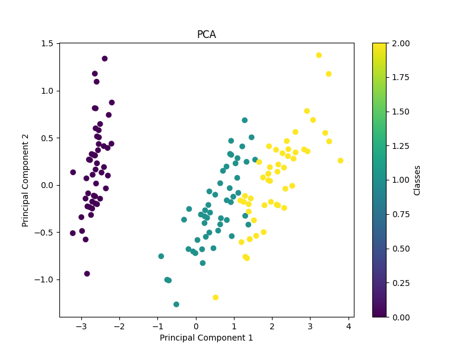
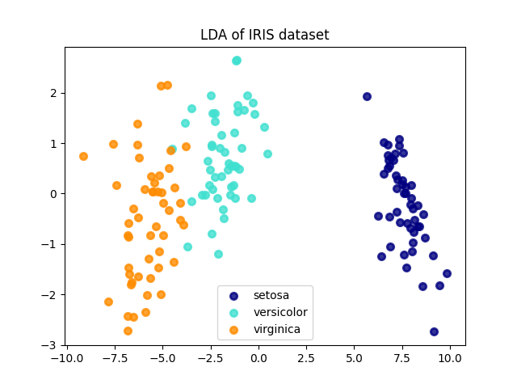
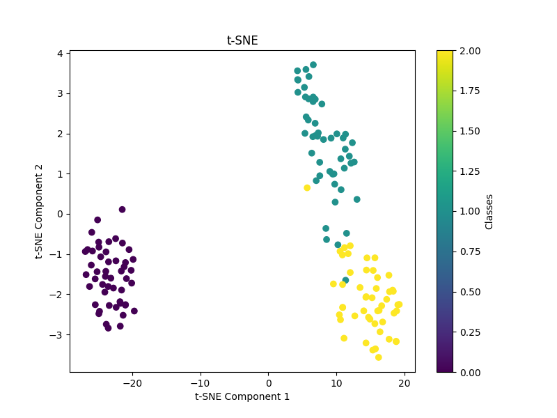

# 数据降维

数据降维是指通过保留数据集中最重要的特征信息，将数据从高维空间转换为低维空间的过程。数据降维旨在减少数据集的维度，同时尽可能地保留原始数据的信息，以便于可视化、压缩和加速机器学习算法的训练和预测。

## 数据降维的常见方法：

## 1. **主成分分析（PCA）**:
PCA 是一种线性降维方法，它通过找到数据中的主要方向（主成分）来将数据从高维空间投影到低维空间。PCA 的目标是最大化投影后数据的方差，以确保尽可能多地保留原始数据的信息。

示例
::: code-group
``` python
import numpy as np
import matplotlib.pyplot as plt
from sklearn.datasets import load_iris
from sklearn.decomposition import PCA

# 加载数据集
iris = load_iris()
X = iris.data
y = iris.target

# 使用 PCA 进行降维
pca = PCA(n_components=2)
X_pca = pca.fit_transform(X)

# 绘制降维后的数据
plt.figure(figsize=(8, 6))
plt.scatter(X_pca[:, 0], X_pca[:, 1], c=y, cmap='viridis')
plt.xlabel('Principal Component 1')
plt.ylabel('Principal Component 2')
plt.title('PCA')
plt.colorbar(label='Classes')
plt.show()
```
:::



在这个示例中，我们使用了 Iris 数据集，并使用 PCA 将其降至二维。然后我们绘制了降维后的数据，其中不同的颜色代表不同的类别。

## 2. **线性判别分析（LDA）**：
LDA 是一种监督学习的降维方法，它不仅考虑了类别之间的区别，还考虑了类别内部的方差。LDA 试图通过最大化类别之间的距离和最小化类别内部的方差来找到最佳投影方向。

示例
::: code-group
``` python
from sklearn.datasets import load_iris
from sklearn.discriminant_analysis import LinearDiscriminantAnalysis
import matplotlib.pyplot as plt

# 加载数据集
iris = load_iris()
X = iris.data
y = iris.target

# 使用LDA进行降维
lda = LinearDiscriminantAnalysis(n_components=2)
X_lda = lda.fit_transform(X, y)

# 可视化降维结果
plt.figure()
colors = ['navy', 'turquoise', 'darkorange']
lw = 2

for color, i, target_name in zip(colors, [0, 1, 2], iris.target_names):
    plt.scatter(X_lda[y == i, 0], X_lda[y == i, 1], color=color, alpha=.8, lw=lw,
                label=target_name)
plt.legend(loc='best', shadow=False, scatterpoints=1)
plt.title('LDA of IRIS dataset')
plt.show()
```
:::



## 3. **t-分布随机邻近嵌入（t-SNE）**：
t-SNE 是一种非线性降维方法，它在高维空间中保持数据点之间的局部和全局相似性，并将数据映射到一个低维空间中。t-SNE 在可视化高维数据集时特别有用，但不适用于数据的压缩或特征提取。

示例
::: code-group
``` python
import numpy as np
import matplotlib.pyplot as plt
from sklearn.datasets import load_iris
from sklearn.manifold import TSNE

# 加载数据集
iris = load_iris()
X = iris.data
y = iris.target

# 使用 t-SNE 进行降维
tsne = TSNE(n_components=2, perplexity=30, random_state=0)
X_tsne = tsne.fit_transform(X)

# 绘制降维后的数据
plt.figure(figsize=(8, 6))
plt.scatter(X_tsne[:, 0], X_tsne[:, 1], c=y, cmap='viridis')
plt.xlabel('t-SNE Component 1')
plt.ylabel('t-SNE Component 2')
plt.title('t-SNE')
plt.colorbar(label='Classes')
plt.show()
```
:::



## 4. **自编码器（Autoencoder）**：
自编码器是一种神经网络结构，它尝试学习将数据从高维空间编码成低维空间，然后再解码回原始空间。自编码器在无监督学习中被广泛用于数据的特征学习和降维。

使用自编码器进行数据降维的基本步骤：

1. 设计网络结构：首先，需要设计自编码器的网络结构。自编码器通常由两部分组成：编码器和解码器。编码器将输入数据映射到低维空间，解码器将低维表示映射回原始数据空间。
2. 选择损失函数：常用的损失函数包括均方误差（Mean Squared Error，MSE）和交叉熵损失函数。损失函数的选择取决于具体的问题和数据类型。
3. 训练模型：使用训练数据训练自编码器模型。训练过程中，自编码器会尽量使重构数据与原始数据相似，同时保持低维表示的有效性。
4. 提取特征：训练完成后，可以使用编码器部分提取数据的低维表示。这些低维表示可以作为数据的新特征，用于后续的任务，如分类、聚类等。
5. 评估性能：使用测试数据评估自编码器模型的性能。通常可以使用重构误差或者其他指标来评估降维效果。

示例
::: code-group
``` python
import numpy as np
import matplotlib.pyplot as plt
from keras.layers import Input, Dense
from keras.models import Model
from keras.datasets import mnist

# 加载MNIST数据集
(x_train, _), (x_test, _) = mnist.load_data()

# 数据预处理
x_train = x_train.astype('float32') / 255.
x_test = x_test.astype('float32') / 255.
x_train = x_train.reshape((len(x_train), np.prod(x_train.shape[1:])))
x_test = x_test.reshape((len(x_test), np.prod(x_test.shape[1:])))

# 构建自编码器模型
input_img = Input(shape=(784,))
encoded = Dense(128, activation='relu')(input_img) # 编码器
decoded = Dense(784, activation='sigmoid')(encoded) # 解码器

autoencoder = Model(input_img, decoded)

# 编译模型
autoencoder.compile(optimizer='adam', loss='binary_crossentropy')

# 训练模型
autoencoder.fit(x_train, x_train, epochs=50, batch_size=256, shuffle=True, validation_data=(x_test, x_test))

# 提取编码器部分
encoder = Model(input_img, encoded)

# 对测试集进行编码和解码
encoded_imgs = encoder.predict(x_test)
decoded_imgs = autoencoder.predict(x_test)

# 可视化结果
n = 10
plt.figure(figsize=(20, 4))
for i in range(n):
    # 原始图像
    ax = plt.subplot(2, n, i + 1)
    plt.imshow(x_test[i].reshape(28, 28))
    plt.gray()
    ax.get_xaxis().set_visible(False)
    ax.get_yaxis().set_visible(False)

    # 重构图像
    ax = plt.subplot(2, n, i + 1 + n)
    plt.imshow(decoded_imgs[i].reshape(28, 28))
    plt.gray()
    ax.get_xaxis().set_visible(False)
    ax.get_yaxis().set_visible(False)
plt.show()
```
:::

## 5. **因子分析（Factor Analysis）**：
因子分析是一种概率模型，它假设观察到的数据由一组潜在的隐变量（因子）决定，并试图通过学习隐变量之间的关系来减少数据的维度。

## 6. **多维缩放（MDS）**：
MDS 是一种距离保持算法，它试图在低维空间中保持数据点之间的原始距离。MDS 旨在将高维数据映射到低维空间，同时尽可能地保持数据点之间的相对距离。

### 如何选择合适的方法？
- 数据类型：根据数据的类型（数值型、类别型、文本型等），选择适合的降维方法。
- 目标：如果需要可解释性强的降维结果，可以选择 PCA 或 LDA；如果需要在可视化中保持数据的局部和全局结构，可以选择 t-SNE；如果需要对非线性结构进行建模，可以选择自编码器。
- 数据量：对于大型数据集，可能需要考虑计算资源的消耗和算法的效率。

综合考虑以上因素，选择适合具体任务需求和数据特点的降维方法。