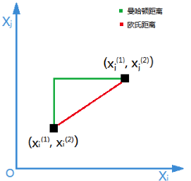

# 正则化方法

正则化方法是一种在机器学习和统计建模中广泛采用的技术，旨在解决模型过拟合问题，提高模型的泛化能力。过拟合指的是模型在训练数据上表现得过于优秀，以至于它学习到了训练数据中的噪声和偶然特征，而不能很好地泛化到未见过的新数据上。其本质是减小w的值来干扰数据的扰动，

正则化通过在损失函数（即模型试图最小化的对象，如均方误差或交叉熵损失）中添加一个正则项（也称为`惩罚项`）来工作。这个正则项通常是模型参数（如权重和偏置）的某种函数，其目的是在优化过程中对模型复杂度进行约束。常见的正则化方法有`L1正则化`和`L2正则化`。

- **L1正则化（Lasso回归）**：在损失函数中添加模型参数绝对值之和作为惩罚项。L1正则化倾向于产生稀疏解，即许多参数被驱动至零，从而实现特征选择。

    $\text{L1 regularization term} = \lambda \sum_{i=1}^{n} |w_i|$

- **L2正则化（Ridge回归）**：在损失函数中添加模型参数平方和作为惩罚项。L2正则化倾向于缩小所有参数的值，但不强制它们为零，有助于防止参数过大，从而提升模型的稳定性。

    $\text{L2 regularization term} = \lambda \sum_{i=1}^{n} w_i^2$

- **Elastic Net正则化**: Elastic Net正则化是L1正则化和L2正则化的组合，它同时使用L1范数和L2范数作为惩罚项。Elastic Net的公式如下：

    $\text{Elastic Net regularization term} = \lambda_1 \sum_{i=1}^{n} |w_i| + \lambda_2 \sum_{i=1}^{n} w_i^2$

## 1. 为什么 L1 和 L2 正则化可以防止过拟合？

1. 拟合过程中通常都倾向于让权值尽可能小，最后构造一个所有参数都比较小的模型。因为一般认为参数值小的模型比较简单，能适应不同的数据集，也在一定程度上避免了过拟合现象。可以设想一下对于一个线性回归方程，若参数很大，那么只要数据偏移一点点，就会对结果造成很大的影响；但如果参数足够小，数据偏移得多一点也不会对结果造成什么影响，即抗扰动能力强。
2. L1 & L2 正则化会使模型偏好于更小的权值。更小的权值意味着更低的模型复杂度；添加 L1 & L2 正则化相当于为模型添加了某种先验，限制了参数的分布，从而降低了模型的复杂度。
3. 模型的复杂度降低，意味着模型对于噪声与异常点的抗干扰性的能力增强，从而提高模型的泛化能力。——直观来说，就是对训练数据的拟合刚刚好，不会过分拟合训练数据（比如异常点，噪声）。

## 2. 范数

范数是一种用于衡量向量大小的数学概念。对于n维向量 $( \mathbf{x} = (x_1, x_2, ..., x_n))$，它的范数定义为：

- L1范数（曼哈顿范数）：$( ||\mathbf{x}||_1 = \sum_{i=1}^{n} |x_i| )$，表示向量中各个元素绝对值之和。
- L2范数（欧几里得范数）：$( ||\mathbf{x}||_2 = \sqrt{\sum_{i=1}^{n} x_i^2} )$，表示向量中各个元素的平方和的平方根。

在正则化中，通常使用`L1范数`或`L2范数`作为惩罚项。这种惩罚项可以使得模型参数保持较小的值，从而降低模型的复杂度，防止过度拟合。

