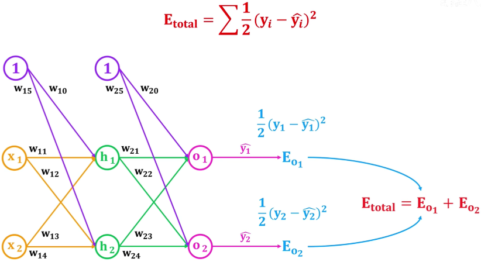
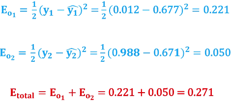

# 正向传播和反向传播

正向传播（Forward Propagation）和反向传播（Backpropagation）是深度学习中两个重要的概念，它们共同构成了神经网络的训练过程。`正向传播`求损失，`反向传播`回传误差。同时，神经网络每层的每个神经元都可以根据误差信号修正每层的权重。

1. **正向传播：**
   - 在正向传播过程中，输入数据通过神经网络，在每一层经过加权和激活函数的处理后，产生输出结果。
   - 正向传播是从输入层到输出层的过程，每一层的输出都作为下一层的输入。
   - 在正向传播过程中，不需要进行参数更新，只是根据当前的权重和偏置以及输入数据计算模型的输出。

2. **反向传播：**
   - 在反向传播过程中，首先通过正向传播计算出模型的预测输出，然后计算预测输出与真实标签之间的误差（损失）。
   - 然后，通过反向传播算法，将这个误差沿着网络反向传播回去，从输出层到输入层，计算每个参数对误差的贡献，并相应地调整这些参数以减小误差。
   - 反向传播利用链式法则来计算参数梯度，即每个参数对于整个损失函数的梯度是由该参数对于下一层的输出的梯度和下一层的输出对于损失函数的梯度相乘得到的。
   - 通过反向传播算法，神经网络的参数（权重和偏置）逐渐调整，使得模型的预测结果逐渐接近真实标签，最小化损失函数。

正向传播和反向传播是神经网络训练过程中的两个关键步骤，通过这两个步骤，神经网络可以不断地从训练数据中学习并优化模型参数。

## 正向传播

## 反向传播(Backpropagation，BP)

反向传播（Backpropagation）是深度学习中神经网络发展的一项重大突破，解决了多层神经网络的监督学习问题，通过计算损失函数关于网络参数的梯度来更新参数，使得网络能够逐步优化，使得模型的预测结果更接近真实标签。下面是反向传播的计算过程：

假设我们有一个包含 L 层的神经网络，其中第 L 层的权重矩阵为 $W^{(l)}$，偏置向量为 $b^{(l)}$，输入为 $(x)$，输出为 $(y)$，损失函数为 $(J(y, \hat{y}))$，其中 $(\hat{y})$ 是网络的预测输出。我们的目标是通过反向传播计算出损失函数关于每个参数的梯度，即 $(\frac{\partial J}{\partial W^{(l)}})$ 和 $(\frac{\partial J}{\partial b^{(l)}})$。

反向传播的计算过程如下：

1. **正向传播（Forward Propagation）：** 通过网络前向传播，计算出预测输出 $(\hat{y})$，并计算损失函数 $(J(y, \hat{y}))$。

2. **计算输出层的梯度：** 首先，计算损失函数关于输出层的梯度 $(\delta^{(L)})$，即输出层的误差。这通常根据损失函数的形式直接计算，例如对于均方误差损失函数，$(\delta^{(L)} = \frac{\partial J}{\partial \hat{y}}\cdot \sigma'(\hat{y}))$，其中 $(\sigma'(\hat{y}))$ 是输出层激活函数的导数。

3. **反向传播误差：** 通过逐层反向传播误差，计算每一层的误差项 $(\delta^{(l)})$。对于隐藏层和输出层之间的每一层 $(l)$，误差项的计算公式为 $(\delta^{(l)} = (W^{(l+1)})^T \delta^{(l+1)} \cdot \sigma' (z^{(l)}))$，其中 $(z^{(l)})$ 是第 $(l)$ 层的加权输入，$(\sigma' (z^{(l)}))$ 是第 $(l)$ 层的激活函数的导数。

4. **计算参数梯度：** 使用误差项 $(\delta^{(l)})$ 和上一层的激活值（或输入值），计算参数的梯度。对于权重矩阵 $(W^{(l)})$，梯度为 $(\frac{\partial J}{\partial W^{(l)}} = \delta^{(l)} \cdot a^{(l-1)T})$，对于偏置向量 $(b^{(l)})$，梯度为 $(\frac{\partial J}{\partial b^{(l)}} = \delta^{(l)})$。

5. **更新参数：** 使用梯度下降等优化算法，更新参数 $(W^{(l)})$ 和 $(b^{(l)})$，以减小损失函数。

**可以得到损失：**

重复以上步骤，直到达到停止条件（如达到最大迭代次数或损失函数收敛）。通过反向传播算法，神经网络可以根据训练数据自动调整参数，以最小化损失函数，从而使得网络能够逐步优化，提高模型的预测准确性。