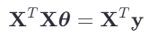

# 正规方程及其推导

`正规方程`是用于解决线性回归问题的一种方法，它不需要迭代，直接通过该方法可以直接求解出最优的参数值。正规方程特别适用于小型数据集，因为对于大数据集，计算和存储完整的矩阵求逆可能会非常昂贵。下面简要介绍正规方程及其推导过程：

正规方程（Normal Equation）是一种用于求解线性回归模型参数的解析方法，它不需要迭代，直接通过解析的方法计算出最优参数值。正规方程特别适用于小型数据集，因为对于大数据集，计算和存储完整的矩阵求逆可能会非常昂贵。

### 线性回归模型

线性回归模型的一般形式是：

    
或者向量化表示为：

其中，$(\hat{\mathbf{y}})$ 是预测的目标变量向量，$(\mathbf{X})$ 是设计矩阵（包含特征的矩阵），$({\theta})$ 是模型参数向量（包含截距和斜率）。

### 代价函数（损失函数）

线性回归通常使用均方误差（Mean Squared Error, MSE）作为代价函数：

### 正规方程的推导

为了找到使代价函数 $(J({\theta}))$ 最小化的参数 $({\theta})$，我们对 $(J({\theta}))$ 关于 $({\theta})$ 求导，并令导数等于零。

**首先，展开代价函数：**

**然后，对 $({\theta})$ 求导：**

**令导数等于零求解 $({\theta})$：**

**整理得：**

**最后，解这个线性方程组得到参数 $({\theta})$：**

这就是正规方程的表达式，通过直接求解此方程，我们可以得到模型参数 $({\theta})$，而无需迭代过程。
> **注意，当 $(\mathbf{X}^T\mathbf{X})$ 不可逆（例如，当特征之间高度相关导致矩阵秩不足时），这种方法就无法使用了。**