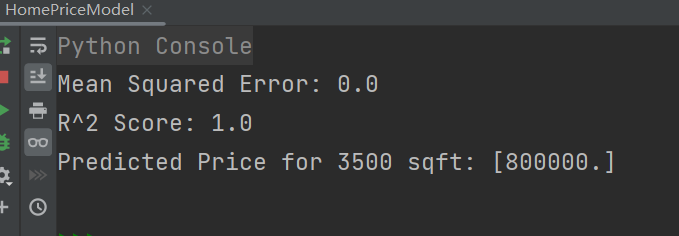

# 监督学习

## 一、回归算法

### 1. 什么是回归算法

回归算法用于预测连续型变量的数值，例如房价、温度、销售额等。它们建立了自变量（输入特征）和因变量（输出标签）之间的关系，并且尝试拟合一条最佳拟合线（或曲线），以最好地预测新的数据点。

在回归问题中，算法接收一组输入特征（通常表示为向量或矩阵），并试图预测与这些特征相关联的一个或多个连续型输出值。这些输出值通常是实数，可以是任意范围内的数字，而不是离散的类别标签。

常见的回归算法包括**线性回归**、**多项式回归**、**岭回归**、**Lasso回归**、**支持向量回归（SVR）**、**神经网络回归**等。这些算法在不同的数据集和问题上表现出不同的性能和适用性。

以一个简单的线性回归问题为例来详细解释回归算法的应用: 
线性回归是回归问题中最简单也最常用的一种算法。它的基本思想是通过找到最佳拟合直线来模拟因变量和自变量之间的关系。

**问题描述**：

假设我们有一组数据，包含了房屋的面积（平方英尺）和相应的价格（美元）。我们想要建立一个模型，根据房屋的面积来预测其价格。

**数据集示例**：
``` txt
| 房屋面积（平方英尺） | 价格（美元） |
| -------------------- | ------------ |
| 1000                 | 300000       |
| 1500                 | 400000       |
| 2000                 | 500000       |
| 2500                 | 600000       |
| 3000                 | 700000       |

```

**步骤：**

1. `数据准备`：首先，我们需要准备数据集，将输入特征（房屋面积）和输出标签（价格）分开。
2. `选择模型`：由于我们要解决的是回归问题，我们选择线性回归模型。线性回归假设自变量和因变量之间存在线性关系，因此我们的模型将尝试拟合一条直线来最好地表示数据。
3. `模型训练`：我们使用数据集对线性回归模型进行训练，即拟合一条最佳拟合线，使得预测值与实际值之间的误差最小化。这通常通过最小化损失函数（例如均方误差）来实现。
4. `模型评估`：一旦模型训练完成，我们需要评估其性能。通常，我们会使用一些指标来评估模型的拟合程度，例如均方误差（Mean Squared Error，MSE）或决定系数（Coefficient of Determination，R^2）等。
预测：最后，我们可以使用训练好的模型来进行预测。给定新的房屋面积，我们可以利用模型预测其对应的价格。


**Python代码示例：**

``` Python
import numpy as np
from sklearn.linear_model import LinearRegression

# 数据准备

# 在 scikit-learn 中，特征矩阵 X 的形状应该是二维数组，即使只有一个特征。
# 这是因为 scikit-learn 对输入数据的要求，
# 它期望特征矩阵的形状为 (n_samples, n_features)，
# 其中 n_samples 是样本数量，n_features 是特征数量。

X = np.array([[1000], [1500], [2000], [2500], [3000]])  # 房屋面积
y = np.array([300000, 400000, 500000, 600000, 700000])  # 房屋价格

# 选择模型并进行训练
model = LinearRegression()
model.fit(X, y)

# 模型评估

# 使用训练好的线性回归模型 model 对输入特征 X 进行预测，得到预测值 predictions。
predictions = model.predict(X)
# 计算预测值 predictions 与真实标签 y 之间的均方误差（MSE）。
# 均方误差是预测值与真实值之间差异的平方的平均值，用来衡量模型预测的准确性。
mse = np.mean((predictions - y) ** 2)
# 使用模型的 score 方法计算了决定系数（R^2 Score）。
# 决定系数是一个介于0到1之间的值，表示模型对数据方差的解释程度，
# 越接近1表示模型拟合得越好，越接近0表示模型拟合得越差。
r2 = model.score(X, y)
print("Mean Squared Error:", mse)
print("R^2 Score:", r2)

# 预测
new_area = np.array([[3500]])  # 新房屋的面积
predicted_price = model.predict(new_area)
print("Predicted Price for 3500 sqft:", predicted_price)

```

**输出结果**：



**结果分析**：

1. **均方误差为0**，表示模型的预测值与实际标签之间的平均方差为0，越接近0表示模型的预测能力越好，在实际情况中几乎不会出现均方误差为0；
2. **决定系数为0**，表示模型能完美解释数据的方差。对数据的拟合非常好，预测值与实际值之间的变异性能完全解释
3. **根据预测模型，一个面积为3500平方英尺的房屋的价格预测值为800，000美元**。

## 二、分类算法

### 1. 什么是分类算法

分类算法是一类机器学习算法，用于解决将数据样本划分到不同类别或标签的问题。其主要目标是通过学习从输入特征到离散输出标签之间的映射关系，从而对新的未标记数据进行分类。

在分类问题中，算法接收一组输入特征（通常表示为向量或矩阵），并试图根据这些特征将每个样本分配到事先定义好的类别中。这些类别通常是离散的、预先定义的，例如二元分类（两个类别）或多元分类（多个类别）。分类算法通过学习从训练数据中提取的模式和特征之间的关系，来进行分类决策。

常见的分类算法包括决策树、**支持向量机（SVM）**、**逻辑回归**、**朴素贝叶斯**、**K最近邻（K-NN）**、**随机森林**等。

使用鸢尾花数据集进行分类，这是一个常用的机器学习数据集，用于分类问题。

### 2. Python代码示例

``` Python
from sklearn.datasets import load_iris
from sklearn.model_selection import train_test_split
from sklearn.tree import DecisionTreeClassifier
from sklearn.metrics import accuracy_score

# 加载鸢尾花数据集
iris = load_iris()
X, y = iris.data, iris.target

# 划分训练集和测试集
X_train, X_test, y_train, y_test = 
train_test_split(X, y, test_size=0.2, random_state=42)

# 选择模型并进行训练
model = DecisionTreeClassifier()
model.fit(X_train, y_train)

# 模型评估
y_pred = model.predict(X_test)
accuracy = accuracy_score(y_test, y_pred)
print("Accuracy:", accuracy)

# 预测
new_sample = [[5.1, 3.5, 1.4, 0.2]]  # 新的鸢尾花样本
predicted_class = model.predict(new_sample)
print("Predicted class for new sample:", iris.target_names[predicted_class])

```

**输出结果**：


**结果分析**：
1. `准确率 (Accuracy)`: 准确率为1.0，表示模型在测试集上的预测全部正确。在理想情况下，准确率为1.0表示模型对测试集中的所有样本都做出了正确的分类预测。
2. `预测结果`: 对于新样本，模型预测其为 'setosa' 类别。这表明模型将新样本成功分类为 'setosa' 类别。