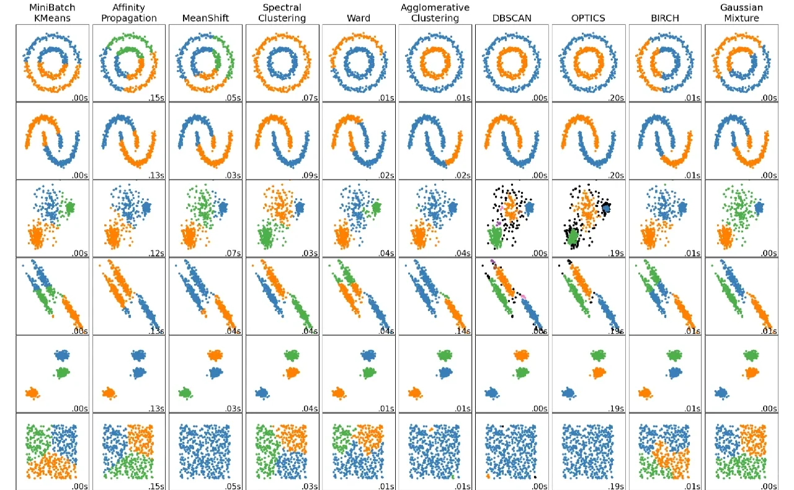

# 聚类算法

聚类算法是一类无监督学习方法，旨在将数据集中的数据点按照它们之间的相似性或距离自动分组成多个类别或簇（clusters），每个簇内的数据对象具有较高的相似性，而不同簇之间的数据对象差异较大。聚类算法不需要预先标记的数据集，即没有预设的类别标签，而是通过数据本身的特征探索数据的结构。以下是几种常见的聚类算法及其特点：

1. **K-means算法**:
   - **特点**: 简单且广泛使用，需要预先设定簇的数量（K值）。通过迭代的方式调整簇中心，使得每个数据点到其所属簇中心的距离平方和最小。
   - **适用场景**: 数据集较大，且簇之间区分度较明显，数据分布较为均匀。

2. **层次聚类**:
   - **特点**: 分为凝聚型和分裂型两种，前者从每个数据点开始逐步合并最近的簇，后者则相反，从整个数据集开始逐步分裂。可以生成树状的聚类结构（树状图或 dendrogram）。
   - **适用场景**: 数据集较小，且需要探索不同层次的聚类结构。

3. **DBSCAN算法**（Density-Based Spatial Clustering of Applications with Noise）:
   - **特点**: 基于密度的聚类，能够发现任意形状的簇，并能有效处理噪声点。通过设置邻域半径（ε）和邻域内最少点数（MinPts）来确定簇的边界。
   - **适用场景**: 数据集可能存在不规则形状的簇，且密度不均一。

4. **Affinity Propagation**:
   - **特点**: 无需事先指定簇的数量，通过数据点间的相似性传递信息，选择数据点作为“典范”（exemplars），其他数据点则依据相似性归于最近的典范。
   - **适用场景**: 数据集较小，且簇的数量不确定时。

5. **Mean Shift**:
   - **特点**: 基于滑动窗口的密度最大化方法，通过迭代移动每个数据点到其邻域内数据点的质心，直到收敛。
   - **适用场景**: 密度不均匀的数据集，寻找数据的局部高密度区域。

聚类算法的选择取决于数据的特点和分析目的，比如数据的规模、维度、分布特性以及是否需要发现特定形状的簇等。此外，聚类效果的评估通常依赖于内部指标（如轮廓系数、`Calinski-Harabasz指数`）、外部指标（如果存在真实标签）或基于应用的具体需求。

- **`K-Means`**
使用特点：大样本量(最大)，中等聚类中心数
典型场景：最常用，聚类中心较少，欧几里德子空间，簇大小均匀
- **`Affinity propagation`**
使用特点：无需指定聚类中心数
典型场景：聚类中心数量不均衡且较多，非欧空间，簇大小不均匀
- **`Mean-shift`**
使用特点：无需指定聚类中心数
典型场景：聚类中心数量不均衡且较多，非欧空间，概率密度主导的非稀疏场景，簇大小不均匀
- **`Spectral clustering`**
使用特点：样本量中等，聚类中心数量小，适用于稀疏数据
典型场景：聚类中心数量较少，非欧空间，高维数据聚类，簇大小均匀
- **`Ward hierarchical clustering`**
使用特点：样本数量较大，聚类中心较多
典型场景：聚类中心多，可能存在连通性约束
- **`Aggomerative clustering`**
使用特点：样本数量较大，聚类中心较多
典型场景：聚类中心多，可能存在连通性约束，非欧空间
- **`DBSCAN`**
使用特点：非常大量的样本，聚类中心数量中等
典型场景：非欧空间，可去除离群值，簇大小不均匀
- **`OPTICS`**
使用特点：样本数非常大，聚类中心数量多
典型场景：非欧空间，簇大小不均匀，离群值去除，可变簇密度
- **`Gaussian mixtures`**
使用特点：不可扩展
典型场景：欧式空间，适用于密度估计
- **`BIRCH`**
使用特点：样本数量大，聚类中心数量多
典型场景：大数据集，离群点去除，低维数据
- **`Bisecting K-Means`**
使用特点：样本数量非常大，聚类中心数量中等
典型场景：通用，簇大小均衡，欧式空间

