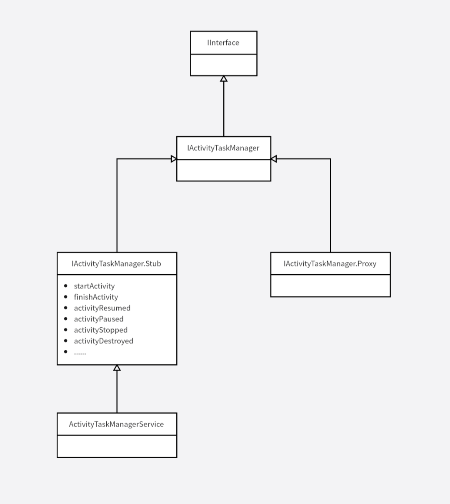
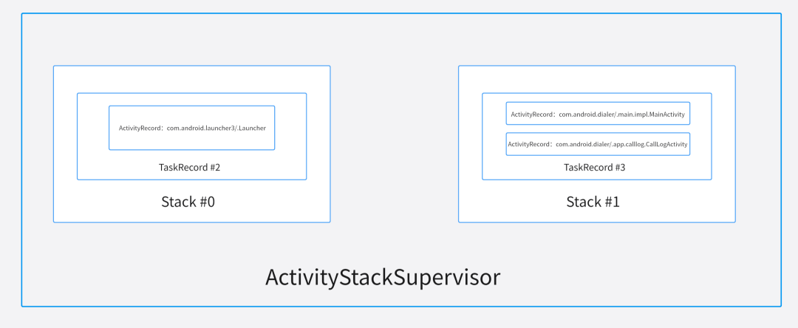

# AMS剖析

## 1.前言
所有的 Android 应用程序都是由 Zygote 进程 fork 而来，在 Zygote 进程中初始化了 Java 运行时，加载了常用的 Java Classes，加载了系统资源等。这些底层基础都会被 Android 应用程序继承。在从 Zygote 中继承的通用基础环境之上，Android 在 Java 层弱化了进程的概念，建立了四大组件及其配套框架。
这套框架中最核心的组件就是 AMS，在 Android10 中，AMS 的部分功能迁移到了 ATMS。

接下来通过分析四大组件的启动过程来了解 AMS/ATMS 的内部实现。

首先分析 Activity 的启动过程，Activity 主要由 ATMS 管理。


## 2.ATMS 整体框架分析
首先明确 ATMS 是一个运行在 SystemServer 中的 Java Binder 服务。其主要作用是向 App 提供管理 Activity 的接口：

``` java
startActivity
finishActivity
activityResumed
activityPaused
activityStopped
activityDestroyed
// ......
```

ATMS 通过 AIDL 实现，相关类的类图如下：



App 可以通过 Binder RPC 调用到 ATMS 提供的接口来管理和操作 Activity：


在 App 进程启动的过程中，会启动一个匿名 Binder 服务 ApplicationThread，ATMS 可以通过调用 ApplicationThread 提供的接口，向 App 进程通知 App 的状态：

``` java
bindApplication
scheduleTransaction
scheduleLowMemory
scheduleSleeping
//......
```

ApplicationThread 同样基于 AIDL 实现，相关类的类图如下：


ATMS 相关的 RPC 调用关系图如下：


## 3.ATMS 相关核心数据结构
所谓的 Activity 的管理，笼统地说，就是通过内部一堆数据结构的增删改查来实现的，接下来我们就来一一分析 ATMS 相关的核心数据结构。

**ProcessRecord**

``` java
class ProcessRecord implements WindowProcessListener {

    // ......

    private final ActivityManagerService mService; // where we came from
    final ApplicationInfo info; // all about the first app in the process
    final boolean isolated;     // true if this is a special isolated process
    final boolean appZygote;    // true if this is forked from the app zygote
    final int uid;              // uid of process; may be different from 'info' if isolated
    final int userId;           // user of process.
    final String processName;   // name of the process

    // ......

    int pid;                    // The process of this application; 0 if none
    String procStatFile;        // path to /proc/<pid>/stat
    int[] gids;                 // The gids this process was launched with
}
```

ProcessRecord 是 Android Framework Java 层用于描述进程的数据结构。四大组件 （Activity,Service, BroadcastReceiver, ContentProvider）定义在AndroidManifest.xml文件， 每一项都可以用属性android:process指定所运行的进程。同一个app可以运行在通过一个进程，也可以运行在多个进程， 甚至多个app可以共享同一个进程。

**ActivityRecord**

``` java
// frameworks/base/services/core/java/com/android/server/wm/ActivityRecord.java

final class ActivityRecord extends ConfigurationContainer {
    private TaskRecord task;        // the task this is in.
    final int launchedFromPid; // always the pid who started the activity.
    // ......
}
```

ActivityRecord 用于记录一个 Activity 对象相关的信息,与应用中的 Activity 实例相互对应。每个 ActivityRecord 会对应到一个 TaskRecord，ActivityRecord 中类型为 TaskRecord 的成员 task，记录所属的 Task。需要注意的是 Activity 和 ActivityRecord 并不是一对一的，而是一对多，因为一个 Actitiy 可能被启动多次，存在多个 Actitiy 对象，进而导致存在多个对应的 ActivityRecord.

ActivityRecord 内部成员 launchedFromPid 用于指定启动 Activity 的进程 pid，通过这个变量与一个 ProcessRecord 对象相关联。

startActivity() 时会创建一个 ActivityRecord：

``` java
// frameworks/base/services/core/java/com/android/server/wm/ActivityStarter.java

private int startActivity(IApplicationThread caller, Intent intent, Intent ephemeralIntent,
            String resolvedType, ActivityInfo aInfo, ResolveInfo rInfo,
            IVoiceInteractionSession voiceSession, IVoiceInteractor voiceInteractor,
            IBinder resultTo, String resultWho, int requestCode, int callingPid, int callingUid,
            String callingPackage, int realCallingPid, int realCallingUid, int startFlags,
            SafeActivityOptions options,
            boolean ignoreTargetSecurity, boolean componentSpecified, ActivityRecord[] outActivity,
            TaskRecord inTask, boolean allowPendingRemoteAnimationRegistryLookup,
            PendingIntentRecord originatingPendingIntent, boolean allowBackgroundActivityStart) {
    
    // ......

    ActivityRecord r = new ActivityRecord(mService, callerApp, callingPid, callingUid,
                callingPackage, intent, resolvedType, aInfo, mService.getGlobalConfiguration(),
                resultRecord, resultWho, requestCode, componentSpecified, voiceSession != null,
                mSupervisor, checkedOptions, sourceRecord);    

    //......
}
```

**TaskRecord**
``` java
// frameworks/base/services/core/java/com/android/server/wm/TaskRecord.java
class TaskRecord extends ConfigurationContainer {
    //任务ID
    final int taskId;       // Unique identifier for this task.
    // 使用一个ArrayList来保存所有的ActivityRecord
    /** List of all activities in the task arranged in history order */
    final ArrayList<ActivityRecord> mActivities;
    // TaskRecord 所在的 ActivityStack
    /** Current stack. Setter must always be used to update the value. */
    private ActivityStack mStack;

    // 构造函数
    TaskRecord(ActivityTaskManagerService service, int _taskId, ActivityInfo info, Intent _intent, IVoiceInteractionSession _voiceSession, IVoiceInteractor _voiceInteractor) {
        // ......
    }

    // 添加 Activity 到顶部
    void addActivityToTop(ActivityRecord r) {
        addActivityAtIndex(mActivities.size(), r);
    }

    //添加Activity到指定的索引位置
    void addActivityAtIndex(int index, ActivityRecord r) {
        //...
        r.setTask(this);//为ActivityRecord设置TaskRecord，就是这里建立的联系
        //...
        index = Math.min(size, index);
        mActivities.add(index, r);//添加到mActivities
        //...
    }
}
```

TaskRecord 内部维护了一个 ArrayList ActivityRecord 用于保存 ActivityRecord，这就是官方文档中说的任务栈，具有后进后出的特点。

在启动 Activity 的过程中会创建 TaskRecord 对象，这也很好理解，ActivityRecord 依存于 TaskRecord。


``` java
private int startActivityUnchecked(final ActivityRecord r, ActivityRecord sourceRecord,
            IVoiceInteractionSession voiceSession, IVoiceInteractor voiceInteractor,
            int startFlags, boolean doResume, ActivityOptions options, TaskRecord inTask,
            ActivityRecord[] outActivity, boolean restrictedBgActivity) {
        
        // ......

        if (mStartActivity.resultTo == null && mInTask == null && !mAddingToTask
                && (mLaunchFlags & FLAG_ACTIVITY_NEW_TASK) != 0) {
            newTask = true;
            result = setTaskFromReuseOrCreateNewTask(taskToAffiliate);
        }     

        // ......
}

private int setTaskFromReuseOrCreateNewTask(TaskRecord taskToAffiliate) {
    // ......
    
    final TaskRecord task = mTargetStack.createTaskRecord(
                    mSupervisor.getNextTaskIdForUserLocked(mStartActivity.mUserId),
                    mNewTaskInfo != null ? mNewTaskInfo : mStartActivity.info,
                    mNewTaskIntent != null ? mNewTaskIntent : mIntent, mVoiceSession,
                    mVoiceInteractor, toTop, mStartActivity, mSourceRecord, mOptions);

    // ......
}
```

**ActivityStack**

``` java
class ActivityStack extends ConfigurationContainer {
    // ......
    private final ArrayList<TaskRecord> mTaskHistory = new ArrayList<>();
    //......
}
```

ActivityStack 很容易与任务栈混淆，实际的任务栈是上面介绍的 TaskRecord。系统中可能同时有多个 TaskRecord，一般前台有一个 TaskRecord 和用户进行交互，而后台中可能有多个 TaskRecord 存在，前后台的 TaskRecord 可以进行切换，为了方便的管理这些 TaskRecord 而引入了 ActivityStack。

ActivityStack 用于管理 TaskRecord，它有一个 ArrayList 类型的成员 mTaskHistory，用于存储 TaskRecord

一般来说，一个 APP 对应一个 ActivityStack。

**ActivityDisplay**

``` java
class ActivityDisplay extends ConfigurationContainer<ActivityStack>
        implements WindowContainerListener {
    int mDisplayId;
    Display mDisplay;
    private final ArrayList<ActivityStack> mStacks = new ArrayList<>();
}
```

ActivityDisplay 表示一个屏幕，Android 支持三种屏幕，主屏幕，外接屏幕，虚拟屏幕（投屏），一般在手机上只有主屏幕。其内部成员 ArrayList ActivityStack mStacks 用于保存当前显示屏可能会显示的所有 ActivityStack。

**ActivityStackSupervisor**

``` java
public class ActivityStackSupervisor implements RecentTasks.Callbacks {
        // .......

        RootActivityContainer mRootActivityContainer;
        
        // ......
}

class RootActivityContainer extends ConfigurationContainer implements DisplayManager.DisplayListener {
    // ......

    private final ArrayList<ActivityDisplay> mActivityDisplays = new ArrayList<>();
    
    // .....
}
```

ActivityStackSupervisor 内部有一个 RootActivityContainer 成员，其内部有一个 ArrayList ActivityDisplay 成员，用于管理多个显示设备，从而管理 ActivityStack，间接的管理着 TaskRecord。

这些类的整体结构如下：


可以理解为一个屏幕上，会有很多个 APP 在运行，每个 APP 进程对应一个 ActivityStack，ActivityStack 内部又保存着多个 Activity 栈 TaskRecord，每个 TaskRecord 中包含着若干个 ActivityRecord。

## 4.场景分析

**Launcher**
模拟器重启后，处于 Launcher 时，运行命令：

``` shell
adb shell dumpsys activity
```

``` yaml
ACTIVITY MANAGER ACTIVITIES (dumpsys activity activities)
# 代表手机主屏幕
Display #0 (activities from top to bottom):
  # Launcher App 对应的 ActivityStack
  Stack #0: type=home mode=fullscreen
  isSleeping=false
  mBounds=Rect(0, 0 - 0, 0)
    Task id #2
    mBounds=Rect(0, 0 - 0, 0)
    mMinWidth=-1
    mMinHeight=-1
    mLastNonFullscreenBounds=null
    # Launcher 中的 TaskRecord
    * TaskRecord{720a8a4 #2 I=com.android.launcher3/.Launcher U=0 StackId=0 sz=1}
      userId=0 effectiveUid=u0a81 mCallingUid=0 mUserSetupComplete=true mCallingPackage=null
      intent={act=android.intent.action.MAIN cat=[android.intent.category.HOME] flg=0x10000100 cmp=com.android.launcher3/.Launcher}
      mActivityComponent=com.android.launcher3/.Launcher
      autoRemoveRecents=false isPersistable=true numFullscreen=1 activityType=2
      rootWasReset=false mNeverRelinquishIdentity=true mReuseTask=false mLockTaskAuth=LOCK_TASK_AUTH_PINNABLE
      # Stack 管理的 Activity 们
      Activities=[ActivityRecord{6f00b94 u0 com.android.launcher3/.Launcher t2}]
      askedCompatMode=false inRecents=true isAvailable=true
      mRootProcess=ProcessRecord{9134f8 2266:com.android.launcher3/u0a81}
      stackId=0
      hasBeenVisible=true mResizeMode=RESIZE_MODE_RESIZEABLE mSupportsPictureInPicture=false isResizeable=true lastActiveTime=15681 (inactive for 314s)
        Hist #0: ActivityRecord{6f00b94 u0 com.android.launcher3/.Launcher t2}
          Intent { act=android.intent.action.MAIN cat=[android.intent.category.HOME] flg=0x10000100 cmp=com.android.launcher3/.Launcher }
          ProcessRecord{9134f8 2266:com.android.launcher3/u0a81}
    # ActivityRecord 信息
    Running activities (most recent first):
      TaskRecord{720a8a4 #2 I=com.android.launcher3/.Launcher U=0 StackId=0 sz=1}
        Run #0: ActivityRecord{6f00b94 u0 com.android.launcher3/.Launcher t2}

    mResumedActivity: ActivityRecord{6f00b94 u0 com.android.launcher3/.Launcher t2}

 ResumedActivity:ActivityRecord{6f00b94 u0 com.android.launcher3/.Launcher t2}

  ResumedActivity: ActivityRecord{6f00b94 u0 com.android.launcher3/.Launcher t2}

# ActivityStackSupervisor 相关信息
ActivityStackSupervisor state:
  topDisplayFocusedStack=ActivityStack{f11ab10 stackId=0 type=home mode=fullscreen visible=true translucent=false, 1 tasks}
  displayId=0 stacks=1
   mHomeStack=ActivityStack{f11ab10 stackId=0 type=home mode=fullscreen visible=true translucent=false, 1 tasks}
   mPreferredTopFocusableStack=ActivityStack{f11ab10 stackId=0 type=home mode=fullscreen visible=true translucent=false, 1 tasks}
   mLastFocusedStack=ActivityStack{f11ab10 stackId=0 type=home mode=fullscreen visible=true translucent=false, 1 tasks}
  mCurTaskIdForUser={0=5}
  mUserStackInFront={}
  isHomeRecentsComponent=true  KeyguardController:
    mKeyguardShowing=false
    mAodShowing=false
    mKeyguardGoingAway=false
    Occluded=false DismissingKeyguardActivity=null at display=0
    mDismissalRequested=false
    mVisibilityTransactionDepth=0
  LockTaskController
    mLockTaskModeState=NONE
    mLockTaskModeTasks=
    mLockTaskPackages (userId:packages)=
      u0:[]
```

相关数据结构关系如图：


## 5.从 Launcher 启动拨号 App
**从 Launcher 启动拨号 App 后，再次执行命令：**

``` shell
adb shell dumpsys activity
```

找到 activity 相关的内容：

``` yaml
ACTIVITY MANAGER ACTIVITIES (dumpsys activity activities)
Display #0 (activities from top to bottom):

  Stack #1: type=standard mode=fullscreen
  isSleeping=false
  mBounds=Rect(0, 0 - 0, 0)
    Task id #3
    mBounds=Rect(0, 0 - 0, 0)
    mMinWidth=-1
    mMinHeight=-1
    mLastNonFullscreenBounds=null
    * TaskRecord{fffb022 #3 A=com.android.dialer U=0 StackId=1 sz=1}
      userId=0 effectiveUid=u0a85 mCallingUid=u0a81 mUserSetupComplete=true mCallingPackage=com.android.launcher3
      affinity=com.android.dialer
      intent={act=android.intent.action.MAIN cat=[android.intent.category.LAUNCHER] flg=0x10200000 pkg=com.android.dialer cmp=com.android.dialer/.main.impl.MainActivity}
      mActivityComponent=com.android.dialer/.main.impl.MainActivity
      autoRemoveRecents=false isPersistable=true numFullscreen=1 activityType=1
      rootWasReset=true mNeverRelinquishIdentity=true mReuseTask=false mLockTaskAuth=LOCK_TASK_AUTH_PINNABLE
      Activities=[ActivityRecord{93ecfba u0 com.android.dialer/.main.impl.MainActivity t3}]
      askedCompatMode=false inRecents=true isAvailable=true
      mRootProcess=ProcessRecord{6468658 2372:com.android.dialer/u0a85}
      stackId=1
      hasBeenVisible=true mResizeMode=RESIZE_MODE_RESIZEABLE mSupportsPictureInPicture=false isResizeable=true lastActiveTime=190729 (inactive for 2s)
        Hist #0: ActivityRecord{93ecfba u0 com.android.dialer/.main.impl.MainActivity t3}
          Intent { act=android.intent.action.MAIN cat=[android.intent.category.LAUNCHER] flg=0x10200000 pkg=com.android.dialer cmp=com.android.dialer/.main.impl.MainActivity bnds=[20,602][130,725] }
          ProcessRecord{6468658 2372:com.android.dialer/u0a85}

    Running activities (most recent first):
      TaskRecord{fffb022 #3 A=com.android.dialer U=0 StackId=1 sz=1}
        Run #0: ActivityRecord{93ecfba u0 com.android.dialer/.main.impl.MainActivity t3}

    mResumedActivity: ActivityRecord{93ecfba u0 com.android.dialer/.main.impl.MainActivity t3}

  Stack #0: type=home mode=fullscreen
  isSleeping=false
  mBounds=Rect(0, 0 - 0, 0)

    Task id #2
    mBounds=Rect(0, 0 - 0, 0)
    mMinWidth=-1
    mMinHeight=-1
    mLastNonFullscreenBounds=null
    * TaskRecord{3d48ab3 #2 I=com.android.launcher3/.Launcher U=0 StackId=0 sz=1}
      userId=0 effectiveUid=u0a81 mCallingUid=0 mUserSetupComplete=true mCallingPackage=null
      intent={act=android.intent.action.MAIN cat=[android.intent.category.HOME] flg=0x10000100 cmp=com.android.launcher3/.Launcher}
      mActivityComponent=com.android.launcher3/.Launcher
      autoRemoveRecents=false isPersistable=true numFullscreen=1 activityType=2
      rootWasReset=false mNeverRelinquishIdentity=true mReuseTask=false mLockTaskAuth=LOCK_TASK_AUTH_PINNABLE
      Activities=[ActivityRecord{4f321d u0 com.android.launcher3/.Launcher t2}]
      askedCompatMode=false inRecents=true isAvailable=true
      mRootProcess=ProcessRecord{74a2096 2234:com.android.launcher3/u0a81}
      stackId=0
      hasBeenVisible=true mResizeMode=RESIZE_MODE_RESIZEABLE mSupportsPictureInPicture=false isResizeable=true lastActiveTime=190617 (inactive for 2s)
        Hist #0: ActivityRecord{4f321d u0 com.android.launcher3/.Launcher t2}
          Intent { act=android.intent.action.MAIN cat=[android.intent.category.HOME] flg=0x10000100 cmp=com.android.launcher3/.Launcher }
          ProcessRecord{74a2096 2234:com.android.launcher3/u0a81}

    Running activities (most recent first):
      TaskRecord{3d48ab3 #2 I=com.android.launcher3/.Launcher U=0 StackId=0 sz=1}
        Run #0: ActivityRecord{4f321d u0 com.android.launcher3/.Launcher t2}

 ResumedActivity:ActivityRecord{93ecfba u0 com.android.dialer/.main.impl.MainActivity t3}

  ResumedActivity: ActivityRecord{93ecfba u0 com.android.dialer/.main.impl.MainActivity t3}

ActivityStackSupervisor state:
  topDisplayFocusedStack=ActivityStack{2831f0f stackId=1 type=standard mode=fullscreen visible=true translucent=false, 1 tasks}
  displayId=0 stacks=2
   mHomeStack=ActivityStack{9e4fb9c stackId=0 type=home mode=fullscreen visible=false translucent=true, 1 tasks}
   mPreferredTopFocusableStack=ActivityStack{2831f0f stackId=1 type=standard mode=fullscreen visible=true translucent=false, 1 tasks}
   mLastFocusedStack=ActivityStack{2831f0f stackId=1 type=standard mode=fullscreen visible=true translucent=false, 1 tasks}
  mCurTaskIdForUser={0=3}
  mUserStackInFront={}
  isHomeRecentsComponent=true  KeyguardController:
    mKeyguardShowing=false
    mAodShowing=false
    mKeyguardGoingAway=false
    Occluded=false DismissingKeyguardActivity=null at display=0
    mDismissalRequested=false
    mVisibilityTransactionDepth=0
  LockTaskController
    mLockTaskModeState=NONE
    mLockTaskModeTasks=
    mLockTaskPackages (userId:packages)=
      u0:[]
```

相关数据结构关系如图：


点击右上角三点中的 Call history 后，再执行 adb shell dumpsys activity 命令：

``` yaml
ACTIVITY MANAGER ACTIVITIES (dumpsys activity activities)
Display #0 (activities from top to bottom):

  Stack #1: type=standard mode=fullscreen
  isSleeping=false
  mBounds=Rect(0, 0 - 0, 0)
    Task id #3
    mBounds=Rect(0, 0 - 0, 0)
    mMinWidth=-1
    mMinHeight=-1
    mLastNonFullscreenBounds=null
    * TaskRecord{fffb022 #3 A=com.android.dialer U=0 StackId=1 sz=2}
      userId=0 effectiveUid=u0a85 mCallingUid=u0a81 mUserSetupComplete=true mCallingPackage=com.android.launcher3
      affinity=com.android.dialer
      intent={act=android.intent.action.MAIN cat=[android.intent.category.LAUNCHER] flg=0x10200000 pkg=com.android.dialer cmp=com.android.dialer/.main.impl.MainActivity}
      mActivityComponent=com.android.dialer/.main.impl.MainActivity
      autoRemoveRecents=false isPersistable=true numFullscreen=2 activityType=1
      rootWasReset=true mNeverRelinquishIdentity=true mReuseTask=false mLockTaskAuth=LOCK_TASK_AUTH_PINNABLE
      Activities=[ActivityRecord{93ecfba u0 com.android.dialer/.main.impl.MainActivity t3}, ActivityRecord{a127424 u0 com.android.dialer/.app.calllog.CallLogActivity t3}]
      askedCompatMode=false inRecents=true isAvailable=true
      mRootProcess=ProcessRecord{6468658 2372:com.android.dialer/u0a85}
      stackId=1
      hasBeenVisible=true mResizeMode=RESIZE_MODE_RESIZEABLE mSupportsPictureInPicture=false isResizeable=true lastActiveTime=316963 (inactive for 8s)
        Hist #1: ActivityRecord{a127424 u0 com.android.dialer/.app.calllog.CallLogActivity t3}
          Intent { cmp=com.android.dialer/.app.calllog.CallLogActivity }
          ProcessRecord{6468658 2372:com.android.dialer/u0a85}
        Hist #0: ActivityRecord{93ecfba u0 com.android.dialer/.main.impl.MainActivity t3}
          Intent { act=android.intent.action.MAIN cat=[android.intent.category.LAUNCHER] flg=0x10200000 pkg=com.android.dialer cmp=com.android.dialer/.main.impl.MainActivity bnds=[20,602][130,725] }
          ProcessRecord{6468658 2372:com.android.dialer/u0a85}

    Running activities (most recent first):
      TaskRecord{fffb022 #3 A=com.android.dialer U=0 StackId=1 sz=2}
        Run #1: ActivityRecord{a127424 u0 com.android.dialer/.app.calllog.CallLogActivity t3}
        Run #0: ActivityRecord{93ecfba u0 com.android.dialer/.main.impl.MainActivity t3}

    mResumedActivity: ActivityRecord{a127424 u0 com.android.dialer/.app.calllog.CallLogActivity t3}

  Stack #0: type=home mode=fullscreen
  isSleeping=false
  mBounds=Rect(0, 0 - 0, 0)

    Task id #2
    mBounds=Rect(0, 0 - 0, 0)
    mMinWidth=-1
    mMinHeight=-1
    mLastNonFullscreenBounds=null
    * TaskRecord{3d48ab3 #2 I=com.android.launcher3/.Launcher U=0 StackId=0 sz=1}
      userId=0 effectiveUid=u0a81 mCallingUid=0 mUserSetupComplete=true mCallingPackage=null
      intent={act=android.intent.action.MAIN cat=[android.intent.category.HOME] flg=0x10000100 cmp=com.android.launcher3/.Launcher}
      mActivityComponent=com.android.launcher3/.Launcher
      autoRemoveRecents=false isPersistable=true numFullscreen=1 activityType=2
      rootWasReset=false mNeverRelinquishIdentity=true mReuseTask=false mLockTaskAuth=LOCK_TASK_AUTH_PINNABLE
      Activities=[ActivityRecord{4f321d u0 com.android.launcher3/.Launcher t2}]
      askedCompatMode=false inRecents=true isAvailable=true
      mRootProcess=ProcessRecord{74a2096 2234:com.android.launcher3/u0a81}
      stackId=0
      hasBeenVisible=true mResizeMode=RESIZE_MODE_RESIZEABLE mSupportsPictureInPicture=false isResizeable=true lastActiveTime=190617 (inactive for 135s)
        Hist #0: ActivityRecord{4f321d u0 com.android.launcher3/.Launcher t2}
          Intent { act=android.intent.action.MAIN cat=[android.intent.category.HOME] flg=0x10000100 cmp=com.android.launcher3/.Launcher }
          ProcessRecord{74a2096 2234:com.android.launcher3/u0a81}

    Running activities (most recent first):
      TaskRecord{3d48ab3 #2 I=com.android.launcher3/.Launcher U=0 StackId=0 sz=1}
        Run #0: ActivityRecord{4f321d u0 com.android.launcher3/.Launcher t2}

 ResumedActivity:ActivityRecord{a127424 u0 com.android.dialer/.app.calllog.CallLogActivity t3}

  ResumedActivity: ActivityRecord{a127424 u0 com.android.dialer/.app.calllog.CallLogActivity t3}

ActivityStackSupervisor state:
  topDisplayFocusedStack=ActivityStack{2831f0f stackId=1 type=standard mode=fullscreen visible=true translucent=false, 1 tasks}
  displayId=0 stacks=2
   mHomeStack=ActivityStack{9e4fb9c stackId=0 type=home mode=fullscreen visible=false translucent=true, 1 tasks}
   mPreferredTopFocusableStack=ActivityStack{2831f0f stackId=1 type=standard mode=fullscreen visible=true translucent=false, 1 tasks}
   mLastFocusedStack=ActivityStack{2831f0f stackId=1 type=standard mode=fullscreen visible=true translucent=false, 1 tasks}
  mCurTaskIdForUser={0=3}
  mUserStackInFront={}
  isHomeRecentsComponent=true  KeyguardController:
    mKeyguardShowing=false
    mAodShowing=false
    mKeyguardGoingAway=false
    Occluded=false DismissingKeyguardActivity=null at display=0
    mDismissalRequested=false
    mVisibilityTransactionDepth=0
  LockTaskController
    mLockTaskModeState=NONE
    mLockTaskModeTasks=
    mLockTaskPackages (userId:packages)=
      u0:[]
```

相关数据结构关系如图：

