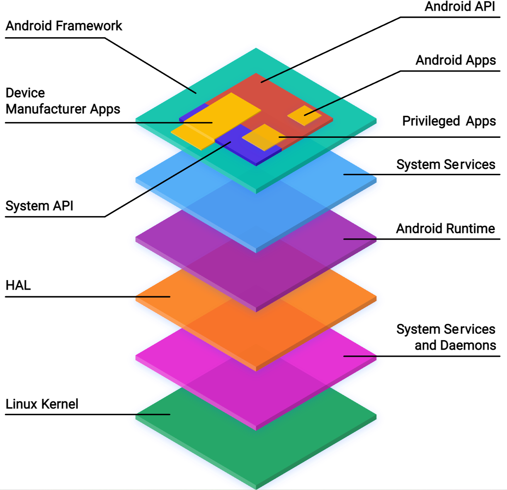

# AOSP架构

AOSP 的软件堆栈包含以下层：

## 介绍：

1. **Android 应用**
完全使用 Android API 开发的应用。Google Play 商店广泛用于查找和下载 Android 应用，不过也有许多其他替代方案。在某些情况下，设备制造商可能希望预安装 Android 应用以支持设备的核心功能。如果您对开发 Android 应用感兴趣，请访问 developers.android.com

2. **特权应用**
使用 Android 和系统 API 组合创建的应用。这些应用必须作为特权应用预安装在设备上。

3. **设备制造商应用**
结合使用 Android API、系统 API 并直接访问 Android 框架实现而创建的应用。由于设备制造商可能会直接访问 Android 框架中的不稳定的 API，因此这些应用必须预安装在设备上，并且只能在设备的系统软件更新时进行更新。

4. **系统 API**
系统 API 表示仅供合作伙伴和 OEM 纳入捆绑应用的 Android API。这些 API 在源代码中被标记为 @SystemApi。

5. **Android API**
Android API 是面向第三方 Android 应用开发者的公开 API。

6. **Android 框架**
构建应用所依据的一组 Java 类、接口和其他预编译代码。框架的某些部分可通过使用 Android API 公开访问。框架的其他部分只能由 OEM 通过系统 API 来访问。Android 框架代码在应用进程内运行。

7. **系统服务**
系统服务是重点突出的模块化组件，例如 system_server、SurfaceFlinger 和 MediaService。Android 框架 API 提供的功能可以与系统服务进行通信，以访问底层硬件。

8. **Android 运行时 (ART)**
AOSP 提供的 Java 运行时环境。 ART 会将应用的字节码转换为由设备运行时环境执行的处理器专有指令。

9. **硬件抽象层 (HAL)**
HAL 是一个抽象层，其中包含硬件供应商要实现的标准接口。借助 HAL，Android 可以忽略较低级别的驱动程序实现。借助 HAL，您可以顺利实现相关功能，而不会影响或更改更高级别的系统。

10. **原生守护程序和库**
该层中的原生守护程序包括 init、healthd、logd 和 storaged。这些守护程序直接与内核或其他接口进行交互，并且不依赖于基于用户空间的 HAL 实现。
该层中的原生库包括 libc、liblog、libutils、libbinder 和 libselinux。这些原生库直接与内核或其他接口进行交互，并且不依赖于基于用户空间的 HAL 实现。

11. **内核**
内核是任何操作系统的中心部分，并与设备上的底层硬件进行通信。尽可能将 AOSP 内核拆分为与硬件无关的模块和特定于供应商的模块。
