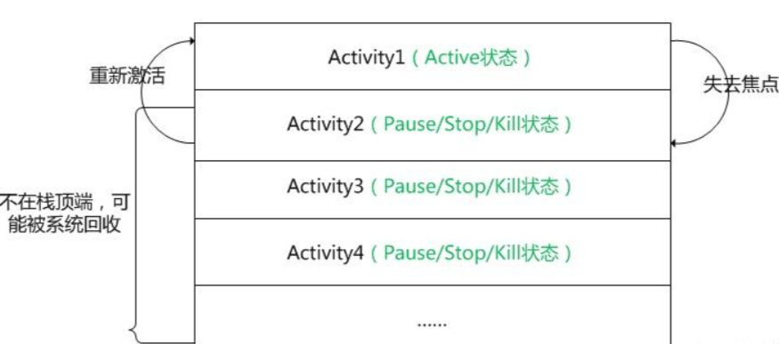

# Activity栈

Android 是通过一种 Activity 栈的方式来管理 Activity 的，一个 Activity 的实例的状态决定它在栈中的位置。处于前台的 Activity 总是在栈的顶端，当前台的 Activity 因为异常或其它原因被销毁时，处于栈第二层的 Activity 将被激活，上浮到栈顶。当新的 Activity 启动入栈时，原 Activity 会被压入到栈的第二层。一个 Activity 在栈中的位置变化反映了它在不同状态间的转换。Activity 的状态与它在栈中的位置关系如下图所示：

如上图所示，除了最顶层即处在 Active 状态的 Activity 外，其它的 Activity 都有可能在系统内存不足时被回收，一个 Activity 的实例越是处在栈的底层，它被系统回收的可能性越大。系统负责管理栈中 Activity 的实例，它根据 Activity 所处的状态来改变其在栈中的位置。

Android的活动栈（Activity Stack）是一个关键的概念，用于管理Activity实例的生命周期和导航。我理解Android的活动栈如下：

1. **栈结构**：活动栈是一个基于栈（Stack）数据结构的管理方式。栈是一种`先进后出`（Last In, First Out，LIFO）的结构，这意味着最后入栈的Activity会成为栈顶，而最先入栈的Activity则位于栈底。

2. **Activity实例管理**：每个Activity在启动时会被放入活动栈的顶部，成为栈顶的Activity。当新的Activity启动时，它会被推入栈顶，原来的Activity则可能进入暂停或停止状态，甚至可能被销毁。

3. **导航控制**：通过Activity栈，Android系统实现了导航控制。用户可以通过按下返回按钮来返回到前一个Activity，这会将栈顶的Activity弹出栈。这种方式使得用户可以轻松地在不同的Activity之间进行导航，就像浏览浏览器历史记录一样。

4. **任务（Task）**：每个应用程序通常都有一个或多个任务，每个任务都有一个与之相关联的活动栈。当用户启动应用程序时，会创建一个新任务，任务包含启动的第一个Activity。多任务（多应用程序）的情况下，每个应用程序都有自己的任务，可以在任务之间切换。

5. **启动模式**：Activity的启动模式可以影响它在活动栈中的行为。不同的启动模式（如`standard`、`singleTop`、`singleTask`和`singleInstance`）决定了Activity如何入栈和处理返回操作。

6. **生命周期管理**：活动栈也与Activity的生命周期密切相关。当Activity从栈顶弹出时，它可能会进入停止或销毁状态，而当Activity重新变为栈顶时，它可能会恢复到活动状态。

总之，活动栈是Android应用程序中用于管理Activity生命周期和导航的关键机制。它有助于维护用户界面的一致性，允许用户轻松地在不同的界面之间切换，同时也提供了一种有效的方式来管理和优化系统资源。

