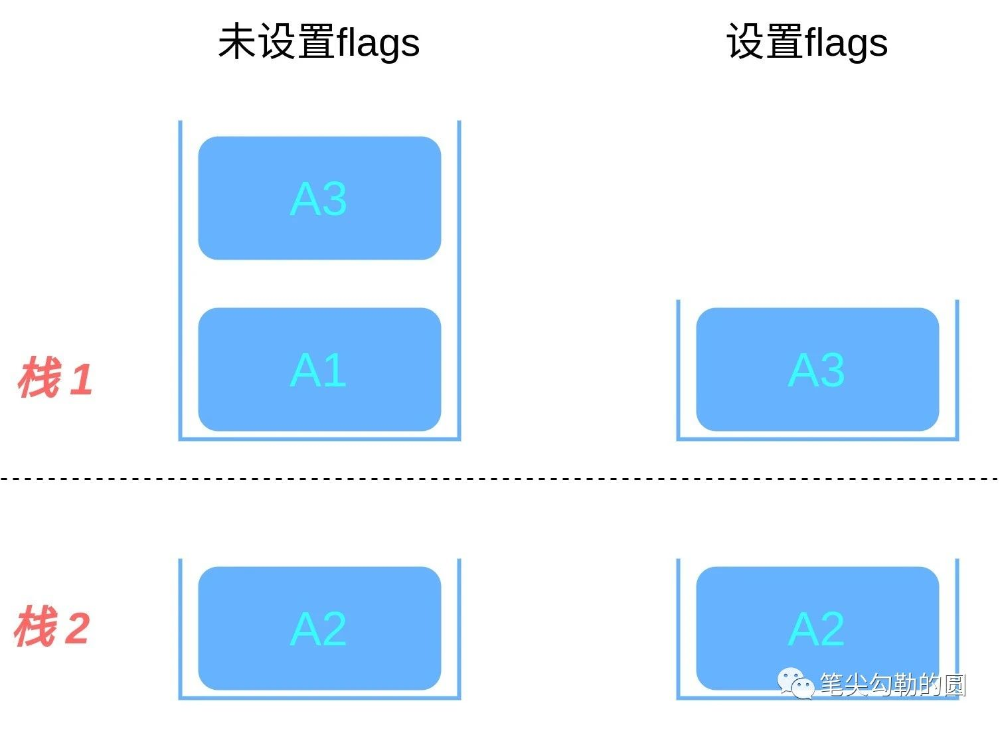

# Activity的启动模式

::: tip
可在AndroidManifest.xml中配置该Activity的LaunchMode为以下配置项。
:::

## 一、standard（标准）

按照正常的启动顺序被依次压入栈中。
这是默认模式，每次激活Activity时都会创建Activity实例，并放入任务栈中。使用场景：大多数Activity。


## 二、singleTask

如果在栈中已经有该Activity的实例，就重用该实例(会调用实例的onNewIntent())。重用时，会让该实例回到栈顶，因此在它上面的实例将会被移出栈。如果栈中不存在该实例，将会创建新的实例放入栈中。使用场景如浏览器的主界面。不管从多少个应用启动浏览器，只会启动主界面一次，其余情况都会走onNewIntent，并且会清空主界面上面的其他页面。


## 三、singleTop（栈顶复用模式）

如果在任务的栈顶正好存在该Activity的实例，就重用该实例( 会调用实例的onNewIntent())，否则就会创建新的实例并放入栈顶，即使栈中已经存在该Activity的实例，只要不在栈顶，都会创建新的实例。使用场景如新闻类或者阅读类App的内容页面。


## 四、singleInstance

在一个新栈中创建该Activity的实例，并让多个应用共享该栈中的该Activity实例。一旦该模式的Activity实例已经存在于某个栈中，任何应用再激活该Activity时都会重用该栈中的实例( 会调用实例的 onNewIntent())。其效果相当于多个应用共享一个应用，不管谁激活该Activity 都会进入同一个应用中。使用场景如闹铃提醒，将闹铃提醒与闹铃设置分离。singleInstance不要用于中间页面，如果用于中间页面，跳转会有问题，比如：A -> B (singleInstance) -> C，完全退出后，再次启动，首先打开的是B。


## 五、singleInstancePerTask

此模式是Android 12中新引入的Activity启动模式，中文名：每个栈单个实例模式，意味着同一Activity的不同实例可以存在于不同的栈中，此时我们需要配合标签`FLAG_ACTIVITY_MULTIPLE_TASK`同时使用。说起来似乎有点抽象，那我们直接看图，其中A1和A3都是singleInstancePerTask模式，A2是standard模式。我们分两种情况讨论。

未设置`FLAG_ACTIVITY_MULTIPLE_TASK`时：


可见，A1设置了singleInstancePerTask模式后，启动A2，还是可以和A2共用一个栈。A2启动A3，因为A3是singleInstancePerTask模式且未创建过实例，所以A3会新创建一个栈。接着A3启动A1，因为此时未设置标签FLAG_ACTIVITY_MULTIPLE_TASK，所以A1复用，A1所在的栈挪到前台，同时A2被清除，A1成为栈顶元素，这一点像极了singleTask模式。

A3启动A1设置`FLAG_ACTIVITY_MULTIPLE_TASK`时：


## 六、常见的Intent flags

1. FLAG_ACTIVITY_NEW_TASK

此标签用来声明将要启动的Activity放入一个新的栈中，注意这里只是声明，要想生效的话需要给启动的Activity指定一个`taskAffinity`，例如：

``` java
Intent intent = new Intent(A1.this, A2.class);
intent.addFlags(Intent.FLAG_ACTIVITY_NEW_TASK);
startActivity(intent);
```

如果不给A2指定taskAffinity，那么A2和A1仍然处于同一个栈中。我们可以加上taskAffinity：

``` xml
<activity
    android:name=".A2"
    android:taskAffinity="a.b.c"
    />
```

这样A2就处于一个新的栈中了。或许你会问，那我只指定A2的taskAffinity不加NEW_TASK flag，这样会是两个栈吗？答案是否定的。

2. FLAG_ACTIVITY_CLEAR_TOP

此标签可以将要启动的Activity显示在栈顶，并清除原先其上方的所有Activity，这个有点类似于singleTask复用模式了。需要注意的是，如果要启动的Activity的launchMode是standard模式，那么除了清除其上方的Activity之外，它自己也会清除，接着创建一个新的实例显示。

3. FLAG_ACTIVITY_SINGLE_TOP

此标签等同于launchMode=singleTop，即使要启动的Activity是standard模式也会进行栈顶复用。

4. FLAG_ACTIVITY_CLEAR_TASK

``` java
 /**
       * If set in an Intent passed to {@link Context#startActivity Context.startActivity()},
       * this flag will cause any existing task that would be associated with the
       * activity to be cleared before the activity is started.  That is, the activity
       * becomes the new root of an otherwise empty task, and any old activities
       * are finished.  This can only be used in conjunction with {@link #FLAG_ACTIVITY_NEW_TASK}.
       */
      public static final int FLAG_ACTIVITY_CLEAR_TASK = 0X00008000;
```

按照官方文档，此标签会清除与要启动的Activity相关的栈，并且此标签需要和FLAG_ACTIVITY_NEW_TASK一起使用。

``` java
Intent intent = new Intent(A2.this, A3.class);
intent.addFlags(Intent.FLAG_ACTIVITY_CLEAR_TASK | Intent.FLAG_ACTIVITY_NEW_TASK);
startActivity(intent);
```

例如，页面A1是standard模式，A2是singleInstance模式，A3是standard模式，顺序是A1启动A2，A2启动A3。在A2启动A3的时候设置上述flags与否产生的变化如下图所示：



可见，区别就是启动A3的时候把和A3同一栈的A1给清除了，只留下A3作为栈元素。


