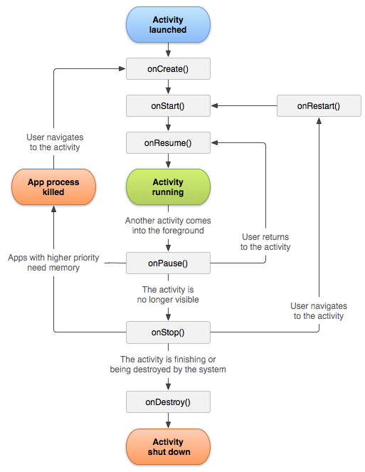

# Activity生命周期详解

## 一、Activity的生命周期

1. **创建阶段**：
   - `onCreate(Bundle savedInstanceState)`：在Activity第一次创建时调用，用于进行一次性的初始化工作，如设置布局、绑定数据等。
   - `onStart()`：在Activity准备好显示给用户之前调用，可以进行一些准备工作。
   
2. **运行阶段**：
   - `onResume()`：在Activity变得可见并与用户交互之前调用，可以开始处理用户输入。
   - `onPause()`：当Activity部分可见但失去焦点时调用，通常用于保存未保存的数据或释放资源。

3. **暂停阶段**：
   - `onStop()`：当Activity完全不可见时调用，可以用于释放不必要的资源，但Activity的状态仍然保留。
   - `onRestart()`：当Activity从停止状态重新启动时调用。

4. **销毁阶段**：
   - `onDestroy()`：当Activity被销毁时调用，通常在释放最终的资源和执行清理操作时使用。

## 二、OnCreate()

它会在系统首次创建 Activity 时触发。Activity 会在创建后进入“已创建”状态。在 onCreate() 方法中，您需执行基本应用启动逻辑，该逻辑在 Activity 的整个生命周期中 **只应发生一次**。例如，onCreate() 的实现可能会将数据绑定到列表，将 Activity 与 ViewModel 相关联，并实例化某些类作用域变量。此方法会接收 `savedInstanceState` 参数，后者是包含 Activity 先前保存状态的 `Bundle` 对象。如果 Activity 此前未曾存在，Bundle 对象的值为 null。

如果有一个生命周期感知型组件与 Activity 生命周期相关联，该组件将收到 `ON_CREATE` 事件。系统将调用带有 `@OnLifecycleEvent` 注释的方法，以执行已创建状态所需的任何设置代码。

除了定义 XML 文件，然后将其传递给 `setContentView()`，还可以在 Activity 代码中新建 `View` 对象，并将新建的 `View` 插入到 `ViewGroup` 中，以构建视图层次结构。然后，将根 `ViewGroup` 传递给 `setContentView()` 以使用该布局。

## 三、onStart()

当 Activity 进入“已开始”状态时，系统会调用此回调。onStart() 调用使 Activity 对用户可见，因为应用会为 Activity 进入前台并支持互动做准备。例如，应用通过此方法来初始化维护界面的代码。

当 Activity 进入已开始状态时，与 Activity 生命周期相关联的所有生命周期感知型组件都将收到 ON_START 事件。

onStart() 方法会非常快速地完成，并且与“已创建”状态一样，Activity 不会一直处于“已开始”状态。一旦此回调结束，Activity 便会进入“已恢复”状态，系统将调用 onResume() 方法。

## 四、onResume()

Activity 会在进入“已恢复”状态时来到前台，然后系统调用 onResume() 回调。这是应用与用户互动的状态。应用会一直保持这种状态，直到某些事件发生，让焦点远离应用。此类事件包括接到来电、用户导航到另一个 Activity，或设备屏幕关闭。

当 Activity 进入已恢复状态时，与 Activity 生命周期相关联的所有生命周期感知型组件都将收到 ON_RESUME 事件。这时，生命周期组件可以启用在组件可见且位于前台时需要运行的任何功能，例如启动相机预览。

当发生中断事件时，Activity 进入“已暂停”状态，系统调用 onPause() 回调。

如果 Activity 从“已暂停”状态返回“已恢复”状态，系统将再次调用 onResume() 方法。因此，您应实现 onResume()，以初始化在 onPause() 期间释放的组件，并执行每次 Activity 进入“已恢复”状态时必须完成的任何其他初始化操作。

## 五、onPause()

系统将此方法视为用户将要离开您的 Activity 的第一个标志（尽管这并不总是意味着 Activity 会被销毁）；此方法表示 Activity 不再位于前台（尽管在用户处于多窗口模式时 Activity 仍然可见）。使用 onPause() 方法暂停或调整当 Activity 处于“已暂停”状态时不应继续（或应有节制地继续）的操作，以及您希望很快恢复的操作。

当 Activity 进入已暂停状态时，与 Activity 生命周期相关联的所有生命周期感知型组件都将收到 ON_PAUSE 事件。这时，生命周期组件可以停止在组件未位于前台时无需运行的任何功能，例如停止相机预览。

还可以使用 onPause() 方法释放系统资源、传感器（例如 GPS）手柄，或当您的 Activity 暂停且用户不需要它们时仍然可能影响电池续航时间的任何资源。然而，正如上文的 onResume() 部分所述，如果处于多窗口模式，“已暂停”的 Activity 仍完全可见。因此，您应该考虑使用 onStop() 而非 onPause() 来完全释放或调整与界面相关的资源和操作，以便更好地支持多窗口模式。

## 六、onStop()

如果 Activity 不再对用户可见，说明其已进入“已停止”状态，因此系统将调用 onStop() 回调。例如，当新启动的 Activity 覆盖整个屏幕时，可能会发生这种情况。如果 Activity 已结束运行并即将终止，系统还可以调用 onStop()。

当 Activity 进入已停止状态时，与 Activity 生命周期相关联的所有生命周期感知型组件都将收到 ON_STOP 事件。这时，生命周期组件可以停止在组件未显示在屏幕上时无需运行的任何功能。

在 onStop() 方法中，应用应释放或调整在应用对用户不可见时的无用资源。例如，应用可以暂停动画效果，或从精确位置更新切换到粗略位置更新。使用 onStop() 而非 onPause() 可确保与界面相关的工作继续进行，即使用户在多窗口模式下查看您的 Activity 也能如此。

应使用 onStop() 执行 CPU 相对密集的关闭操作。

当 Activity 进入“已停止”状态时，Activity 对象会继续驻留在内存中：该对象将维护所有状态和成员信息，但不会附加到窗口管理器。Activity 恢复后，Activity 会重新调用这些信息。您无需重新初始化在任何回调方法导致 Activity 进入“已恢复”状态期间创建的组件。系统还会追踪布局中每个 View 对象的当前状态，如果用户在 EditText 微件中输入文本，系统将保留文本内容，因此您无需保存和恢复文本。

::: details
注意：Activity 停止后，如果系统需要恢复内存，可能会销毁包含该 Activity 的进程。即使系统在 Activity 停止后销毁相应进程，系统仍会保留 Bundle（键值对的 blob）中 View 对象（例如 EditText 微件中的文本）的状态，并在用户返回 Activity 时恢复这些对象。
:::

进入“已停止”状态后，Activity 要么返回与用户互动，要么结束运行并消失。如果 Activity 返回，系统将调用 onRestart()。如果 Activity 结束运行，系统将调用 onDestroy()。下一部分将介绍 onDestroy() 回调。

## 七、onDestroy()

销毁 Activity 之前，系统会先调用 onDestroy()。系统调用此回调的原因如下：

Activity 即将结束（由于用户彻底关闭 Activity 或由于系统为 Activity 调用 finish()），或者
由于配置变更（例如设备旋转或多窗口模式），系统暂时销毁 Activity
当 Activity 进入已销毁状态时，与 Activity 生命周期相关联的所有生命周期感知型组件都将收到 ON_DESTROY 事件。这时，生命周期组件可以在 Activity 被销毁之前清理所需的任何数据。

您应使用 ViewModel 对象来包含 Activity 的相关视图数据，而不是在您的 Activity 中加入逻辑来确定 Activity 被销毁的原因。如果因配置变更而重新创建 Activity，ViewModel 不必执行任何操作，因为系统将保留 ViewModel 并将其提供给下一个 Activity 实例。如果不重新创建 Activity，ViewModel 将调用 onCleared() 方法，以便在 Activity 被销毁前清除所需的任何数据。

您可以使用 isFinishing() 方法区分这两种情况。

如果 Activity 即将结束，onDestroy() 是 Activity 收到的最后一个生命周期回调。如果由于配置变更而调用 onDestroy()，系统会立即新建 Activity 实例，然后在新配置中为新实例调用 onCreate()。

onDestroy() 回调应释放先前的回调（例如 onStop()）尚未释放的所有资源。

# 八、onNewIntent()

当新的 Intent 传递给现有的活动实例时，它会被调用。在 Android 中，Intent 用于请求操作、在组件之间传递数据（如活动、服务和广播接收器），以及启动其他活动。
如果一个Activity已经启动过，并且存在当前应用的Activity任务栈中，启动模式为singleTask，singleInstance或singleTop，那么在此启动或回到这个Activity的时候，不会创建新的实例，也就是不会执行onCreate方法，而是执行OnNewIntent方法。

::: tip
一个Activity退出后重进，触发的生命周期顺序：onPause、onstop、onSaveInstanceState、ondestory、oncreate、onStart、onRestoreInstanceState、onResume。
:::
