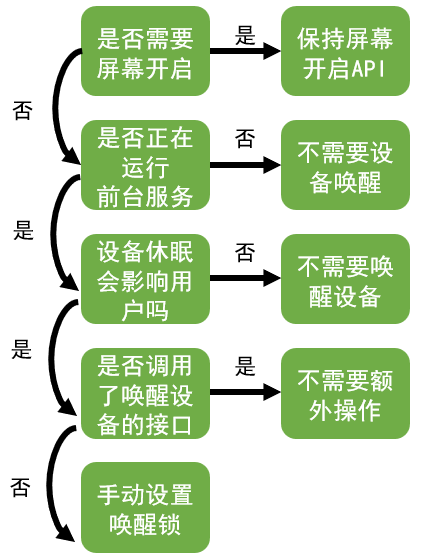

# AlarmManager


## 1. AlarmManager是什么

`AlarmManager` 是 Android 中一个用于在特定时间安排应用程序运行的类，可以安排一次性或重复的任务。通常用于设置闹钟、触发后台任务或进行定期更新等场景。

::: code-group
``` java
//AlarmManager 系统服务的获取方式
AlarmManager alarmManager = (AlarmManager) getSystemService(Context.ALARM_SERVICE);
```
:::

## 2. set方法

设置一个标准的闹钟，触发时不会唤醒设备（`设备可能会进入休眠模式`）。适用于不需要精确时间触发的闹钟。

::: code-group
``` java
alarmManager.set(AlarmManager.RTC_WAKEUP, triggerTime, pendingIntent);
```
:::

- `RTC_WAKEUP` 表示当前设备处于休眠状态时仍然会唤醒设备来触发闹钟。
- `triggerTime` 是闹钟触发的时间，单位是毫秒。
- `pendingIntent` 是当闹钟触发时执行的 `PendingIntent`。

## 3. setExact方法

设置一个精准的闹钟，触发时唤醒设备并确保在指定时间精确触发。适用于需要精确触发的场景，但是会更耗费资源。

::: code-group
``` java
alarmManager.setExact(AlarmManager.RTC_WAKEUP, triggerTime, pendingIntent);
```
:::

## 4. setExactAndWhileIdle方法

设置一个精准闹钟，并且即使设备处于 `Doze` 模式下也能触发。Doze 模式是省电模式。设备在空闲时会限制应用的后台活动。

::: code-group
``` java
alarmManager.setExactAndWhileIdle(AlarmManager.RTC_WAKEUP, triggerTime, pendingIntent);
```
:::

## 5. setRepeating方法

设置一个重复的闹钟。按照指定的时间间隔反复触发。适用于需要周期性执行的任务。在 `Doze` 模式下其精确性会受到影响。

::: code-group
``` java
alarmManager.setRepeating(AlarmManager.RTC_WAKEUP, triggerTime, intervalMillis, pendingIntent);
```
:::

`intervalMillis` 是闹钟的重复间隔时间，单位是毫秒。

## 6. setInexactRepeating方法

与 `setRepeating()` 方法不同，`setInexactRepeating()` 允许系统在设备处于省电模式（如 `Doze` 模式）时灵活调整闹钟的触发时间，从而节省电池电量。

::: code-group
``` java
alarmManager.setInexactRepeating(AlarmManager.RTC_WAKEUP, triggerTime, intervalMillis, pendingIntent);
```
:::

## 7. setWindow方法

设置一个在给定时间窗口内触发的闹钟。系统会在指定的窗口时间内尽可能地选择一个合适的时刻触发闹钟。更适用于省电模式。

::: code-group
``` java
alarmManager.setWindow(AlarmManager.RTC_WAKEUP, triggerTime, windowMillis, pendingIntent);
```
:::

`windowMillis` 是一个窗口时间段，系统会在这个时间段内触发闹钟。

## 8. 触发方法选择

- **`set()`**：标准闹钟，不保证精确触发。
- **`setExact()`**：精确闹钟，适用于需要精确时间的场景。
- **`setExactAndAllowWhileIdle()`**：精确闹钟，支持 Doze 模式。
- **`setRepeating()`**：周期性闹钟。
- **`setWindow()`**：允许在时间窗口内触发的灵活闹钟。

## 9. 触发类型选择

`AlarmManager` 中，除了 `RTC_WAKEUP` 之外，还有几种常用的触发类型，它们决定了闹钟如何在系统中运行以及是否会唤醒设备。具体可选值如下：

### 1. **`AlarmManager.RTC_WAKEUP`**
   - **描述**：触发的时间基于 UTC（协调世界时）。如果设备处于睡眠状态，它会唤醒设备。
   - **适用场景**：通常用于需要准确的时间触发的场景，并且要求唤醒设备。

### 2. **`AlarmManager.RTC`**
   - **描述**：与 `RTC_WAKEUP` 类似，但如果设备处于休眠状态时，不会唤醒设备。即它只能在设备处于活跃状态时触发。
   - **适用场景**：适用于不需要唤醒设备，仅在设备活跃时执行的任务。它的触发时间同样基于 UTC。

### 3. **`AlarmManager.ELAPSED_REALTIME_WAKEUP`**
   - **描述**：基于设备开机后经过的时间（即从设备启动开始的时间），会在设定的时间段后触发闹钟，并唤醒设备。
   - **适用场景**：适用于定时任务，且需要唤醒设备以执行任务。通常用于定期任务或后台同步。

### 4. **`AlarmManager.ELAPSED_REALTIME`**
   - **描述**：与 `ELAPSED_REALTIME_WAKEUP` 类似，但如果设备处于休眠状态时，不会唤醒设备。触发时间是基于设备开机后的时间。
   - **适用场景**：适用于不需要唤醒设备的定时任务，时间是基于设备启动以来的时间。

### 总结：
- **`RTC_WAKEUP`** 和 **`RTC`** 是基于 UTC 时间的：
  - `RTC_WAKEUP` 会唤醒设备。
  - `RTC` 不会唤醒设备。
  
- **`ELAPSED_REALTIME_WAKEUP`** 和 **`ELAPSED_REALTIME`** 是基于设备开机后的时间（即设备的“上电时间”）：
  - `ELAPSED_REALTIME_WAKEUP` 会唤醒设备。
  - `ELAPSED_REALTIME` 不会唤醒设备。

### 选择合适的触发类型：
- 如果需要基于**实际的时间点**（例如，UTC时间）设置闹钟，并且要确保设备在休眠时也能执行任务，选择 `RTC_WAKEUP`。
- 如果任务不需要唤醒设备，只要在设备处于活跃状态时触发，可以选择 `RTC`。
- 如果任务是基于设备启动后的**时间延迟**（例如，开机后 5 分钟触发），并且需要唤醒设备，可以选择 `ELAPSED_REALTIME_WAKEUP`。
- 如果任务仅在设备处于活动状态时执行，并且是基于设备启动后的时间，则可以选择 `ELAPSED_REALTIME`。

选择正确的触发类型可以帮助你更有效地管理设备的电池使用情况，同时确保任务按预期执行。

## 10. 闹钟权限的声明

如果以 Android 12 或更高版本为目标平台，必须获取“闹钟和提醒”特殊应用访问权限。要在应用的清单文件中声明 `SCHEDULE_EXACT_ALARM` 权限：

::: code-group
``` xml
<manifest ...>
    <uses-permission android:name="android.permission.SCHEDULE_EXACT_ALARM"/>
    <application ...>
        ...
    </application>
</manifest>
```
:::

如果以 Android 13（API 级别 33）或更高版本为目标平台，可以选择声明 `SCHEDULE_EXACT_ALARM` 或 `USE_EXACT_ALARM` 权限：

::: code-group
``` xml
<manifest ...>
    <uses-permission android:name="android.permission.USE_EXACT_ALARM"/>
    <application ...>
        ...
    </application>
</manifest>
```
:::

虽然 `SCHEDULE_EXACT_ALARM` 和 `USE_EXACT_ALARM` 权限都表示相同的功能。但是授予方式不同，并且支持不同的用例。只有在应用中面向用户的功能需要精确计时的操作时，应用才应该使用精确的闹钟。

### 1. **`USE_EXACT_ALARM`**

- 自动授予
- 无法被用户撤销
- 受到 `GooglePlay` 政策的约束
- 使用情形受限

### 2. **`SCHEDULE_EXACT_ALARM`**

- 由用户授予
- 用例广泛
- 应用应该确认权限未被撤销

> 与 **`USE_EXACT_ALARM`** 不同，**`SCHEDULE_EXACT_ALARM`** 权限必须由用户授予。用户和系统都可以撤消 **`SCHEDULE_EXACT_ALARM`** 权限。

## 11. 后台任务设备唤醒策略

