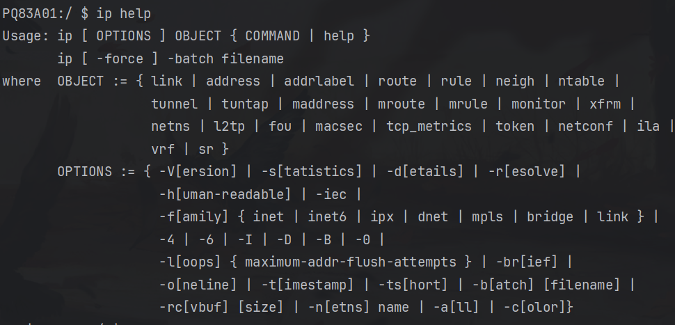

# Android `ip` 命令详解



`ip` 命令用于管理 Android 设备的网络接口、IP 地址、路由等网络配置。Android 使用 `toybox` 或 `busybox` 实现 `ip` 命令，并且可能缺少部分 GNU/Linux 发行版中的功能。

---

## **1. 基本用法**

```bash
ip [ OPTIONS ] OBJECT { COMMAND | help }
ip [ -force ] -batch filename
```

- `OBJECT`（对象）：指定要操作的网络组件，如 `link`（网络接口）、`address`（IP 地址）、`route`（路由表）等。
- `COMMAND`（命令）：对对象执行的操作，如 `show`（查看）、`add`（添加）、`del`（删除）。
- `OPTIONS`（选项）：控制输出格式，如 `-s`（统计信息）、`-d`（详细信息）、`-r`（解析地址）。

---

## **2. 主要对象 (`OBJECT`)**

| 对象 (`OBJECT`) | 说明                                         |
| --------------- | -------------------------------------------- |
| `link`          | 管理网络接口（类似 `ifconfig`）              |
| `address`       | 管理 IP 地址（类似 `ifconfig` 和 `ip addr`） |
| `addrlabel`     | 配置地址标签                                 |
| `route`         | 管理路由表（类似 `route` 命令）              |
| `rule`          | 配置路由规则                                 |
| `neigh`         | 查看和管理 ARP/NDP 表（邻居发现协议）        |
| `ntable`        | 显示邻居表缓存信息                           |
| `tunnel`        | 管理网络隧道（VPN/隧道接口）                 |
| `tuntap`        | 配置 TUN/TAP 设备                            |
| `maddress`      | 配置多播地址                                 |
| `mroute`        | 配置多播路由                                 |
| `mrule`         | 配置多播规则                                 |
| `monitor`       | 监听网络事件                                 |
| `xfrm`          | 配置 IPsec（传输模式）                       |
| `netns`         | 管理网络命名空间（仅部分 Android 设备支持）  |
| `l2tp`          | 管理 L2TP 隧道                               |
| `fou`           | 配置 Foo Over UDP（FOU）                     |
| `macsec`        | 配置 MACsec（以太网安全）                    |
| `tcp_metrics`   | 查看 TCP 统计信息                            |
| `token`         | 配置 IPv6 令牌                               |
| `netconf`       | 配置网络参数                                 |
| `ila`           | 配置 IPv6 ILA                                |
| `vrf`           | 配置 VRF（虚拟路由转发）                     |
| `sr`            | 配置 Segment Routing（SRv6）                 |

---

## **3. 选项 (`OPTIONS`)**

| 选项              | 说明                                 |
| ----------------- | ------------------------------------ |
| `-V`              | 显示 `ip` 命令的版本信息             |
| `-s`              | 显示统计信息                         |
| `-d`              | 显示详细信息（debug）                |
| `-r`              | 解析主机名（如果适用）               |
| `-h`              | 以可读格式显示数值（human-readable） |
| `-iec`            | 以 IEC 单位显示大小（如 KiB、MiB）   |
| `-f {inet         | inet6                                | link}` | 仅显示特定协议的信息（IPv4、IPv6、本地） |
| `-4`              | 仅显示 IPv4 信息                     |
| `-6`              | 仅显示 IPv6 信息                     |
| `-o`              | 以单行格式显示（oneline）            |
| `-br`             | 以紧凑格式显示（brief）              |
| `-batch filename` | 以批量模式执行多个 `ip` 命令         |
| `-force`          | 强制执行某些操作                     |
| `-color`          | 使用彩色输出（如果支持）             |

---

## **4. `ip` 命令的完整功能**

### **4.1 网络接口管理**

- 显示所有网络接口：
  ```bash
  ip link show
  ```
- 启用或禁用接口：
  ```bash
  ip link set wlan0 up   # 启用 wlan0
  ip link set wlan0 down # 禁用 wlan0
  ```

### **4.2 IP 地址管理**

- 显示 IP 地址：
  ```bash
  ip address show
  ```
- 添加 IP 地址：
  ```bash
  ip address add 192.168.1.100/24 dev wlan0
  ```
- 删除 IP 地址：
  ```bash
  ip address del 192.168.1.100/24 dev wlan0
  ```

### **4.3 路由管理**

- 显示路由表：
  ```bash
  ip route show
  ```
- 添加默认网关：
  ```bash
  ip route add default via 192.168.1.1 dev wlan0
  ```
- 删除路由：
  ```bash
  ip route del default
  ```

### **4.4 邻居（ARP/NDP）管理**

- 显示 ARP 表：
  ```bash
  ip neigh show
  ```
- 删除 ARP 记录：
  ```bash
  ip neigh del 192.168.1.1 dev wlan0
  ```

### **4.5 监听网络事件**

- 监听所有 `ip` 相关事件：
  ```bash
  ip monitor all
  ```
- 仅监听路由变化：
  ```bash
  ip monitor route
  ```

### **4.6 其他网络配置**

- 配置多播地址：
  ```bash
  ip maddress add 01:00:5e:00:00:01 dev wlan0
  ```
- 配置 MACsec（部分设备支持）：
  ```bash
  ip macsec add link wlan0 type macsec
  ```
---
