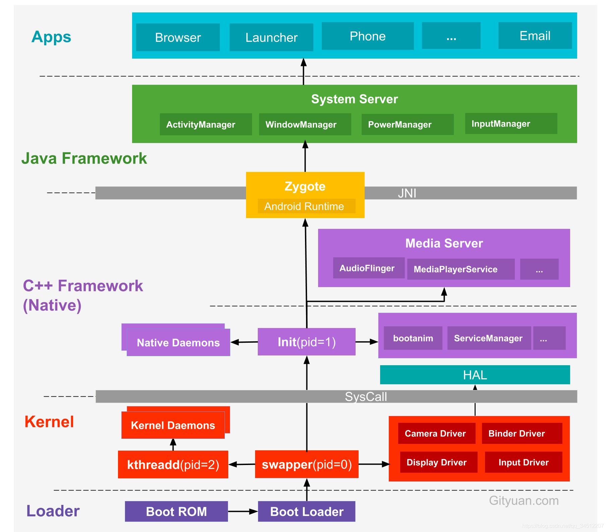
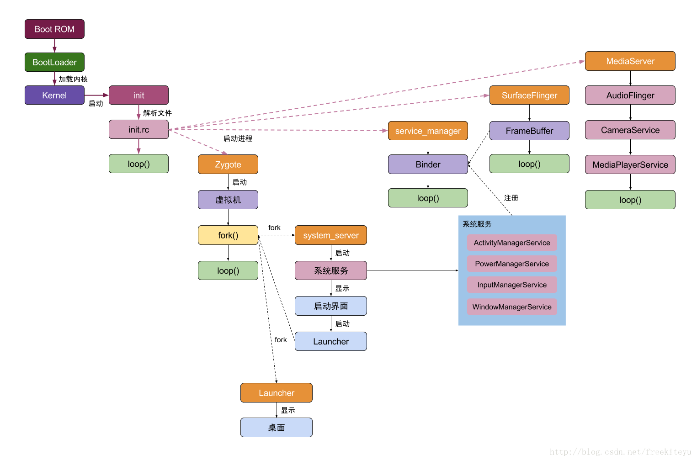
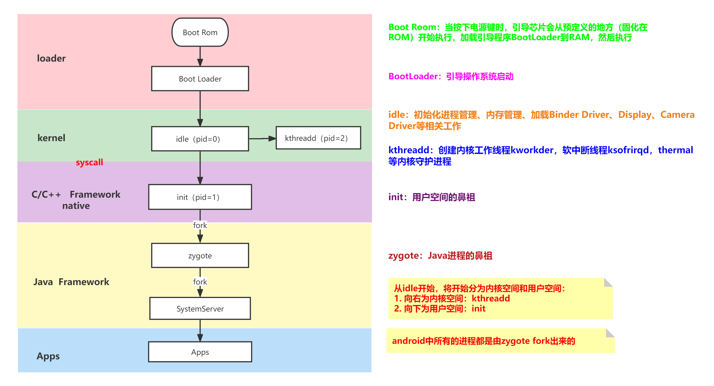

# Android系统启动流程

从手机开机开始涉及到的关键流程一般可分为以下五个步骤：

手机开启执行Boot ROM引导芯片开始执行。
加载引导程序Boot Loader到RAM，Boot Loader一般就会由厂商进行定制。
执行引导程序：初始化堆栈、硬件、网络内存等操作。
启动Android内核，寻找init关键文件，并启动init进程
Kernel启动后，在用户空间启动init进程，该进程作为用户空间的第一个进程，并调用init进程中的main方法开始启动Zygote进程。

第一个进程：init进程是fork过来的，所有进程都是init进程的子进程，fork的特点是会一分为二。

init.te 和 init.rc 文件

zygote - java进程的鼻祖

进程的个数等于虚拟机的个数

如果为app创建了一个独立的服务，会导致app多一个进程

为什么虚拟机的启动会在zygote中？

为什么TextView、Activity等不需要依赖？

zygote的preload方法加载

