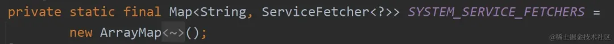
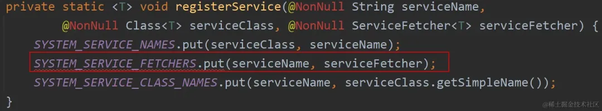

# Application为什么不能作为Dialog的context

Dialog的context只能是Activity，而不能是Application，不然会导致弹窗崩溃：

不管是Activity界面的显示还是Dialog的窗口显示，都会调用到WindowManagerImpl#addView()方法，这个方法经过一连续调用，会走到ViewRootImpl#setView()方法中。
在这个方法中，最终会调用到IWindowSession#addToDisplayAsUser()方法，这个方法是一个跨进程的调用，最终会执行到WMS的addWindow()方法。
在这个方法中会将窗口的信息进行保存管理，并且对于窗口的信息进行校验，比如上面的崩溃信息：“BadTokenException: Unable to add window”就是由于在这个方法中检验失败导致的；另外也是在这个方法中将窗口和Surface、Layer绘制建立起了连接。
接着开始在ViewRootImpl#setView()执行requestLayout()方法，开始进行渲染绘制等。

## 1.WindowManagerImpl

窗口只要显示，就得借助WindowManagerImpl#addView()方法，而WindowManagerImpl创建流程在Application和Activity的差异，就是Application作为Dialog的context会异常的核心原因。

1. Application下WindowManagerImpl的创建
对于Application而言，getSystemService()方法的调用，最终会走到父类ContextWrapper中：

而这个mBase属性对应的类为ContextImpl对象，对应`ContextImpl#getSystemService()`:

对应`SystemServiceRegistry#getSystemService()`：

`SYSTEM_SERVICE_FETCHERS`是一个Map集合，对应的key为服务的名称，value为服务的实现方式：

Android会在`SystemServiceRegistry`初始化的时候将各种服务以及服务的实现方法注册到这个集合中：

WindowManager服务的注册方式：

调用context.getSystemService(WINDOW_SERVICE)会返回一个WindowManagerImpl对象，核心点就在于WindowManagerImpl的构造函数，可以看到构造函数只传入了一个ContextImpl对象，其构造方法：

通过这种方法创建的WindowManagerImpl对象，其mParentWindow属性是null的。

## 2.Activity下WindowManagerImpl的创建
Activity重写了getSystemService()方法：

而mWindowManager属性的赋值是发生在Activity#attach()方法中：

这个mWindow属性对应的类型为Window类型（其唯一实现类为大家耳熟能详的PhoneWindow，其创建时机和Activity创建的时机是一起的），走进去看下：

经过一层层的调用，最终的WindowManager是通过`WindowManagerImpl#createLocalWindowManager`创建的，并且参数传入的是当前的Window对象，即`PhoneWindow`。

可以看到，该方法最终创建了`WindowManagerImpl`对象，关键点是其`mParentWindow`属性的值为上面传入的`PhoneWindow`，`不为null`。

## 3.小结：
`Activity获取到的WindManager服务，即WindowManagerImpl的mParentWindow属性不为空，而Application获取的mParentWindow属性为null。`

