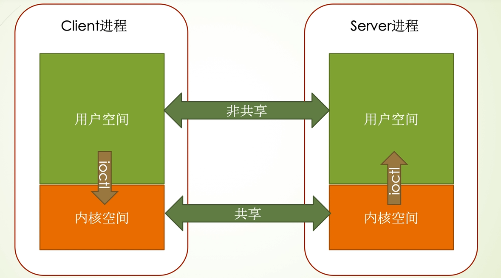
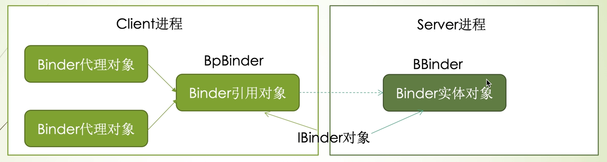
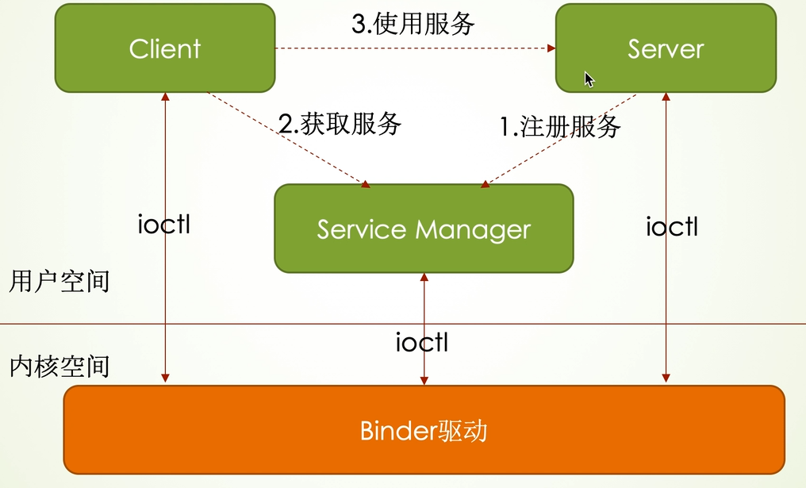
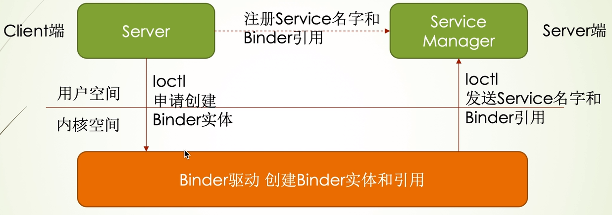
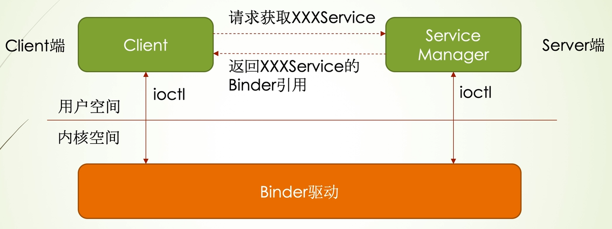
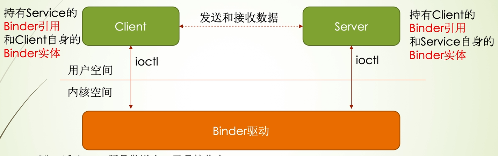

# Binder

## 1.什么是Binder

在Android系统中，Binder 是一种用于进程间通信（Inter-Process Communication，IPC）的机制。应用程序是由**Activity**、**Service**、**Broadcast Receiver**和**Content Provider**四种类型的组件构成的，它们有可能运行在同一进程中，也有可能运行在不同的进程中。此外，各种系统组件也运行在独立的进程中。这些运行在不同进程中的应用程序组件和系统组件之间的通信机制就是Binder。Binder是基于OpenBinder来实现的，它是一种类似于**COM**和**CORBA**分布式组件架构，通俗一点，其实是提供远程过程调用（RPC）功能。

每个Android进程只能运行在自己的进程所拥有的虚拟地址空间，Client进程与Server进程通信，利用进程间可共享的内核空间完成底层通信工作。

Binder 主要有以下几个关键组件：

1. Binder驱动程序：Binder机制的核心部分是内核中的Binder驱动程序，它负责处理进程间通信的底层细节。
2. Binder服务：应用程序可以将服务发布为Binder服务，其他应用程序可以通过Binder机制访问这些服务。这种服务通常以**接口**的形式提供，允许远程进程调用其中定义的方法。
3. Binder通信：Binder使用一种称为 **Binder IPC** 机制的方式进行通信。它允许一个进程通过Binder对象引用调用另一个进程中的对象的方法。Binder对象引用是一种轻量级的跨进程引用，允许远程进程访问服务。

## 2.Binder机制的关键概念

1. Binder实体对象：Binder服务的提供者，类型是**BBinder**，也就是BBinder对象。
2. Binder引用对象：Binder实体对象在客户端进程的代表，类型是**BpBinder**，也称为BpBinder对象。
3. Binder代理对象：代理对象也称为接口对象，主要是为客户端的上层应用提供接口服务，类型是Interface，Android将Binder引用对象和代理对象分开的好处就是一个Binder引用对象可以有多个代理对象，方便应用层使用。
4. IBinder对象：实体对象和引用对象的统称，因为BBinder和BpBinder继承自IBinder。

## 3.为什么要用Binder

因为Android是基于Linux底层实现的，而Linux已经有了几个进程间通讯的方式。比如：**管道**、**消息队列**、**共享内存** 等等。但是管道和消息队列的实现方式是：一个提供服务的进程（发送方），将提供的数据从发送方的缓存区拷贝到内核的缓存区，然后接收方再开辟一块缓存区，从内核缓存区将数据拷贝到自己的缓存区。所以这期间一共需要进行两次拷贝，而且拷贝过程中接收方不知道需要开辟一块多大的缓存区才能放得下发送方发送的数据，所以只能开辟一块尽可能大的缓存区，这样会造成空间的浪费。或者先通过进程通信了解到需要开辟多大的缓存区，再来开辟缓存区，这样虽然不会造成空间上的浪费但是会造成时间上的浪费。而共享内存不用进行数据的拷贝，由于多个进程可以直接访问到同一块内存，对于数据的访问难以控制，安全性不好。并且需要额外的同步机制来防止数据不一致和竞态条件。

Binder采用了客户端-服务器模型，支持跨进程的对象引用，避免了数据拷贝的开销，并提供了更高的效率和安全性。所以Android提供了一个Binder机制，用于进程间通信。

## 4.Binder机制和原理

Binder基于客户端-服务器通信模式，提供数据或者是服务的发送方相当于服务器，需要请求服务的相当于客户端，整个Binder机制有四个重要的部分，分别是：**Client**、**Server**、**ServiceManager** 和 **Binder**。

首先Server通过定义一个AIDL接口来创建Binder的实体，这个接口定义了服务的方法，并在编译时生成相应的Binder类。实际的服务类将继承生成的Binder类，实现AIDL接口中定义的方法。然后为这个Binder起一个名字，Binder的名字（也称为Binder的描述符）是在AIDL接口的定义中指定的。将Binder和名称一起发送给ServiceManager，让ServiceManager去注册这个Binder，ServiceManager收到以后去内核区创建一个Binder的实体，同时自己持有这个Binder的引用。Server和ServiceManager是处于不同进程的，Server通知ServiceManager注册Binder的时候，也用到了Binder来实现进程间的通信。ServiceManager在注册的时候自动创建一个Binder实体，编号为0，这是内核里创建出来的第一个Binder实体。而提供数据或服务的Server，相对于ServiceManager是一个客户端，Server通过编号0来获取第一个Binder的引用，借此完成与ServiceManager的通信。

Server中的Binder实体在ServiceManager里注册完，客户端通过编号为0的Binder与ServiceManager通信，告诉ServiceManager想要请求的Server，然后告诉ServiceManager请求的Sever对应的Binder的名字，ServiceManager收到客户端的请求后，通过客户端发送的Binder名字，在已经注册的索引表中找到Binder，将其引用发回给客户端，客户端就能通过这个引用来获取Server中的数据或使用服务了。

