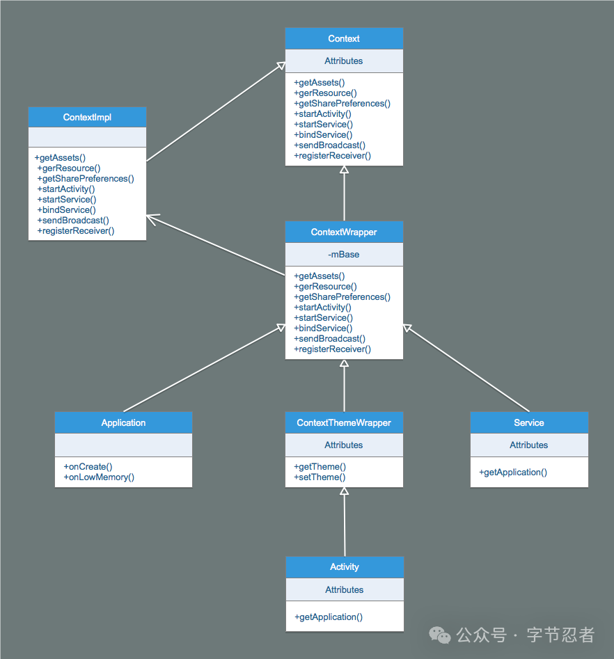

# Context

## 1.什么是Context
它是Android里的一个上帝类，启动四大组件、获取资源、获取类加载器等重要功能都通过Context 来完成，Activity、Service与Application也都派生自Context，Broadcast Receiver与Content Provider与Context 也有着密切的联系。

Context类图如下所示：



可以发现Context是个抽象类，它的具体实现类是ContextImpl，ContextWrapper是个包装类，内部的成员变量mBase指向的也是个ContextImpl对象，ContextImpl完成了 实际的功能，Activity、Service与Application都直接或者间接的继承ContextWrapper。

我们知道Context表示的应用的上下文环境，四大组件都与Context有密切的关系，在创建组件的时候会同时创建Context，并将两者进行绑定，我们来看看四大组件与 Context之间的关系。


## 2.Context与四大组件的关系
1. Activity的创建流程
``` java
public final class ActivityThread {
    
    private Activity performLaunchActivity(ActivityClientRecord r, Intent customIntent) {
            // System.out.println("##### [" + System.currentTimeMillis() + "] ActivityThread.performLaunchActivity(" + r + ")");
    
            ActivityInfo aInfo = r.activityInfo;
            // 1. 获取LoadedApk对象。
            if (r.packageInfo == null) {
                r.packageInfo = getPackageInfo(aInfo.applicationInfo, r.compatInfo,
                        Context.CONTEXT_INCLUDE_CODE);
            }
    
            ComponentName component = r.intent.getComponent();
            if (component == null) {
                component = r.intent.resolveActivity(
                    mInitialApplication.getPackageManager());
                r.intent.setComponent(component);
            }
    
            if (r.activityInfo.targetActivity != null) {
                component = new ComponentName(r.activityInfo.packageName,
                        r.activityInfo.targetActivity);
            }
    
            // 2. 创建Activity对象。
            Activity activity = null;
            try {
                java.lang.ClassLoader cl = r.packageInfo.getClassLoader();
                activity = mInstrumentation.newActivity(
                        cl, component.getClassName(), r.intent);
                StrictMode.incrementExpectedActivityCount(activity.getClass());
                r.intent.setExtrasClassLoader(cl);
                r.intent.prepareToEnterProcess();
                if (r.state != null) {
                    r.state.setClassLoader(cl);
                }
            } catch (Exception e) {
                if (!mInstrumentation.onException(activity, e)) {
                    throw new RuntimeException(
                        "Unable to instantiate activity " + component
                        + ": " + e.toString(), e);
                }
            }
    
            try {
                // 3. 创建Application对象。
                Application app = r.packageInfo.makeApplication(false, mInstrumentation);
    
                // ...log
                
                if (activity != null) {
                    // 4. 创建ContextImpl对象。
                    Context appContext = createBaseContextForActivity(r, activity);
                    CharSequence title = r.activityInfo.loadLabel(appContext.getPackageManager());
                    Configuration config = new Configuration(mCompatConfiguration);
                    if (r.overrideConfig != null) {
                        config.updateFrom(r.overrideConfig);
                    }
                    if (DEBUG_CONFIGURATION) Slog.v(TAG, "Launching activity "
                            + r.activityInfo.name + " with config " + config);
                    Window window = null;
                    if (r.mPendingRemoveWindow != null && r.mPreserveWindow) {
                        window = r.mPendingRemoveWindow;
                        r.mPendingRemoveWindow = null;
                        r.mPendingRemoveWindowManager = null;
                    }
                    activity.attach(appContext, this, getInstrumentation(), r.token,
                            r.ident, app, r.intent, r.activityInfo, title, r.parent,
                            r.embeddedID, r.lastNonConfigurationInstances, config,
                            r.referrer, r.voiceInteractor, window);
    
                    if (customIntent != null) {
                        activity.mIntent = customIntent;
                    }
                    r.lastNonConfigurationInstances = null;
                    activity.mStartedActivity = false;
                    int theme = r.activityInfo.getThemeResource();
                    if (theme != 0) {
                        activity.setTheme(theme);
                    }
    
                    activity.mCalled = false;
                    if (r.isPersistable()) {
                        // 5. 执行Activity的onCreate()回调方法。
                        mInstrumentation.callActivityOnCreate(activity, r.state, r.persistentState);
                    } else {
                        mInstrumentation.callActivityOnCreate(activity, r.state);
                    }
                    if (!activity.mCalled) {
                        throw new SuperNotCalledException(
                            "Activity " + r.intent.getComponent().toShortString() +
                            " did not call through to super.onCreate()");
                    }
                    r.activity = activity;
                    r.stopped = true;
                    if (!r.activity.mFinished) {
                        activity.performStart();
                        r.stopped = false;
                    }
                    if (!r.activity.mFinished) {
                        if (r.isPersistable()) {
                            if (r.state != null || r.persistentState != null) {
                                mInstrumentation.callActivityOnRestoreInstanceState(activity, r.state,
                                        r.persistentState);
                            }
                        } else if (r.state != null) {
                            mInstrumentation.callActivityOnRestoreInstanceState(activity, r.state);
                        }
                    }
                    if (!r.activity.mFinished) {
                        activity.mCalled = false;
                        if (r.isPersistable()) {
                            mInstrumentation.callActivityOnPostCreate(activity, r.state,
                                    r.persistentState);
                        } else {
                            mInstrumentation.callActivityOnPostCreate(activity, r.state);
                        }
                        if (!activity.mCalled) {
                            throw new SuperNotCalledException(
                                "Activity " + r.intent.getComponent().toShortString() +
                                " did not call through to super.onPostCreate()");
                        }
                    }
                }
                r.paused = true;
    
                mActivities.put(r.token, r);
    
            } catch (SuperNotCalledException e) {
                throw e;
    
            } catch (Exception e) {
                if (!mInstrumentation.onException(activity, e)) {
                    throw new RuntimeException(
                        "Unable to start activity " + component
                        + ": " + e.toString(), e);
                }
            }
    
            return activity;
        }
}
```

Activity的创建流程如下所示：

1. 获取LoadedApk对象。
2. 创建Activity对象。
3. 创建Application对象。
4. 创建ContextImpl对象。
5. 执行Activity的onCreate()回调方法。

2. Service的创建流程

``` java
public final class ActivityThread {
    
    private void handleCreateService(CreateServiceData data) {
            // If we are getting ready to gc after going to the background, well
            // we are back active so skip it.
            unscheduleGcIdler();
    
            // 1. 获取LoadedApk对象。
            LoadedApk packageInfo = getPackageInfoNoCheck(
                    data.info.applicationInfo, data.compatInfo);
            Service service = null;
            try {
                // 2. 创建Service对象。
                java.lang.ClassLoader cl = packageInfo.getClassLoader();
                service = (Service) cl.loadClass(data.info.name).newInstance();
            } catch (Exception e) {
                if (!mInstrumentation.onException(service, e)) {
                    throw new RuntimeException(
                        "Unable to instantiate service " + data.info.name
                        + ": " + e.toString(), e);
                }
            }
    
            try {
                if (localLOGV) Slog.v(TAG, "Creating service " + data.info.name);
                // 3. 创建ContextImpl对象。
                ContextImpl context = ContextImpl.createAppContext(this, packageInfo);
                context.setOuterContext(service);
    
                // 4. 创建Application对象。
                Application app = packageInfo.makeApplication(false, mInstrumentation);
                service.attach(context, this, data.info.name, data.token, app,
                        ActivityManagerNative.getDefault());
                // 5. 执行Service的onCreate()回调方法。
                service.onCreate();
                mServices.put(data.token, service);
                try {
                    ActivityManagerNative.getDefault().serviceDoneExecuting(
                            data.token, SERVICE_DONE_EXECUTING_ANON, 0, 0);
                } catch (RemoteException e) {
                    throw e.rethrowFromSystemServer();
                }
            } catch (Exception e) {
                if (!mInstrumentation.onException(service, e)) {
                    throw new RuntimeException(
                        "Unable to create service " + data.info.name
                        + ": " + e.toString(), e);
                }
            }
        }
}
```

Service的创建流程如下所示：

获取LoadedApk对象。
创建Service对象。
创建ContextImpl对象。
创建Application对象。
执行Service的onCreate()回调方法。

静态广播的创建流程

``` java

public final class ActivityThread {
    
    private void handleReceiver(ReceiverData data) {
            // If we are getting ready to gc after going to the background, well
            // we are back active so skip it.
            unscheduleGcIdler();
    
            String component = data.intent.getComponent().getClassName();
            // 1. 获取LoadedApk对象。
            LoadedApk packageInfo = getPackageInfoNoCheck(
                    data.info.applicationInfo, data.compatInfo);
    
            IActivityManager mgr = ActivityManagerNative.getDefault();
    
            BroadcastReceiver receiver;
            try {
                // 2. 创建BroadcastReceiver对象。
                java.lang.ClassLoader cl = packageInfo.getClassLoader();
                data.intent.setExtrasClassLoader(cl);
                data.intent.prepareToEnterProcess();
                data.setExtrasClassLoader(cl);
                receiver = (BroadcastReceiver)cl.loadClass(component).newInstance();
            } catch (Exception e) {
                // ...log
            }
    
            try {
                // 3. 创建Application对象。
                Application app = packageInfo.makeApplication(false, mInstrumentation);
    
                // ...log
    
                // 4. 获取ContextImpl对象。
                ContextImpl context = (ContextImpl)app.getBaseContext();
                sCurrentBroadcastIntent.set(data.intent);
                receiver.setPendingResult(data);
                // 5. 回调onReceive()方法。
                receiver.onReceive(context.getReceiverRestrictedContext(),
                        data.intent);
            } catch (Exception e) {
                // ...log
            } finally {
                sCurrentBroadcastIntent.set(null);
            }
    
            if (receiver.getPendingResult() != null) {
                data.finish();
            }
        }   
}
```


静态广播的创建流程如下所示：

1. 获取LoadedApk对象。
2. 创建BroadcastReceiver对象。
3. 创建Application对象。
4. 获取ContextImpl对象。
5. 回调onReceive()方法。

Content Provider的创建流程

``` java
public final class ActivityThread {
    
     private IActivityManager.ContentProviderHolder installProvider(Context context,
                IActivityManager.ContentProviderHolder holder, ProviderInfo info,
                boolean noisy, boolean noReleaseNeeded, boolean stable) {
            ContentProvider localProvider = null;
            IContentProvider provider;
            if (holder == null || holder.provider == null) {
                if (DEBUG_PROVIDER || noisy) {
                    Slog.d(TAG, "Loading provider " + info.authority + ": "
                            + info.name);
                }
                Context c = null;
                ApplicationInfo ai = info.applicationInfo;
                if (context.getPackageName().equals(ai.packageName)) {
                    c = context;
                } else if (mInitialApplication != null &&
                        mInitialApplication.getPackageName().equals(ai.packageName)) {
                    c = mInitialApplication;
                } else {
                    try {
                        // 1. 创建ContextImpl对象。
                        c = context.createPackageContext(ai.packageName,
                                Context.CONTEXT_INCLUDE_CODE);
                    } catch (PackageManager.NameNotFoundException e) {
                        // Ignore
                    }
                }
                if (c == null) {
                    // ...log
                    return null;
                }
                try {
                    // 2. 创建Content Provider对象。
                    final java.lang.ClassLoader cl = c.getClassLoader();
                    localProvider = (ContentProvider)cl.
                        loadClass(info.name).newInstance();
                    provider = localProvider.getIContentProvider();
                    if (provider == null) {
                        // ...log
                        return null;
                    }
                    if (DEBUG_PROVIDER) Slog.v(
                        TAG, "Instantiating local provider " + info.name);
                    // 3. 将ContextImpl对象绑定到Content Provider。
                    localProvider.attachInfo(c, info);
                } catch (java.lang.Exception e) {
                    // ...log
                    return null;
                }
            } else {
                provider = holder.provider;
                if (DEBUG_PROVIDER) Slog.v(TAG, "Installing external provider " + info.authority + ": "
                        + info.name);
            }
    
            IActivityManager.ContentProviderHolder retHolder;
    
            synchronized (mProviderMap) {
                if (DEBUG_PROVIDER) Slog.v(TAG, "Checking to add " + provider
                        + " / " + info.name);
                IBinder jBinder = provider.asBinder();
                if (localProvider != null) {
                    ComponentName cname = new ComponentName(info.packageName, info.name);
                    ProviderClientRecord pr = mLocalProvidersByName.get(cname);
                    if (pr != null) {
                        // ...log
                        provider = pr.mProvider;
                    } else {
                        holder = new IActivityManager.ContentProviderHolder(info);
                        holder.provider = provider;
                        holder.noReleaseNeeded = true;
                        pr = installProviderAuthoritiesLocked(provider, localProvider, holder);
                        mLocalProviders.put(jBinder, pr);
                        mLocalProvidersByName.put(cname, pr);
                    }
                    retHolder = pr.mHolder;
                } else {
                    ProviderRefCount prc = mProviderRefCountMap.get(jBinder);
                    if (prc != null) {
                        // ...log
                        if (!noReleaseNeeded) {
                            incProviderRefLocked(prc, stable);
                            try {
                                ActivityManagerNative.getDefault().removeContentProvider(
                                        holder.connection, stable);
                            } catch (RemoteException e) {
                                //do nothing content provider object is dead any way
                            }
                        }
                    } else {
                        ProviderClientRecord client = installProviderAuthoritiesLocked(
                                provider, localProvider, holder);
                        if (noReleaseNeeded) {
                            prc = new ProviderRefCount(holder, client, 1000, 1000);
                        } else {
                            prc = stable
                                    ? new ProviderRefCount(holder, client, 1, 0)
                                    : new ProviderRefCount(holder, client, 0, 1);
                        }
                        mProviderRefCountMap.put(jBinder, prc);
                    }
                    retHolder = prc.holder;
                }
            }
    
            return retHolder;
        }
}
```

1. 创建ContextImpl对象。
2. 创建Content Provider对象。
3. 将ContextImpl对象绑定到Content Provider。
4. 通过上面的分析我们知道在四大组件创建的过程中，都需要创建ContextImpl对象与Application对象，Application对象都是通过LoadedApk的makeApplication()方法来完成的，但 是ContextImpl对象的创建方法却各不相同，我们来看一看。

Application的创建流程

通过上述内容可以发现，对于四大组件，Application的创建和获取方式也是不尽相同的，具体说来：
- Activity：通过LoadedApk的makeApplication()方法创建。
- Service：通过LoadedApk的makeApplication()方法创建。
- 静态广播：通过其回调方法onReceive()方法的第一个参数指向Application。
- ContentProvider：无法获取Application，因此此时Application不一定已经初始化。
- LoadedApk的makeApplication()方法如下所示：

``` java
public final class LoadedApk {
    
       public Application makeApplication(boolean forceDefaultAppClass,
                Instrumentation instrumentation) {
            // Application只会创建一次，如果Application对象已经存在则不再创建，一个APK对应一个
            // LoadedApk对象，一个LoadedApk对象对应一个Application对象。
            if (mApplication != null) {
                return mApplication;
            }
    
            Trace.traceBegin(Trace.TRACE_TAG_ACTIVITY_MANAGER, "makeApplication");
    
            Application app = null;
    
            String appClass = mApplicationInfo.className;
            if (forceDefaultAppClass || (appClass == null)) {
                appClass = "android.app.Application";
            }
    
            try {
                // 1. 创建加载Application的ClassLoader对象。
                java.lang.ClassLoader cl = getClassLoader();
                if (!mPackageName.equals("android")) {
                    Trace.traceBegin(Trace.TRACE_TAG_ACTIVITY_MANAGER,
                            "initializeJavaContextClassLoader");
                    initializeJavaContextClassLoader();
                    Trace.traceEnd(Trace.TRACE_TAG_ACTIVITY_MANAGER);
                }
                // 2. 创建ContextImpl对象。
                ContextImpl appContext = ContextImpl.createAppContext(mActivityThread, this);
                // 3. 创建Application对象。
                app = mActivityThread.mInstrumentation.newApplication(
                        cl, appClass, appContext);
                // 4. 将Application对象设置给ContextImpl。
                appContext.setOuterContext(app);
            } catch (Exception e) {
                if (!mActivityThread.mInstrumentation.onException(app, e)) {
                    Trace.traceEnd(Trace.TRACE_TAG_ACTIVITY_MANAGER);
                    throw new RuntimeException(
                        "Unable to instantiate application " + appClass
                        + ": " + e.toString(), e);
                }
            }
            // 5. 将Application对象添加到ActivityThread的Application列表中。
            mActivityThread.mAllApplications.add(app);
            mApplication = app;
    
            if (instrumentation != null) {
                try {
                    // 6. 执行Application的回调方法onCreate()。
                    instrumentation.callApplicationOnCreate(app);
                } catch (Exception e) {
                    if (!instrumentation.onException(app, e)) {
                        Trace.traceEnd(Trace.TRACE_TAG_ACTIVITY_MANAGER);
                        throw new RuntimeException(
                            "Unable to create application " + app.getClass().getName()
                            + ": " + e.toString(), e);
                    }
                }
            }
    
            // Rewrite the R 'constants' for all library apks.
            SparseArray<String> packageIdentifiers = getAssets(mActivityThread)
                    .getAssignedPackageIdentifiers();
            final int N = packageIdentifiers.size();
            for (int i = 0; i < N; i++) {
                final int id = packageIdentifiers.keyAt(i);
                if (id == 0x01 || id == 0x7f) {
                    continue;
                }
    
                rewriteRValues(getClassLoader(), packageIdentifiers.valueAt(i), id);
            }
    
            Trace.traceEnd(Trace.TRACE_TAG_ACTIVITY_MANAGER);
    
            return app;
        }
}
```

Application的创建流程如下所示：

1. 创建加载Application的ClassLoader对象。
2. 创建ContextImpl对象。
3. 创建Application对象。
4. 将Application对象设置给ContextImpl。
5. 将Application对象添加到ActivityThread的Application列表中。
6. 执行Application的回调方法onCreate()。
👉 注：Application只会创建一次，如果Application对象已经存在则不再创建，一个APK对应一个LoadedApk对象，一个LoadedApk对象 对应一个Application对象。

Application对象的构建时通过Instrumentation的newApplication()方法完成的。

``` java
public class Instrumentation {
   static public Application newApplication(Class<?> clazz, Context context)
           throws InstantiationException, IllegalAccessException, 
           ClassNotFoundException {
       Application app = (Application)clazz.newInstance();
       app.attach(context);
       return app;
   } 
}
```

这里我们再注意一下ContextImpl的setOuterContext()方法，它用来设置外部Context，但是不同场景下设置的对象不同，具体说来：

- makeApplication()：Outer Context设置的是Application。
- createBaseContextForActivity()：Outer Context设置的是Activity。
- handleCreateService()：Outer Context设置的是Service。
- BroadcastReceiver/Provider：Outer Context设置的是默认的ContextImpl。
