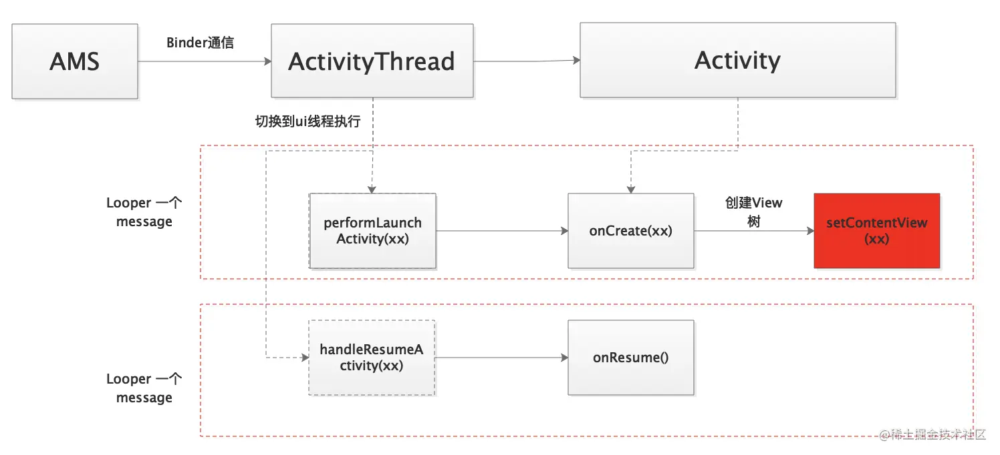

# DecorView

## 1. Activity的创建过程


AMS管理着Activity生命周期，每当切换Activity状态时通过Binder告诉ActivityThread，ActivityThread通过Handler切换到主线程(UI线程）执行，最终分别调用到我们熟知的onCreate(xx)/onResume()方法。

DecorView的主要角色是作为顶层容器，承载着应用的视图结构。当在应用中使用setContentView方法加载布局时，实际上是将这个布局作为子视图添加到DecorView中。因此，DecorView定义了应用界面的边界，所有的视图都在这个边界内进行绘制和事件分发。

DecorView 是一个特别的视图类，它作为窗口的顶级视图。它是所有窗口装饰和内容视图的根视图。在Activity中，可以通过以下方式获取DecorView

::: code-group
``` java
View decorView = getWindow().getDecorView();
```
:::

DecorView 包含了状态栏、导航栏、标题栏以及应用程序的内容区域。一般来说，DecorView 的层次结构如下:

::: code-group
``` txt
DecorView
 ├── StatusBar (状态栏)
 ├── NavigationBar (导航栏)
 ├── TitleBar (标题栏)
 └── ContentView (内容视图)
```
:::

通过操作 DecorView，你可以实现一些高级效果，例如全屏模式、隐藏状态栏和导航栏等。下面是一个隐藏状态栏的例子：

::: code-group
``` java
// 隐藏状态栏和导航栏
decorView.setSystemUiVisibility(
    View.SYSTEM_UI_FLAG_FULLSCREEN 
    | View.SYSTEM_UI_FLAG_HIDE_NAVIGATION 
    | View.SYSTEM_UI_FLAG_IMMERSIVE_STICKY
);

```
:::

此外，DecorView 还可以用于在窗口中添加自定义视图，覆盖在应用内容之上。例如，显示一个全局的浮动按钮：

::: code-group
``` java
WindowManager windowManager = (WindowManager) getSystemService(Context.WINDOW_SERVICE);
WindowManager.LayoutParams params = new WindowManager.LayoutParams(
    WindowManager.LayoutParams.WRAP_CONTENT,
    WindowManager.LayoutParams.WRAP_CONTENT,
    WindowManager.LayoutParams.TYPE_APPLICATION_PANEL,
    WindowManager.LayoutParams.FLAG_NOT_FOCUSABLE,
    PixelFormat.TRANSLUCENT
);

Button floatButton = new Button(this);
floatButton.setText("Float");

windowManager.addView(floatButton, params);
```
:::

**1. DecorView与Window的关系**

Window是Android中一个抽象的概念，代表屏幕上的一块区域，可以用来显示视图。每个Acitvity都会被赋予一个Window，而这个Window则负责承载DecorView。Window是一个显示DecorView的容器。Window和View通过WindowManager服务来管理，WindowManager负责将Window放在屏幕上正确的位置上。

**2. DecorView与Activity的关系**

Activity是Android应用中负责创建用户界面的组件。每个Activity都会有一个与之相关的Window。而这个Window则承载DecorView。在Activity的生命周期中，当调用SetContentView方法时，系统就会开始构建视图层次结构，将指定的布局文件加载到当前Activity的Window所关联的DecorView中。

**3. DecorView与ViewRootImpl的关系**

ViewRootImpl是AndroidUI系统的内部机制，作为桥梁连接Window和DecorView。它负责初始化视图层次结构的根，处理布局、绘制
事件分发等。当一个Activity的视图被设置或者窗口发生变化时，ViewRootImpl确保DecorView触发更新和重新绘制。

## 2. setContentView(xx)源码解析
从Activity onCreate(xx)看起

**AppCompatDelegateImpl**

::: code-group
``` java
    @Override
    protected void onCreate(Bundle savedInstanceState) {
        //先调用父类构造函数
        //初始化一些必要变量
        super.onCreate(savedInstanceState);
        setContentView(R.layout.layout_path);
    }
```
:::


## 3. 创建流程

DecorView的创建通常在onCreate中开始，当setContentView方法被调用时，通过getWindow()方法获取当前Activity的Window对象。

1. 当一个 Activity 启动时，ActivityThread 会调用 Activity 的 performLaunchActivity 方法。这个方法会创建一个新的 Activity 实例，并调用其 onCreate 方法。

::: code-group
``` java
Activity a = performLaunchActivity(r, customIntent);
```
:::

::: code-group
``` java
public void setContentView(int layoutResID) {
    getWindow().setContentView(layoutResID);
    initWindowDecorActionBar();
}
```
:::

2. Window的setContentView方法内部，进一步调用了PhoneWindow的setContentView实现。在这个方法中，会创建或找到DecorView，然后将解析的视图树添加到DecorView中。

::: code-group
``` java
@Override
public void setContentView(int layoutResID) {
    // 确保DecorView已经被创建
    if (mContentParent == null) {
        installDecor();
    } else if (!hasFeature(FEATURE_CONTENT_TRANSITIONS)) {
        mContentParent.removeAllViews();
    }

    if (hasFeature(FEATURE_CONTENT_TRANSITIONS)) {
        final Scene newScene = Scene.getSceneForLayout(mContentParent, layoutResID,
                getContext());
        transitionTo(newScene);
    } else {
        mLayoutInflater.inflate(layoutResID, mContentParent);
    }
    mContentParent.requestApplyInsets();
    final Callback cb = getCallback();
    if (cb != null && !isDestroyed()) {
        cb.onContentChanged();
    }
    mContentParentExplicitlySet = true;
}
```
:::

3. LayoutInflater会根据layoutID找到对应的布局文件并解析，根据文件中的定义构建一个完整的View树。这个View树随后会被设置成Activity的内容视图，实际上被添加到Acitvity所关联的Window的DecorView中。

installDecor方法负责初始化DecorView。如果DecorView还没有被创建，PhoneWindow会创建一个新的DecorView实例，并将其设置为窗口的根视图。接着，解析的视图树（即Activity的布局）被添加到DecorView中。

::: code-group
``` java
private void installDecor() {
    if (mDecor == null) {
        mDecor = generateDecor(-1);
        mDecor.setDescendantFocusability(ViewGroup.FOCUS_AFTER_DESCENDANTS);
        mDecor.setIsRootNamespace(true);
        ...
    } else {
        ...
    }
    if (mContentParent == null) {
        mContentParent = generateLayout(mDecor);
        // 其他初始化代码...
    }
}

// generateDecor 方法会返回一个新的 DecorView 实例
protected DecorView generateDecor() {
    return new DecorView(getContext(), -1);
}
```
:::

4. 将DecorView添加到WindowManager中

WindowManager 是系统服务，它负责管理应用程序窗口的显示。它提供了一些用于管理窗口显示的方法，例如添加、删除、更新窗口等。在 Activity 的 onResume() 方法之后，会将 DecorView 添加到 WindowManager 中。这将导致 DecorView 显示在屏幕上。触发点是在，ActivityThread中的handleResumeActivity()方法中

::: code-group
``` java
@Override
public void handleResumeActivity(ActivityClientRecord r, boolean finalStateRequest,
        boolean isForward, boolean shouldSendCompatFakeFocus, String reason) {
    // ...

    // 执行Activity onResume
    if (!performResumeActivity(r, finalStateRequest, reason)) {
        return;
    }

    ...

    if (r.window == null && !a.mFinished && willBeVisible) {
        // PhoneWindow
        r.window = r.activity.getWindow();
        View decor = r.window.getDecorView();
        decor.setVisibility(View.INVISIBLE);
        ViewManager wm = a.getWindowManager();
        WindowManager.LayoutParams l = r.window.getAttributes();
        a.mDecor = decor;
        ...

        if (a.mVisibleFromClient) {
            if (!a.mWindowAdded) {
                a.mWindowAdded = true;

                // 添加到WindowManager中，并与wms建立双向通信
                wm.addView(decor, l);
            } else {
                a.onWindowAttributesChanged(l);
            }
        }
    } else if (!willBeVisible) {
        if (localLOGV) Slog.v(TAG, "Launch " + r + " mStartedActivity set");
        r.hideForNow = true;
    }

   //  ...
}
```
:::

这就是在onCreate与onResume的时候不能直接拿到View的宽高的原因。因为DecorView添加是在onResume之后。

5. 一旦DecorView被创建并设置内容，ViewRootImpl就负责将DecorView附加到窗口。ViewRootImpl是一个系统内部使用的类，它连接窗口管理器（WindowManager）和DecorView，处理布局、绘制和事件分发。

在上面将DecorView添加到WindowManager中时，内部是交由WindowManagerGlobal的addView处理，在该方法中会创建ViewRootImpl对象。

::: code-group
``` java
public void addView(View view, ViewGroup.LayoutParams params,
        Display display, Window parentWindow, int userId) {

    ...

    ViewRootImpl root;
    View panelParentView = null;

    synchronized (mLock) {
        ...

        // 创建ViewRootImpl
        if (windowlessSession == null) {
            root = new ViewRootImpl(view.getContext(), display);
        } else {
            root = new ViewRootImpl(view.getContext(), display,
                    windowlessSession, new WindowlessWindowLayout());
        }

        view.setLayoutParams(wparams);

        mViews.add(view);
        mRoots.add(root);
        mParams.add(wparams);

        try {

            // 将DecorView交由ViewRootImpl，进行后续的绘制与事件分发等出来。
            root.setView(view, wparams, panelParentView, userId);
        } catch (RuntimeException e) {
            final int viewIndex = (index >= 0) ? index : (mViews.size() - 1);
            if (viewIndex >= 0) {
                removeViewLocked(viewIndex, true);
            }
            throw e;
        }
    }
}
```
:::

DecorView的绘制是由ViewRootImpl触发的，而内部其实是调用了它的requestLayout()方法

::: code-group
``` java
public void setView(View view, WindowManager.LayoutParams attrs, View panelParentView,
        int userId) {
    ...
    requestLayout()
    ...
}

@Override
public void requestLayout() {
    if (!mHandlingLayoutInLayoutRequest) {
        // 主线程判断
        checkThread();
        mLayoutRequested = true;
        // 等待垂直刷新信号量的到来，触发分发绘制流程
        scheduleTraversals();
    }
}

/*
requestLayout()方法中，做了经典的两件事情

1. 验证是否是在主线程触发
2. 等待刷新，触发后续的绘制流程
*/
```
:::

## 4. 总结

整个流程主要可以归纳为四步：
1. 在Activity的attach()方法里面先创建PhoneWindow并获取WindowManager
2. 在Activity的onCreate()方法里调用setContentView()会通过调用用PhoneWindow的installDecor()来创建DecorView。
3. 在Activity的onResume()方法之后，也就是handleResumeActivity()方法中，会把DecorView添加到WindowMangaer中，并与wms建立双向通信。最终交个ViewRootImpl进行后续的绘制流程。
4. 在ViewRootImple中，验证触发线程，并等到屏幕刷新信号来了，会调用到ViewRootImpl的performTraversals()来进行后续的绘制。
