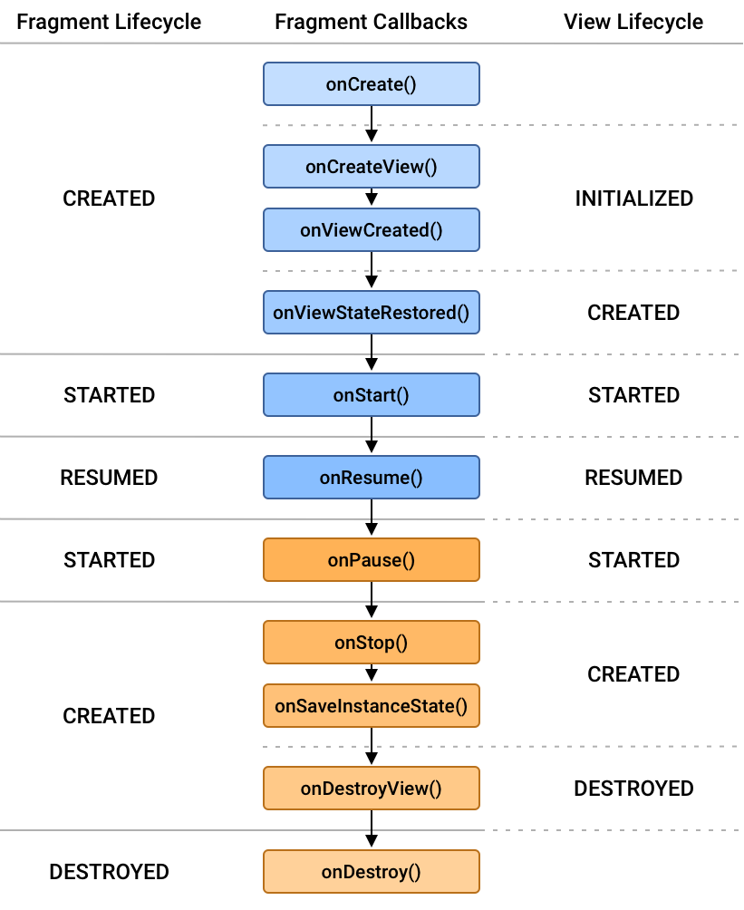

# Fragment

## 1. 什么是Fragment

> Fragment 是 Android 应用程序的一部分，是一个可以嵌入在活动（Activity）中的用户界面或行为的模块化部分。Fragment 使得应用程序能够适应各种屏幕尺寸和设备配置，同时保持代码的模块化和可维护性。

## 2. Fragment的生命周期

每个 `Fragment` 实例都有自己的生命周期。为了管理其生命周期，`Fragment` 实现了 `LifecycleOwner`，可以通过 `getLifecycle()` 方法访问 `Lifecycle` 对象。

`Lifecycle` 的状态都保存在 `Lifecycle.state` 枚举类中：

- `INITIALIZED`
- `CREATED`
- `STARTED`
- `RESUMED`
- `DESTORYED`

在 `Lifecycle` 基础上构建的 `Fragment`，可以实现生命周期感知型组件处理生命周期。

除了使用 `LifecycleObserver`，Fragment本身也有一套与生命周期节点相对应的回调方法：

1. `onAttach`(Context context): 当 Fragment 与 Activity 相关联时调用。
2. `onCreate`(Bundle savedInstanceState): Fragment 正在被创建时调用。可以在这里初始化一些非图形资源。
3. `onCreateView`(LayoutInflater inflater, ViewGroup container, Bundle savedInstanceState): Fragment 创建其视图层次结构时调用。返回一个 View。
4. `onViewCreated`(View view, Bundle savedInstanceState): 在 onCreateView() 方法返回后立即调用。可以在这里进行视图的进一步初始化，如绑定视图、设置监听器等。
5. `onActivityCreated`(Bundle savedInstanceState): Activity 的 onCreate() 方法已经返回时调用。
6. `onStart`(): Fragment 正在变为可见时调用。
7. `onResume`(): Fragment 正在与用户交互时调用。
8. `onPause`(): 用户离开 Fragment 时调用，但 Fragment 仍然可见（部分遮挡）。
9. `onStop`(): Fragment 不再可见时调用。
10. `onDestroyView`(): Fragment 的视图层次结构正在被移除时调用。
11. `onDestroy`(): Fragment 正在被销毁时调用。可以在这里清理资源。
12. `onDetach`(): Fragment 与 Activity 分离时调用。

可以说：Lifecycle 内部维护的是 状态，对外分发的是 事件。

```txt
INITIALIZED
    ↓ ON_CREATE
CREATED
    ↓ ON_START
STARTED
    ↓ ON_RESUME
RESUMED
    ↓ ON_PAUSE
STARTED
    ↓ ON_STOP
CREATED
    ↓ ON_DESTROY
DESTROYED
```

## 3. Fragment 和 Fragment 管理器

在将Fragment实例化之后，它会处于 `INITIALIZED` 状态。为了保证Fragment在剩余的生命周期可以顺利完成状态转换，必须将其添加到 FragmentManager 中。FragmentManager 负责确定其 `Fragment` 应该处于哪个状态，然后将其转换为该状态。

除了管理Fragment的生命周期之外，`FragmentManager` 还负责将 Fragment 附加到宿主Activity，并在Fragment不再使用时分离。将Fragment添加到FragmentManager 并添加到宿主Activity之后，系统会调用 `onAttach()` 回调。Fragment会处于活跃状态， `FragmentManager` 管理其生命周期状态。此时可以使用 findFragmentById() 等 FragmentManager 方法会返回这个Fragment。

当 Fragment 从 FragmentManager 中移除并与其宿主 Activity 分离后，系统会调用 onDetach() 回调。此时，该 Fragment 不再处于活跃状态，也无法再通过 findFragmentById() 检索到。
在发生生命周期状态变更之后，系统始终都会调用 `onDetach()`。

这些回调与 `FragmentTransaction` 方法 `attach()` 和 `detach()` 无关。

## 4. Fragment生命周期状态和回调

`FragmentManager` 在确定 Fragment 的生命周期状态时，主要会考虑几点：

1. Fragment 最高能达到什么状态，是由它的 `FragmentManager` 决定的，不能超过 `FragmentManager` 自身的状态。
2. 在做 `FragmentTransaction` 的时候，可以通过 `setMaxLifecycle()` 给 Fragment 设一个生命周期状态的上限。
3. Fragment的生命周期状态绝不能超过父级。比如说：父 Fragment 或者 Activity 一定得先于子Fragment启动；反过来，子Fragment也一定得先于父Fragment或Activity停止。



## 5. 事务管理机制

Fragment 事务管理机制使得我们可以动态地添加、移除、替换和附加 Fragment。也就是FragmentTransaction

FragmentTransaction的方法：

1. `add`(int containerViewId, Fragment fragment): 将 Fragment 添加到容器中。
2. `replace`(int containerViewId, Fragment fragment): 用新的 Fragment 替换当前容器中的 Fragment。
3. `remove`(Fragment fragment): 从容器中移除 Fragment。
4. `attach`(Fragment fragment): 重新附加先前分离的 Fragment。
5. `detach`(Fragment fragment): 分离 Fragment，但不销毁其状态。
6. `addToBackStack`(String name): 将事务添加到返回栈，以便用户可以通过按下返回键撤消事务。

### 事务示例

::: code-group

```java
FragmentManager fragmentManager = getSupportFragmentManager();
FragmentTransaction fragmentTransaction = fragmentManager.beginTransaction();

// 创建一个新的 Fragment 实例
MyFragment myFragment = new MyFragment();

// 添加 Fragment 到容器中
fragmentTransaction.add(R.id.fragment_container, myFragment);

// 可选：将事务添加到返回栈
fragmentTransaction.addToBackStack(null);

// 提交事务
fragmentTransaction.commit();

```

:::

### 参数传递示例

::: code-group

```java
// 创建 Fragment 实例
MyFragment fragment = new MyFragment();

// 创建 Bundle 并添加数据
Bundle args = new Bundle();
args.putString("key", "value");

// 设置参数
fragment.setArguments(args);

// 在 Fragment 中获取参数
@Override
public void onCreate(Bundle savedInstanceState) {
    super.onCreate(savedInstanceState);
    if (getArguments() != null) {
        String value = getArguments().getString("key");
    }
}
```

:::

## 4. 需要注意的事项

1. **Fragment 重建: 系统可能会在配置变化（如屏幕旋转）时销毁并重建 Fragment。确保在 `onSaveInstanceState()` 中保存状态，并在 onCreate() 中恢复状态**。
2. **避免在 `Fragment` 中持有对 `Activity` 的强引用，尤其是在长时间运行的任务中。使用 WeakReference 或在 onDetach() 中清理引用。**
3. **嵌套 `Fragment`: 如果使用嵌套 `Fragment`，确保使用子 FragmentManager（`getChildFragmentManager()`）进行管理。**
4. **生命周期问题: 注意 Fragment 的生命周期方法与 Activity 的生命周期方法的交互。例如，在 onCreateView() 和 onDestroyView() 之间管理视图资源，在 `onAttach()` 和 `onDetach()` 之间管理 Activity 资源。**
5. **应该在 `onViewCreated()` 中初始化视图和设置监听器，可以确保这些操作在视图已经被创建之后进行，从而避免空指针异常（NullPointerException）等问题。**
