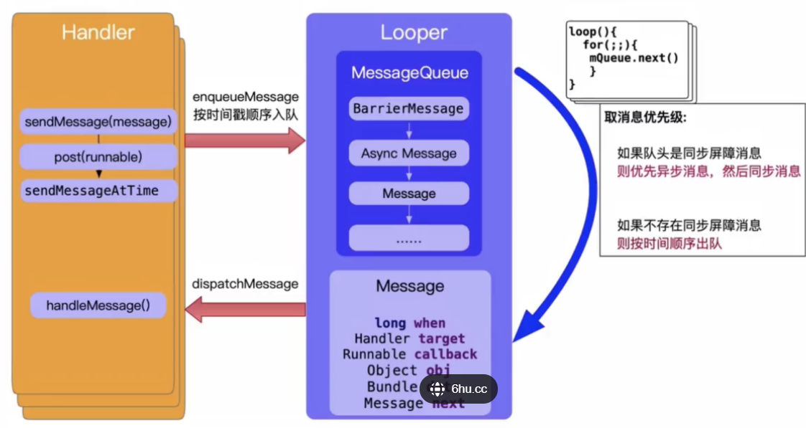

# Handler

## 1.什么是handler

**Handler** 用于线程间通信的消息传递机制。Handler其实就是在主线程起一个子线程，子线程运行并生成 **Message**，**Looper** 获取Message并传递给Handler，Handler逐个获取子线程中的Message。

Binder/Socker用于进程间通信，而Handler消息机制用于同进程的线程间通信。

只要有异步线程与主线程通信的地方就一定会Handler。在多线程的应用场景中，将工作线程中需要更新UI的操作信息传递到UI主线程。

## 2.Handler的相关概念

1. Message:代表一个行为What或者遗传动作Runnable，每一个消息在加入消息队列时，都有明确的目标Handler
2. ThreadLocal:线程本地存储区（简称TLS），每个线程都有自己私有的本地存储区，不同线程之间彼此不能访问对方的TLS区域。ThreadLocal的作用是提供线程内的局部变量TLS，这种变量在线程的生命周期内起作用，每一个线程存在线程隔离。
3. MessageQueue（C层和Java层都有实现）：以队列的形式对外提供插入和删除的工作，其内部结构是以双向链表的形式存储消息的。
4. Looper（C层和Java层都有实现）：Looper负责从消息队列中循环取出消息然后把消息交给Handler处理。
5. Handler：消息的真正处理者，具备获取消息、发送消息、处理消息、移除消息等功能。

## 3.消息机制

