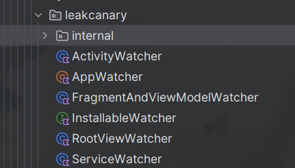
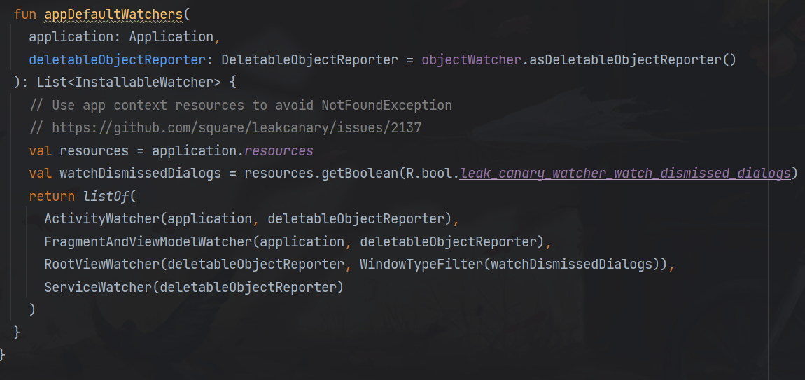

# LeakCanary原理分析

## 1. LeakCanary的组成：

### **总结架构层级**
| 模块         | 核心组件/类                    | 功能关联             |
| ------------ | ------------------------------ | -------------------- |
| 监控模块     | ActivityDestroyWatcher         | 监听组件生命周期     |
| 对象观察模块 | ObjectWatcher                  | 跟踪弱引用和引用队列 |
| 堆转储模块   | HeapDumper                     | 生成堆快照文件       |
| 堆分析模块   | Shark/HeapAnalyzer             | 解析泄漏路径         |
| 结果展示模块 | DisplayLeakService             | 展示泄漏详情         |
| 基础设施模块 | MainProcessAppWatcherInstaller | 自动初始化和配置管理 |

## 2. LeakCanary监听泄漏的核心原理

`LeakCanary` 的核心原理是利用Java的 `弱引用` 和 `引用队列`。弱引用的特性是当对象只有弱引用时，GC就会回收它。LeakCanary通过监听 `Activity` 或 `Fragment` 、`ViewModel`、`RootView`、`Service`的销毁，然后创建对应的弱引用，并关联一个引用队列。如果在Activity销毁后，弱引用没有被加入队列，说明可能泄漏了。




举一个通俗的比喻：你在快递站寄出了一个包裹（Activity/Fragment），正常的流程应该是：
1. 你寄出后，快递员（GC）来及时取走（回收内存）
2. 如果有包裹长时间未被取走（内存泄漏），就发出报警。

在这个过程中，`LeakCanary` 的检测机制就像快递站的监控系统：
- 标记包裹：每个包裹贴上[弱引用]标签（容易被撕掉，代表容易被回收）
- 定期检查：过段时间检查标签是否还在（未被回收）
- 报警分析：如果标签仍在，说明快递员没来取（GC未回收），触发报警并分析原因。

早期的版本需要在应用 `Application` 的 `onCreate` 中处理 `LeakCanary` 的初始化, 在新版本中为了降低接入的成本，将 `LeakCanary` 的初始化放在了库定义的 `AppWatcherInstaller` 中，原理是利用 `ContentProvider` 的 `onCreate` 的初始化时机早于 `Application` 中的 `onCreate`(晚于 `Application` 的 `attchBaseContext`)。

## 3. 技术原理详解

1. 标记阶段：监听销毁 + 创建弱引用
   - 监听对象的销毁：通过 `ActivityLifecycleCallbacks` 监听Activity/Fragment的 `onDestory()` 事件
::: code-group
``` kotlin
// Application
@HiltAndroidApp
class LeakCanaryApp : Application() {

  override fun onCreate() {
    super.onCreate()
    registerActivityLifecycleCallbacks(ActivityProviderCallbacks())
  }
}

// ActivityProviderCallbacks
class ActivityProviderCallbacks : ActivityLifecycleCallbacks {

  override fun onActivityCreated(
    activity: Activity,
    savedInstanceState: Bundle?
  ) {
    CurrentActivityProvider.onActivityCreated(activity)
  }

  override fun onActivityDestroyed(activity: Activity) {
    CurrentActivityProvider.onActivityDestroyed(activity)
  }

  override fun onActivityStarted(activity: Activity) = Unit

  override fun onActivityResumed(activity: Activity) = Unit

  override fun onActivityPaused(activity: Activity) = Unit

  override fun onActivityStopped(activity: Activity) = Unit

  override fun onActivitySaveInstanceState(activity: Activity, outState: Bundle) = Unit
}
```
:::

   - 创建弱引用标记：在对象销毁时，`LeakCanary` 会为它创建一个带有唯一标识的弱引用，并关联到一个引用队列（`ReferenceQueue`）
2. 追踪阶段：延迟检查 + 强制GC
   - 延迟等待：销毁后等待5秒（让GC有机会回收对象）
   - 主动触发GC：若发现弱引用未进入队列（未被回收），手动触发一次GC再次确认。
   - 确认泄漏：两次检查后对象仍然未被回收，则判定未内存泄漏。
3. 分析阶段：转储内存 + 逆向追踪
   - 生成内存快照：调用 `Debug.dumpHprofData()` 生成 `.hprof` 文件。
   - 解析引用链：使用 `Shark` 库分析快照，找到泄漏对象的GC Root（如静态变量、线程等）的强引用路径，精确定位泄漏点。
4. 通知栏发送可视化路径：发送通知提醒开发者存在内存泄漏，并展示泄漏路径。

源码解析详见：
[LeakCanary源码分析](LeakCanary源码分析.md "可选标题")