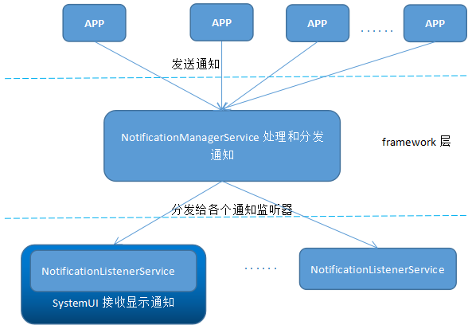

# Notification从发送到显示的流程简析

## 1. Notification架构

Notificatio主要由三部分组成：发送/更新/取消通知的应用app、系统通知服务、`NotificationManagerService` 和 通知监听器 `NotificationListenerService`。应用可以调用 `NotificationManager.notify(int, notification)` 发送通知到系统框架层，框架层, 框架层中的 NoticationManagerSevice 对通知进行处理，判断是否拦截通知、播放声音、振动、调用通知灯等，再将通知发送给各个通知监听器 NotificationnService。SystemUI作为最重要的通知监听器，在接收到通知后会对通知UI进行更新显示。

