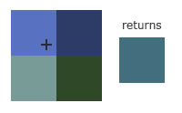

# OpenGL-纹理
我们已经了解到，我们可以为每个顶点添加颜色来增加图形的细节，从而创建出有趣的图像。但是，如果想让图形看起来更真实，我们就必须有足够多的顶点，从而指定足够多的颜色。这将会产生很多额外开销，因为每个模型都会需求更多的顶点，每个顶点又需求一个颜色属性。

艺术家和程序员更喜欢使用纹理(Texture)。纹理是一个2D图片（甚至也有1D和3D的纹理），它可以用来添加物体的细节；你可以想象纹理是一张绘有砖块的纸，无缝折叠贴合到你的3D的房子上，这样你的房子看起来就像有砖墙外表了。因为我们可以在一张图片上插入非常多的细节，这样就可以让物体非常精细而不用指定额外的顶点。

除了图像以外，纹理也可以被用来储存大量的数据，这些数据可以发送到着色器上，但是这不是我们现在的主题。


为了能够把纹理映射(Map)到三角形上，我们需要指定三角形的每个顶点各自对应纹理的哪个部分。这样每个顶点就会关联着一个纹理坐标(Texture Coordinate)，用来标明该从纹理图像的哪个部分采样（译注：采集片段颜色）。之后在图形的其它片段上进行片段插值(Fragment Interpolation)。

纹理坐标在x和y轴上，范围为0到1之间（注意我们使用的是2D纹理图像）。使用纹理坐标获取纹理颜色叫做采样(Sampling)。纹理坐标起始于(0, 0)，也就是纹理图片的左下角，终始于(1, 1)，即纹理图片的右上角。下面的图片展示了我们是如何把纹理坐标映射到三角形上的。


我们为三角形指定了3个纹理坐标点。如上图所示，我们希望三角形的左下角对应纹理的左下角，因此我们把三角形左下角顶点的纹理坐标设置为(0, 0)；三角形的上顶点对应于图片的上中位置所以我们把它的纹理坐标设置为(0.5, 1.0)；同理右下方的顶点设置为(1, 0)。我们只要给顶点着色器传递这三个纹理坐标就行了，接下来它们会被传片段着色器中，它会为每个片段进行纹理坐标的插值。

纹理坐标看起来就像这样：

``` java
float texCoords[] = {
    0.0f, 0.0f, // 左下角
    1.0f, 0.0f, // 右下角
    0.5f, 1.0f // 上中
};
```

对纹理采样的解释非常宽松，它可以采用几种不同的插值方式。所以我们需要自己告诉OpenGL该怎样对纹理采样。

## 纹理环绕方式
纹理坐标的范围通常是从(0, 0)到(1, 1)，那如果我们把纹理坐标设置在范围之外会发生什么？OpenGL默认的行为是重复这个纹理图像（我们基本上忽略浮点纹理坐标的整数部分），但OpenGL提供了更多的选择：

| 环绕方式        |      描述      |
| ------------- | :-----------: |
| GL_REPEAT      | 对纹理的默认行为，重复纹理图像。 |
| GL_MIRRORED_REPEAT      |   和GL_REPEAT一样，但每次重复图片是镜像放置的。    |
| GL_CLAMP_TO_EDGE |   纹理坐标会被约束在0到1之间，超出的部分会重复纹理坐标的边缘，产生一种边缘被拉伸的效果。    |
| GL_CLAMP_TO_BORDER |   超出的坐标为用户指定的边缘颜色。    |

当纹理坐标超出默认范围时，每个选项都有不同的视觉效果输出。我们来看看这些纹理图像的例子：


前面提到的每个选项都可以使用glTexParameter*函数对单独的一个坐标轴设置（s、t（如果是使用3D纹理那么还有一个r）它们和x、y、z是等价的）：

``` java
glTexParameteri(GL_TEXTURE_2D, GL_TEXTURE_WRAP_S, GL_MIRRORED_REPEAT);
glTexParameteri(GL_TEXTURE_2D, GL_TEXTURE_WRAP_T, GL_MIRRORED_REPEAT);
```

第一个参数指定了纹理目标；我们使用的是2D纹理，因此纹理目标是GL_TEXTURE_2D。第二个参数需要我们指定设置的选项与应用的纹理轴。我们打算配置的是WRAP选项，并且指定S和T轴。最后一个参数需要我们传递一个环绕方式(Wrapping)，在这个例子中OpenGL会给当前激活的纹理设定纹理环绕方式为GL_MIRRORED_REPEAT。

如果我们选择GL_CLAMP_TO_BORDER选项，我们还需要指定一个边缘的颜色。这需要使用glTexParameter函数的fv后缀形式，用GL_TEXTURE_BORDER_COLOR作为它的选项，并且传递一个float数组作为边缘的颜色值：

``` java
float borderColor[] = { 1.0f, 1.0f, 0.0f, 1.0f };
glTexParameterfv(GL_TEXTURE_2D, GL_TEXTURE_BORDER_COLOR, borderColor);
```

## 纹理过滤

纹理坐标不依赖于分辨率(Resolution)，它可以是任意浮点值，所以OpenGL需要知道怎样将纹理像素(Texture Pixel，也叫Texel，译注1)映射到纹理坐标。当你有一个很大的物体但是纹理的分辨率很低的时候这就变得很重要了。你可能已经猜到了，OpenGL也有对于纹理过滤(Texture Filtering)的选项。纹理过滤有很多个选项，但是现在我们只讨论最重要的两种：**GL_NEAREST**和**GL_LINEAR**。

::: tip
Texture Pixel也叫Texel，你可以想象你打开一张.jpg格式图片，不断放大你会发现它是由无数像素点组成的，这个点就是纹理像素；注意不要和纹理坐标搞混，纹理坐标是你给模型顶点设置的那个数组，OpenGL以这个顶点的纹理坐标数据去查找纹理图像上的像素，然后进行采样提取纹理像素的颜色。
:::

GL_NEAREST（也叫邻近过滤，Nearest Neighbor Filtering）是OpenGL默认的纹理过滤方式。当设置为GL_NEAREST的时候，OpenGL会选择中心点最接近纹理坐标的那个像素。下图中你可以看到四个像素，加号代表纹理坐标。左上角那个纹理像素的中心距离纹理坐标最近，所以它会被选择为样本颜色：


GL_LINEAR（也叫线性过滤，(Bi)linear Filtering）它会基于纹理坐标附近的纹理像素，计算出一个插值，近似出这些纹理像素之间的颜色。一个纹理像素的中心距离纹理坐标越近，那么这个纹理像素的颜色对最终的样本颜色的贡献越大。下图中你可以看到返回的颜色是邻近像素的混合色：


那么这两种纹理过滤方式有怎样的视觉效果呢？让我们看看在一个很大的物体上应用一张低分辨率的纹理会发生什么吧（纹理被放大了，每个纹理像素都能看到）：


GL_NEAREST产生了颗粒状的图案，我们能够清晰看到组成纹理的像素，而GL_LINEAR能够产生更平滑的图案，很难看出单个的纹理像素。GL_LINEAR可以产生更真实的输出，但有些开发者更喜欢8-bit风格，所以他们会用GL_NEAREST选项。

当进行放大(Magnify)和缩小(Minify)操作的时候可以设置纹理过滤的选项，比如你可以在纹理被缩小的时候使用邻近过滤，被放大时使用线性过滤。我们需要使用glTexParameter*函数为放大和缩小指定过滤方式。这段代码看起来会和纹理环绕方式的设置很相似：

``` java
glTexParameteri(GL_TEXTURE_2D, GL_TEXTURE_MIN_FILTER, GL_NEAREST);
glTexParameteri(GL_TEXTURE_2D, GL_TEXTURE_MAG_FILTER, GL_LINEAR);
```

