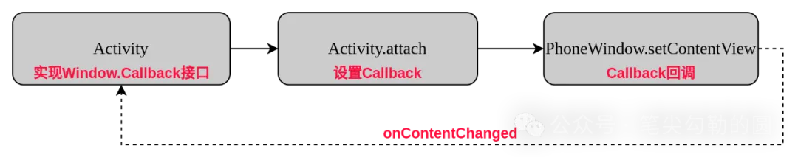
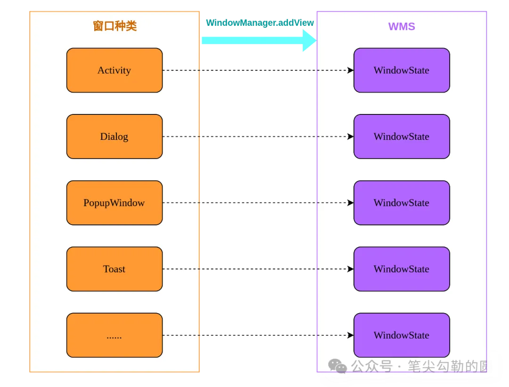
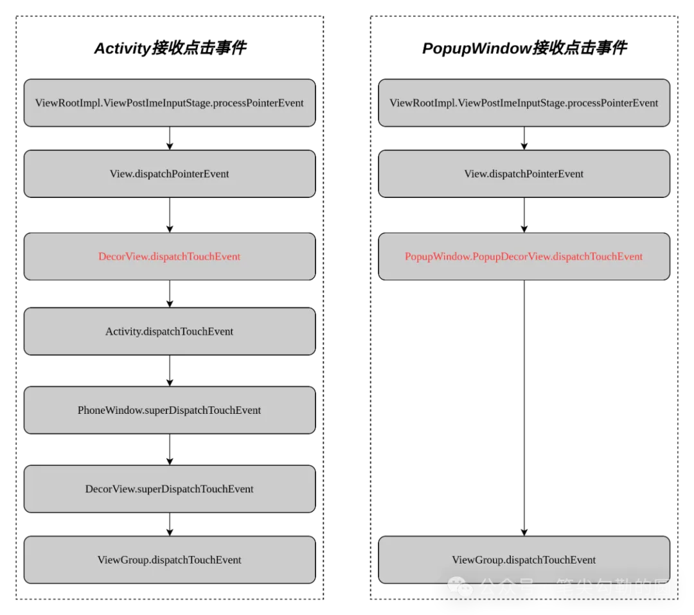

# PhoneWindow

Activity和Dialog在显示过程中都创建了`PhoneWindow`对象，而`PopupWindow`和`Toast`却没有。

## 1.PhoneWindow的作用

Window类的注释：

``` java
/**
 * Abstract base class for a top-level window look and behavior policy.  An
 * instance of this class should be used as the top-level view added to the
 * window manager. It provides standard UI policies such as a background, title
 * area, default key processing, etc.
 *
 * <p>The framework will instantiate an implementation of this class on behalf of the application.
 */
public abstract class Window {......}
```

根据注释所说，Window类是顶级窗口外观和行为策略的抽象基类，提供标准的UI策略，如背景、标题区域、默认行为处理等等。也就是说，Window类会提供一套通用的规则、模板以及行为策略。

1. 支持LayoutParams布局参数

Window类定义了一套默认的布局参数mWindowAttributes：

``` java
private final WindowManager.LayoutParams mWindowAttributes =
        new WindowManager.LayoutParams();


public LayoutParams() {
    super(LayoutParams.MATCH_PARENT, LayoutParams.MATCH_PARENT);
    type = TYPE_APPLICATION;
    format = PixelFormat.OPAQUE;
}
```
这里默认初始化了窗口类型等参数。还记得Dialog的show方法吗？

``` java
public void show() {
......
    WindowManager.LayoutParams l = mWindow.getAttributes();
......
}
```

这里调用了Window的getAttributes方法，返回了窗口的默认属性，也就是上面的mWindowAttributes对象。此外，Window类还定义了一系列针对LayoutParams的设置函数：

``` java

// 设置宽高
public void setLayout(int width, int height) {
    final WindowManager.LayoutParams attrs = getAttributes();
    attrs.width = width;
    attrs.height = height;
    dispatchWindowAttributesChanged(attrs);
}

// 设置gravity
public void setGravity(int gravity) {
    final WindowManager.LayoutParams attrs = getAttributes();
    attrs.gravity = gravity;
    dispatchWindowAttributesChanged(attrs);
}

// 设置类型
public void setType(int type) {
    final WindowManager.LayoutParams attrs = getAttributes();
    attrs.type = type;
    dispatchWindowAttributesChanged(attrs);
}

// 设置输入法模式
public void setSoftInputMode(int mode) {
    final WindowManager.LayoutParams attrs = getAttributes();
    if (mode != WindowManager.LayoutParams.SOFT_INPUT_STATE_UNSPECIFIED) {
        attrs.softInputMode = mode;
        mHasSoftInputMode = true;
    } else {
        mHasSoftInputMode = false;
    }
    dispatchWindowAttributesChanged(attrs);
}
```
这里可以针对窗口的宽高、gravity、类型、输入法模式等进行设置。例如在Activity某个button的click事件里面调用设置宽高的方法：

``` java
MainActivity.this.getWindow().setLayout(500,500);
```

因此，Window类可以方便的设置LayoutParams布局参数，作为子类，PhoneWindow亦如此。

DecorView模板与解耦

在分析Activity和Dialog的创建过程中，我们调用setContentView方法时，最终源码都是调用了PhoneWindow的setContentView方法，然后里面创建了DecorView。想到这里，大家有没有觉得拥有PhoneWindow对象就等于拥有了DecorView了呢？是的，在某种程度上讲，PhoneWindow提供了一套DecorView模板，支持显示一些风格相对统一的UI布局。比如两个Activity，设置了不同的contentView，那么它们除了contentView不一样，整体的UI风格主题等看起来都是一样的，可以理解为这就是PhoneWindow的View模板作用。

还记得PhoneWindow的installDecor方法吗？里面除了创建DecorView对象，接着又创建了mContentParent：

``` java
private void installDecor() {
    mForceDecorInstall = false;
    if (mDecor == null) {
        mDecor = generateDecor(-1);
        mDecor.setDescendantFocusability(ViewGroup.FOCUS_AFTER_DESCENDANTS);
        mDecor.setIsRootNamespace(true);
        if (!mInvalidatePanelMenuPosted && mInvalidatePanelMenuFeatures != 0) {
            mDecor.postOnAnimation(mInvalidatePanelMenuRunnable);
        }
    } else {
        mDecor.setWindow(this);
    }
    if (mContentParent == null) {
        // 生成布局
        mContentParent = generateLayout(mDecor);
    }
}
```

在前文中，generateLayout方法我们并未展开，里面主要是生成一些UI模板特性。今天我们来看看：

``` java
protected ViewGroup generateLayout(DecorView decor) {
    // 得到窗口风格
    TypedArray a = getWindowStyle();
......
    // 是否是浮动窗口
    mIsFloating = a.getBoolean(R.styleable.Window_windowIsFloating, false);
    int flagsToUpdate = (FLAG_LAYOUT_IN_SCREEN|FLAG_LAYOUT_INSET_DECOR)
            & (~getForcedWindowFlags());
    if (mIsFloating) {
        // 设置宽高为wrap_content
        setLayout(WRAP_CONTENT, WRAP_CONTENT);
        setFlags(0, flagsToUpdate);
    } else {
        setFlags(FLAG_LAYOUT_IN_SCREEN|FLAG_LAYOUT_INSET_DECOR, flagsToUpdate);
        getAttributes().setFitInsetsSides(0);
        getAttributes().setFitInsetsTypes(0);
    }
    // 是否没有标题栏
    if (a.getBoolean(R.styleable.Window_windowNoTitle, false)) {
        requestFeature(FEATURE_NO_TITLE);
    // 是否有动作栏
    } else if (a.getBoolean(R.styleable.Window_windowActionBar, false)) {
        requestFeature(FEATURE_ACTION_BAR);
    }
......
    // 是否全屏显示
    if (a.getBoolean(R.styleable.Window_windowFullscreen, false)) {
        setFlags(FLAG_FULLSCREEN, FLAG_FULLSCREEN & (~getForcedWindowFlags()));
    }
    // 状态栏透明度
    if (a.getBoolean(R.styleable.Window_windowTranslucentStatus,
            false)) {
        setFlags(FLAG_TRANSLUCENT_STATUS, FLAG_TRANSLUCENT_STATUS
                & (~getForcedWindowFlags()));
    }
    // 导航栏透明度
    if (a.getBoolean(R.styleable.Window_windowTranslucentNavigation,
            false)) {
        setFlags(FLAG_TRANSLUCENT_NAVIGATION, FLAG_TRANSLUCENT_NAVIGATION
                & (~getForcedWindowFlags()));
    }
    }
......
```
这个方法很长，大家可以看看代码里我的注释。整体来看，此方法定义了窗口的主题样式，比如是否悬浮、是否含有标题栏和动作栏、状态栏和导航栏透明度等等。因此可以说，PhoneWindow提供了一套UI模板，大大简化了布局外观的实现，且较好地解耦了Activity对于View的管理。

Window回调

在PhoneWindow.setContentView方法的最后出现了Callback，前文中未进行介绍，今天我们来看看：

``` java
public void setContentView(int layoutResID) {
......
    // 获取Callback实例
    final Callback cb = getCallback();
    if (cb != null && !isDestroyed()) {
        // 回调方法
        cb.onContentChanged();
    }
    mContentParentExplicitlySet = true;
}
```
这里首先获取了Callback，然后调用了Callback.onContentChanged方法，似乎是在通知谁内容发生了变更。我们来看看Callback的定义，在Window类里面：

``` java
public interface Callback {
    // 分发key事件
    public boolean dispatchKeyEvent(KeyEvent event);
......
    // 分发touch事件        
    public boolean dispatchTouchEvent(MotionEvent event);
......
    // 内容改变
    public void onContentChanged();
    }
```
这里的回调方法还挺多，除了我们上面说的onContentChanged方法外，还有Input事件的分发等等。那onContentChanged方法到底通知的是谁呢？既然Callback是由Window通知的，那设置Callback应该就在创建Window也就是PhoneWindow的时候。没错，我们以Activity为例，创建PhoneWindow是在Activity.attach方法中：

``` java
final void attach(Context context, ActivityThread aThread,
            Instrumentation instr, IBinder token, int ident,
            Application application, Intent intent, ActivityInfo info,
            CharSequence title, Activity parent, String id,
            NonConfigurationInstances lastNonConfigurationInstances,
            Configuration config, String referrer, IVoiceInteractor voiceInteractor,
            Window window, ActivityConfigCallback activityConfigCallback, IBinder assistToken,
            IBinder shareableActivityToken) {
......
    mWindow = new PhoneWindow(this, window, activityConfigCallback);
    mWindow.setWindowControllerCallback(mWindowControllerCallback);
    // 为当前Activity设置callback
    mWindow.setCallback(this);
    }
......
```
果然，这里调用了mWindow.setCallback(this)，this就是当前Activity，我们继续看看Activity的定义：

``` java
public class Activity extends ContextThemeWrapper
        implements LayoutInflater.Factory2,
        Window.Callback, KeyEvent.Callback,
        OnCreateContextMenuListener, ComponentCallbacks2,
        Window.OnWindowDismissedCallback,
        ContentCaptureManager.ContentCaptureClient {......}
```
一切都是那么的符合预期，Activity实现了Window.Callback接口，所以可以将自己设置成Callback对象。于是，当setContentView完成后，Activity就能收到onContentChanged回调啦。画个图：


（图示：Activity收到内容改变通知）

因此，Activity可以设置callback监听，当PhoneWindow无论是内容变更还是收到输入事件，都能够收到通知。这种模式可以很好地实现组件的并发性和响应性，同时也能实现代码的解耦。
了解了PhoneWindow的作用之后，大家想想为什么Activity和Dialog创建了PhoneWindow对象而PopupWindow和Toast却没有呢？本人认为，PhoneWindow具有设置布局参数、提供外观模板和对于复杂逻辑解耦的作用，Activity和Dialog的布局和逻辑相对复杂一些，因此需要PhoneWindow来管理，而PopupWindow和Toast其实均属于轻量级的弹出式窗口，一般不会用于过于复杂的布局场景，因此无需PhoneWindow来协助管理。

2 窗口的本质

从上节的分析来看，PhoneWindow的作用还挺大。那么，窗口到底是什么？没有创建PhoneWindow对象还能称之为窗口吗？

WMS角度的窗口

从WindowManagerService(WMS)的角度来看，窗口就是一个View树，跟你有没有创建PhoneWindow毫无关系。前文中我们说过，Activity、Dialog、PopupWindow和Toast最终都调用了WindowManager.addView方法，后面就会走到WMS去添加窗口。因此，Window类和PhoneWindow类更多的是提供一种窗口交互的抽象和实现，对于WMS而言，通过WindowManager.addView其实就是产生了新的窗口，在WMS侧会以WindowState的形式存在。综上所述，Activity、Dialog、PopupWindow、Toast以及其他通过WindowManager.addView添加的View树，都属于窗口。画一张图来感受一下这个关系：



（图示：窗口与WindowState一一对应）

看完这张图，想必大家对于窗口到底是什么有了清晰的认识。关于WMS部分我们后面会介绍。

窗口的点击事件

上一节我们说到Window的Callback中有多个回调方法，除了onContentChanged外还有点击事件分发方法dispatchTouchEvent。有人要问了，没有创建PhoneWindow的窗口，还能收到点击事件吗？我们用Activity和PopupWindow作为有无PhoneWindow的两种窗口来看一下。关于完整的点击事件流程我们介绍完窗口系列文章后再去讲，这里直接上结论，看图：



（图示：Activity和PopupWindow的点击事件）

上图中左右两边分别是点击Activity窗口和点击PopupWindow窗口的点击事件调用链。大家看出区别了吗？点击事件都是从ViewRootImpl过来，分歧点在于DecorView和PopupDecorView的dispatchTouchEvent处理逻辑不一样。图中我已经标红了，我们分别来看一下。

`DecorView的dispatchTouchEvent：`
``` java
public boolean dispatchTouchEvent(MotionEvent ev) {
    // 获取callback
    final Window.Callback cb = mWindow.getCallback();
    return cb != null && !mWindow.isDestroyed() && mFeatureId < 0
            ? cb.dispatchTouchEvent(ev) : super.dispatchTouchEvent(ev);
}
```
上一节已说，因为Activity注册了callback监听，这里通过PhoneWindow获取的cb对象就是Activity，因此下一步会走到Activity的dispatchTouchEvent方法。

接着看看PopupDecorView的dispatchTouchEvent方法：

``` java
public boolean dispatchTouchEvent(MotionEvent ev) {
    if (mTouchInterceptor != null && mTouchInterceptor.onTouch(this, ev)) {
        return true;
    }
    // 调用ViewGroup的方法
    return super.dispatchTouchEvent(ev);
}
```
这里会直接调用super.dispatchTouchEvent也就是ViewGroup的方法，后面就是正常的View树分发了。

大家发现没有，Activity事件分发中，DecorView是主动通过callback回调了Activity，然后才去逐渐进行View树的事件分发，而PopupWindow中的PopupDecorView是直接调用ViewGroup的方法开始View树的事件分发。因此，我们说Window.Callback机制可以处理点击事件，但是点击事件不一定需要PhoneWindow参与。这在某种程度上也证实了PhoneWindow对于窗口的生成是可以有而不是必须有，也佐证了前面我们说的窗口的本质是WindowManager添加View树而不是创建PhoneWindow对象。到此，大家对于窗口是什么肯定有了清晰且全面的认识。

3 总结

本篇从PhoneWindow入手，讲述了Window类和PhoneWindow类对于窗口的作用和意义，也进一步从系统层阐述了窗口的本质。大家理解了本篇的内容后，对于窗口是否有种豁然开朗的感觉呢？这对于后面学习WMS将会大有好处。好了，总结一下本篇的核心知识点吧：

1. Window类只是窗口交互的一种抽象封装，View树才是用户消息交互的实体。

2. PhoneWindow可以帮助管理页面布局，它拥有一系列设置布局参数的方法，方便我们调整布局。

3. PhoneWindow提供了一套DecorView模板，方便的形成一套风格相对统一的外观展示。

4. PhoneWindow可以设置和获取Callback的注册对象，当页面内容发生变更或者收到输入事件后可以通知注册的对象。

5. 拥有PhoneWindow对象不是产生窗口的必要条件，对于WMS来说，只要是通过WindowManager.addView都会产生新的窗口。

6. Activity、Dialog、PopupWindow、Toast以及其他调用WindowManager.addView的窗口，在WMS处均有WindowState对象与之一一对应，这也是窗口本质的一种体现。

7. 窗口的点击事件最终都会走到View树进行分发下去，有无PhoneWindow对象不影响事件传递。


