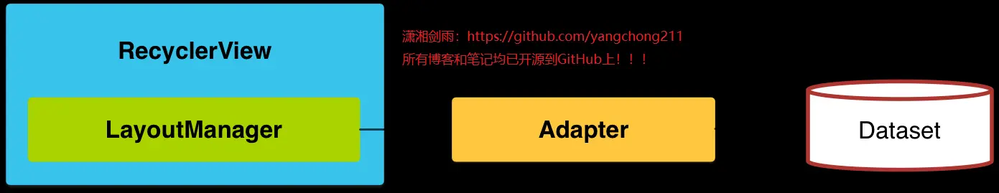
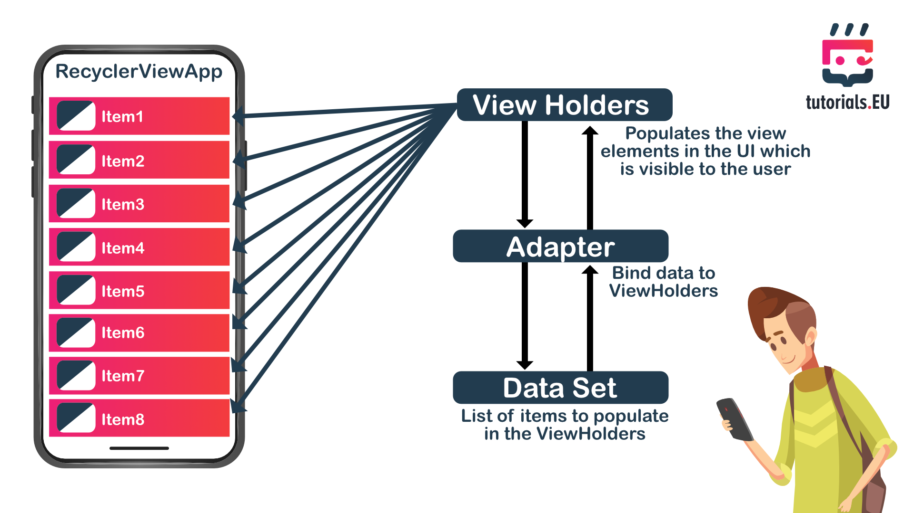
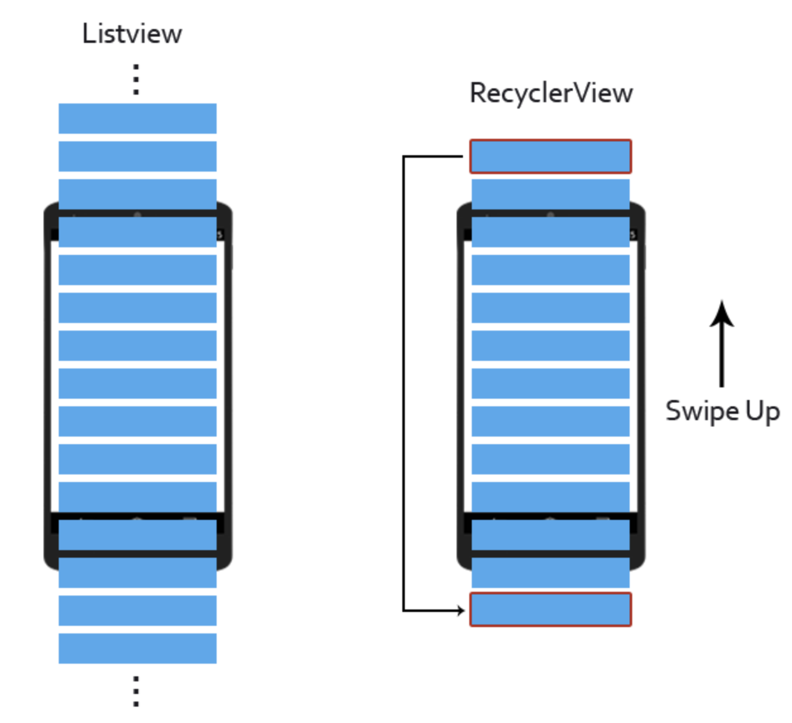

# RecyclerView知识点汇总

## 1. adapter的作用是什么，如何理解adapter的订阅模式

RecyclerView.Adapter - 处理数据集合并负责绑定视图
ViewHolder - 持有所有的用于绑定数据或者需要操作的View
LayoutManager - 负责摆放屎图等相关操作
ItemDecoration - 负责绘制item的分割线
ItemAnimator - 为item的一般操作添加动画效果




adapter的作用是什么

RecyclerView.Adapter扮演的角色
- 一是，根据不同ViewType创建与之相应的的Item-Layout
- 二是，访问数据集合并将数据绑定到正确的View上

adapter中需要重写的方法
public VH onCreateViewHolder(ViewGroup parent, int viewType)
创建Item视图，并返回相应的ViewHolder
public void onBindViewHolder(VH holder, int position)
绑定数据到正确的Item视图上。
public int getItemCount()
返回该Adapter所持有的Itme数量
public int getItemViewType(int position)
用来获取当前项Item(position参数)是哪种类型的布局

如何理解adapter订阅者模式

当时据集合发生改变时，我们通过调用.notifyDataSetChanged()，来刷新列表，因为这样做会触发列表的重绘。
- notifyDataSetChanged()源码

::: code-group
``` java
public final void notifyDataSetChanged() {
    mObservable.notifyChanged();
}

static class AdapterDataObservable extends Observable<AdapterDataObserver> {
    public boolean hasObservers() {
        return !mObservers.isEmpty();
    }

    public void notifyChanged() {
        for (int i = mObservers.size() - 1; i >= 0; i--) {
            mObservers.get(i).onChanged();
        }
    }

    public void notifyItemRangeChanged(int positionStart, int itemCount) {
        notifyItemRangeChanged(positionStart, itemCount, null);
    }

    public void notifyItemRangeChanged(int positionStart, int itemCount, Object payload) {
        for (int i = mObservers.size() - 1; i >= 0; i--) {
            mObservers.get(i).onItemRangeChanged(positionStart, itemCount, payload);
        }
    }

    public void notifyItemRangeInserted(int positionStart, int itemCount) {
        for (int i = mObservers.size() - 1; i >= 0; i--) {
            mObservers.get(i).onItemRangeInserted(positionStart, itemCount);
        }
    }
}


public static abstract class AdapterDataObserver {
    public void onChanged() {
        // Do nothing
    }

    public void onItemRangeChanged(int positionStart, int itemCount) {
        // do nothing
    }

    public void onItemRangeChanged(int positionStart, int itemCount, Object payload) {
        onItemRangeChanged(positionStart, itemCount);
    }
}

// setAdapter()源码中的setAdapterInternal(adapter, false, true)方法
public void setAdapter(Adapter adapter) {
    // bail out if layout is frozen
    setLayoutFrozen(false);
    setAdapterInternal(adapter, false, true);
    requestLayout();
}

private void setAdapterInternal(Adapter adapter, boolean compatibleWithPrevious,
        boolean removeAndRecycleViews) {
    if (mAdapter != null) {
        mAdapter.unregisterAdapterDataObserver(mObserver);
        mAdapter.onDetachedFromRecyclerView(this);
    }
    if (!compatibleWithPrevious || removeAndRecycleViews) {
        removeAndRecycleViews();
    }
    mAdapterHelper.reset();
    final Adapter oldAdapter = mAdapter;
    mAdapter = adapter;
    if (adapter != null) {
        //注册一个观察者RecyclerViewDataObserver
        adapter.registerAdapterDataObserver(mObserver);
        adapter.onAttachedToRecyclerView(this);
    }
    if (mLayout != null) {
        mLayout.onAdapterChanged(oldAdapter, mAdapter);
    }
    mRecycler.onAdapterChanged(oldAdapter, mAdapter, compatibleWithPrevious);
    mState.mStructureChanged = true;
    markKnownViewsInvalid();
}

// 当数据变更时，调用notify**方法时，Adapter内部的被观察者会遍历通知已经注册的观察者的对应方法，这时界面就会响应变更。
```
:::

## 2. RecyclerView 和 ListView 有什么不同？优缺点？



## 3. ViewHolder的作用是什么，如何复用，何时停止调用OncreateViewHolder呢？

## 4. LayoutManager作用是什么？LayoutManager样式有哪些？setLayoutManager源码里做了什么？

## 5. SnapHelper主要是做什么用的？SnapHelper是怎么实现支持RecyclerView的对齐方式？

## 6. SpanSizeLookup的作用是干什么的？SpanSizeLookup如何使用？SpanSizeLookup实现原理如何理解？

## 7. 上拉加载更多的功能是如何做的？添加滚动监听事件需要注意什么问题？网格布局上拉加载如何优化？

## 8. RecyclerView绘制原理如何理解？性能优化本质是什么？RecyclerView绘制原理过程大概是怎样的？

## 9. RecyclerView的Recyler是如何实现ViewHolder的缓存？如何理解recyclerView三级缓存是如何实现的？

## 10. 屏幕滑动(状态是item状态可见，不可见，即将可见变化)时三级缓存是如何理解的？adapter中的几个方法是如何变化？

## 11. SnapHelper有哪些重要的方法，其作用就是是什么？LinearSnapHelper中是如何实现滚动停止的？

## 12. LinearSnapHelper代码中calculateDistanceToFinalSnap作用是什么？那么out[0]和out[1]分别指什么？

## 14. 如何实现可以设置分割线的颜色，宽度，以及到左右两边的宽度间距的自定义分割线，说一下思路？

## 15. 如何实现复杂type首页需求？如果不封装会出现什么问题和弊端？如何提高代码的简便性和高效性？

## 16. 关于item条目点击事件在onCreateViewHolder中写和在onBindViewHolder中写有何区别？如何优化？

## 17. RecyclerView滑动卡顿原因有哪些？如何解决嵌套布局滑动冲突？如何解决RecyclerView实现画廊卡顿？

## 18. RecyclerView常见的优化有哪些？实际开发中都是怎么做的，优化前后对比性能上有何提升？

## 19. 如何解决RecyclerView嵌套RecyclerView条目自动上滚的Bug？如何解决ScrollView嵌套RecyclerView滑动冲突？

## 20. 如何处理ViewPager嵌套水平RecyclerView横向滑动到底后不滑动ViewPager？如何解决RecyclerView使用Glide加载图片导致图片错乱问题？
