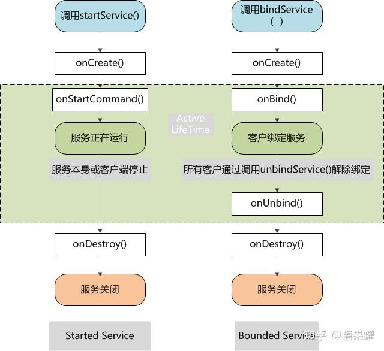

（1）service整体的生命时间是从onCreate()被调用开始，到onDestroy()方法返回为止。和activity一样，service在onCreate()中进行它的初始化工作，在onDestroy()中释放残留的资源比如，一个音乐播放service可以在onCreate()中创建播放音乐的线程，在onDestory()中停止这个线程onCreate()和onDestroy()会被所有的service调用，不论service是通过startService()还是bindService()建立
（2）service积极活动的生命时间（active lifetime）是从onStartCommand()或onBind()被调用开始，它们各自处理由startService()或bindService()方法传过来的Intent对象如果service是被开启的，那么它的活动生命周期和整个生命周期一同结束。如果service是被绑定的，那么它的活动生命周期是在onUnbind()方法返回后结束。

