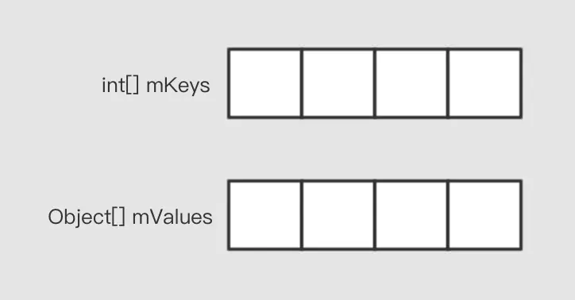
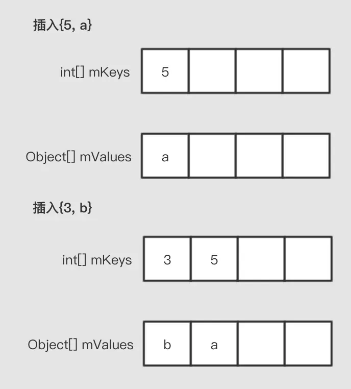
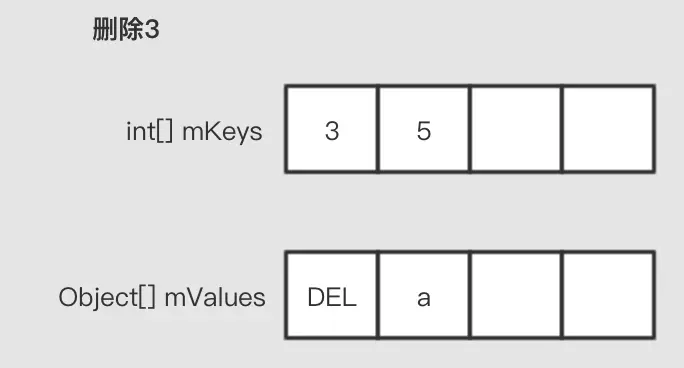

# SparseArray

## 1. SparseArray与HashMap比较

Android提供了SparseArray，这也是一种KV形式的数据结构，提供了类似于Map的功能。但是实现方法却和HashMap不一样。它与Map相比，可以说是各有千秋。

**优点：** 
1. 占用内存空间小，没有额外的Entry对象
2. 没有Auto-Boxing

**缺点：**
1. 不支持任意类型的Key，只支持数字类型（int，long）
2. 数据条数特别多的时候，效率会低于HashMap，因为它是基于二分查找去找数据的

总的来说，SparseArray适用于数据量不是很大，同时Key又是数字类型的场景。

## 2. SparseArray的实现与特性

它使用的是两个数组来存储数据，一个数组存储key，另一个数组来存储value。

**初始化的状态**
内部有两个数组变量来存储对应的数据，mKeys用来存储key，mValues用来存储泛型数据，注意，这里使用了Object[]来存储泛型数据，而不是T[]。

**插入数据**
如下图所示，插入数据，总是“紧贴”数组的左侧，换句话说，总是从最左边的一个空位开始使用。

另一个值得注意的事情是，key总是有序的，不管经过多少次插入，key数组中，key总是从小到大排列。

**扩容**
当一直插入数据，快满的时候，就会自动的扩容，创建一个更大的数组出来，将现有的数据全部复制过去，再插入新的数据。这是基于数组实现的数据结构共同的特性。

**删除**
删除是使用标记删除的方法，直接将目标位置的有效元素设置为一个DELETED标记对象。

**查询数据**
比如我们查5这个数据get(5)，那么它是在mKeys中去查找是否存在5，如果存在，返回index，然后用这个index在对应的mValues取出对应的值就好了。

