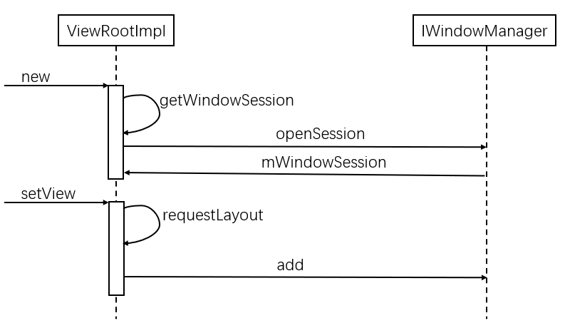

# WMS中窗口的注册

首先先要明确一下PhoneWindow的概念和作用：其继承自Window类，表达了窗口的一种约束机制；而WMS中的Window则是一个抽象的概念，其有一个WindowState用于描述状态。可以简单理解为：PhoneWindow是应用进程端对于“窗口”的描述，WindowState则是WMS中对“窗口”的描述。

当ViewRootImpl构造的时候，它还需要建立与WMS通信的双向通道。分别是：
1. ViewRootImpl->WMS:IwindowSession;
2. WMS->ViewRootImpl:Iwindow。

因为WMS是在ServiceManager中注册的实名BinderServer。因而任何程序都能在任何时候通过向ServiceManager发起查询来获取WMS的服务。而IWindowSession和IWindow则是两个匿名的BinderServer，它们需要借助一定的方式才能提供服务。

流程图如下：

步骤1. ViewRootImpl在构造函数中，首先会利用WMS提供的openSession接口打开一条session通道，并存储到内部的mWindowSession变量中：

源码

函数getWindowSession负责建立应用程序与WMS之间的Session连接：

源码

如果sWindowSession不为空，那么就没有必要再重复打开Session连接了；否则需要先通过ServiceManager来获取WMS服务，再利用它提供的OpenSession接口来建立与WMS的通道。

步骤2. addView在最后会调用ViewRootImpl.setView。这个函数一方面会将DecorView，也就是View树的根设置到ViewRootI名片；
中；另一方面会向WMS申请注册一个窗口，同时将ViewRootImpl中的W（Iwindow的子类）对象作为参数传递给WMS。

关键的一步就是通过IwindowSession接口提供的addToDisplay向WMS申请注册一个窗口。

