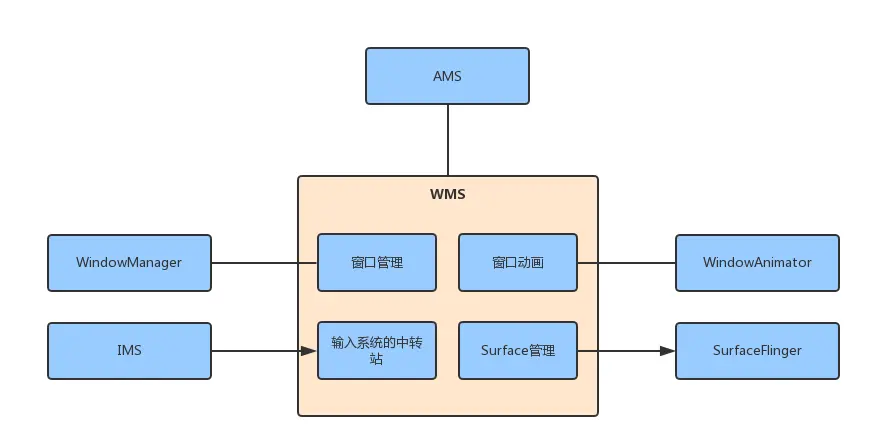
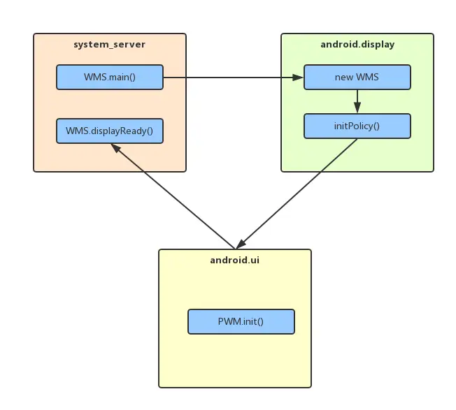

# WindowManagerService（WMS）

## 1. WMS的功能概述

从计算机的IO系统角度分析，WMS至少要完成两个功能：
1. 全局的窗口管理（output）窗口管理属于输出的部分，应用程序的显示请求在SurfaceFlinger和WMS的协助下有序地输出给物理屏幕或者其他显示设备。
2. 全局的事件管理派发（input）事件派发属于WMS的输入功能。这同时也是WMS区别于SurfaceFlinger的一个重要因素，因为后者只做有关于显示的事情，而WMS则还要兼顾到对输入事件的派发。WMS的事件源包括但不限于：键盘、屏幕触控与点按事件等等。

WMS由SystemServer负责启动，就意味着WMS的启动时机相对较晚，那么在WMS还没有运行之前，终端显示屏应该是一团黑的。实际上，因为在WMS启动前系统只需要显示开机画面，它们都有特殊的方式来向屏幕输出图像。比如BootAnimation直接通过 OpenGL ES 与 SurfaceFlinger 的配合来完成的。这从侧面说明要想在Android中显示UI，不一定要通过WMS。而且WMS直到系统关机才能退出，发生异常必须要自动重启。



## 2. 主要职责

1. 窗口管理

- 负责创建、销毁和管理应用程序的窗口。每个应用程序窗口都由 `WMS` 进行统一管理，包括窗口的大小、位置、层级等属性。
- 确定窗口的显示顺序和层级关系，以确保正常的窗口叠加和显示效果。

2. 输入事件和分发

- 接收来自输入设备（触摸屏、键盘）等输入事件，并将这些事件分发给相应的窗口进行处理。
- 根据窗口的焦点状态和层级关系，确定哪个窗口应该接收特定的输入事件。

3. 动画管理

- 负责处理窗口的动画效果，如窗口的打开、关闭、切换等动画。
- 协调不同窗口之间的动画，以提供流畅的用户体验。

4. 屏幕布局和调整

- 根据设备的屏幕尺寸和分辨率，调整窗口的大小和布局，以适应不同的显示环境。
- 处理屏幕旋转、分屏等情况，确保窗口能正确调整和显示。

## 1. WMS的启动与初始化

WMS的启动过程发生在Android系统的启动阶段，由 `SystemServer` 进程负责启动。SystemServer进程负责启动所有核心的系统服务。WMS是在SystemServer的 `startOtherServices()` 方法中启动的。WindowManagerService没有继承与SystemService，而是直接继承了`IWindowManager.Stub`接口。WMS通过 `WindowManagerService.main` 方法创建，这个方法会实例化 `WindowManagerService` 对象注册到 `ServiceManager` 中，并调用其构造函数实现初始化，这样其他服务就能通过 ServiceManager 获取 WMS 的引用。

::: code-group
``` java
// frameworks/base/services/java/com/android/server/SystemServer.java

    private void startOtherServices(@NonNull TimingsTraceAndSlog t) {
            // 2.1 创建WMS
            wm = WindowManagerService.main(context, inputManager, !mFirstBoot, mOnlyCore,
                    new PhoneWindowManager(), mActivityManagerService.mActivityTaskManager);
            // 2.2 进行初始化
            wm.onInitReady();
            // 2.3 设置InputCallback接口
            inputManager.setWindowManagerCallbacks(wm.getInputManagerCallback());
            // 2.4 进行Display配置更新
            wm.displayReady();
            // 2.5 系统启动完成
            wm.systemReady();
            // 2.6 计算Configuration
        final Configuration config = wm.computeNewConfiguration(DEFAULT_DISPLAY);
        DisplayMetrics metrics = new DisplayMetrics();
        context.getDisplay().getMetrics(metrics);
        context.getResources().updateConfiguration(config, metrics);
    }
```
:::

### 1.1 WMS#main()创建WMS对象

在执行main()方法后，最终会在android.display线程去创建WMS的实例：

::: code-group
``` java
// frameworks/base/services/core/java/com/android/server/wm/WindowManagerService.java

    public static WindowManagerService main(final Context context, final InputManagerService im,
            final boolean showBootMsgs, final boolean onlyCore, WindowManagerPolicy policy,
            ActivityTaskManagerService atm) {
        return main(context, im, showBootMsgs, onlyCore, policy, atm,
                SurfaceControl.Transaction::new, Surface::new, SurfaceControl.Builder::new);
    }

    /**
     * Creates and returns an instance of the WindowManagerService. This call allows the caller
     * to override factories that can be used to stub native calls during test.
     */
    @VisibleForTesting
    public static WindowManagerService main(final Context context, final InputManagerService im,
            final boolean showBootMsgs, final boolean onlyCore, WindowManagerPolicy policy,
            ActivityTaskManagerService atm, Supplier<SurfaceControl.Transaction> transactionFactory,
            Supplier<Surface> surfaceFactory,
            Function<SurfaceSession, SurfaceControl.Builder> surfaceControlFactory) {
        // DisplayThread就是android.display线程
        // runWithScissors的执行会导致system_server线程等待android.display执行完再进行下一步操作。
        DisplayThread.getHandler().runWithScissors(() ->
                sInstance = new WindowManagerService(context, im, showBootMsgs, onlyCore, policy,
                        atm, transactionFactory, surfaceFactory, surfaceControlFactory), 0);
        return sInstance;
    }
------------------------
    private WindowManagerService(Context context, InputManagerService inputManager,
            boolean showBootMsgs, boolean onlyCore, WindowManagerPolicy policy,
            ActivityTaskManagerService atm, Supplier<SurfaceControl.Transaction> transactionFactory,
            Supplier<Surface> surfaceFactory,
            Function<SurfaceSession, SurfaceControl.Builder> surfaceControlFactory) {
        ......

        // Tranaction对象
        mTransaction = mTransactionFactory.get();

        // 创建WindowAnimator对象
        mAnimator = new WindowAnimator(this);
        // 创建RootWindowContainer对象
        mRoot = new RootWindowContainer(this);
        // 创建WindowSurfacePlacer对象
        mWindowPlacerLocked = new WindowSurfacePlacer(this);
        // 创建TaskSnapshotController对象
        mTaskSnapshotController = new TaskSnapshotController(this);
        // 创建DisplayWindowListenerController对象
        mDisplayNotificationController = new DisplayWindowListenerController(this);
        ......
        // 创建SurfaceAnimationRunner对象
        mSurfaceAnimationRunner = new SurfaceAnimationRunner(mTransactionFactory,
                mPowerManagerInternal);
        // 创建TaskPositioningController
        mTaskPositioningController = new TaskPositioningController(
                this, mInputManager, mActivityTaskManager, mH.getLooper());
        // 创建DragDropController对象
        mDragDropController = new DragDropController(this, mH.getLooper());
        // 创建EmbeddedWindowController
        mEmbeddedWindowController = new EmbeddedWindowController(mAtmService);
        // 创建 DisplayAreaPolicy.Provider对象
        mDisplayAreaPolicyProvider = DisplayAreaPolicy.Provider.fromResources(
                mContext.getResources());
        .....
    }

```
:::

构造方法中，创建了WMS所用到的多个对象。

### 1.2 WMS#onInitReady()对Policy进行初始化

执行onInitReady()方法进行初始化：

::: code-group
``` java
 // frameworks/base/services/core/java/com/android/server/policy/PhoneWindowManager.java

    public void onInitReady() {
        initPolicy();//初始化policy

        // Add ourself to the Watchdog monitors.
        Watchdog.getInstance().addMonitor(this);
        createWatermark();
        showEmulatorDisplayOverlayIfNeeded();
    }
-------------------------------------
    private void initPolicy() {
        UiThread.getHandler().runWithScissors(new Runnable() {
            @Override
            public void run() {
                WindowManagerPolicyThread.set(Thread.currentThread(), Looper.myLooper());
                mPolicy.init(mContext, WindowManagerService.this, WindowManagerService.this);
            } // android.ui线程
        }, 0);
    }
```
:::

在 `android.ui` 线程中调用 `WindowManagerPolicy#init()` 方法进行初始化，其中 `WindowManagerPolicy` 就是 `SystemServer.java` 中`WindowManagerService.main()` 方法传进来的 `PhoneWindowManager`。

::: code-group
``` java
// frameworks/base/services/core/java/com/android/server/policy/PhoneWindowManager.java

    public void init(Context context, IWindowManager windowManager,
            WindowManagerFuncs windowManagerFuncs) {
        mContext = context;
        mWindowManager = windowManager;
        mWindowManagerFuncs = windowManagerFuncs;
        ......
    }

```
:::

这个方法中做了大量的初始化操作。**PhoneWindowManager继承于WindowManagerPolicy**，是WMS中管理窗口过程中的一个策略类，窗口的显示、事件的派发等都受到PhoneWindowManager中的策略影响。mWindowManager和mWindowManagerFuncs都是WMS对象本身。

这里的 `initPolicy()` 方法最终执行在`android.ui`线程中，并且也是使用 `runWithScissors`，所以中和前面的两个线程，有如下的线程执行关系：



initPolicy方法和WMS的main方法的实现类似，它的具体实现在PhoneWindowManager（PWM）中。PWM的init方法运行在”android.ui”线程中，它的优先级要高于initPolicy方法所在的”android.display”线程，因此”android.display”线程要等PWM的init方法执行完毕后，处于等待状态的”android.display”线程才会被唤醒从而继续执行下面的代码：WMS.displayRead()。

### 1.3 IMS#setWindowManagerCallbacks()设置InputCallback回调

这个方法用来向IMS中设置InputManagerCallback回调：

::: code-group
``` java
// frameworks/base/services/core/java/com/android/server/input/InputManagerService.java

    public void setWindowManagerCallbacks(WindowManagerCallbacks callbacks) {
        mWindowManagerCallbacks = callbacks;
    }
```
:::

`InputManagerCallback` 对象在WMS加载时完成创建：

::: code-group
``` java
// frameworks/base/services/core/java/com/android/server/wm/WindowManagerService.java

    // 创建InputManagerCallback对象
    final InputManagerCallback mInputManagerCallback = new InputManagerCallback(this);
------------------------------
    public InputManagerCallback getInputManagerCallback() {
        return mInputManagerCallback;
    }
```
:::

InputManagerCallback接口用于接受IMS中的回调，如input事件派发过程中发生的ANR等，就是通过该接口向WMS中传递。

### 1.4 WMS#displayReady()更新DisplayContent配置

这个方法用来进行Display相关配置的第一次更新：

::: code-group
``` java
// frameworks/base/services/core/java/com/android/server/wm/WindowManagerService.java

    public void displayReady() {
        synchronized (mGlobalLock) {
            if (mMaxUiWidth > 0) {
                mRoot.forAllDisplays(displayContent -> displayContent.setMaxUiWidth(mMaxUiWidth));
            }
            applyForcedPropertiesForDefaultDisplay();
            // 告知WindowAnimator初始化完成
            mAnimator.ready();
            // 表示Display准备完成
            mDisplayReady = true;
            // Reconfigure all displays to make sure that forced properties and
            // DisplayWindowSettings are applied.
            // 更新Configuration
            mRoot.forAllDisplays(DisplayContent::reconfigureDisplayLocked);
            mIsTouchDevice = mContext.getPackageManager().hasSystemFeature(
                    PackageManager.FEATURE_TOUCHSCREEN);
        }

        try {
            // 更新Configuration
            mActivityTaskManager.updateConfiguration(null);
        } catch (RemoteException e) {
        }
    }
```
:::

这里通过 `DisplayContent#reconfigureDisplayLocked()` 更新 `DisplayContent` 相关配置。

### 1.5 WMS#systemReady()方法

这个方法的执行，表示system_server启动完成，WMS中会分别执行其他组件的systemReady()方法：

::: code-group
``` java
// frameworks/base/services/core/java/com/android/server/policy/PhoneWindowManager.java

    public void systemReady() {
        // 系统
        mSystemReady = true;
        // PhoneWindowManager
        mPolicy.systemReady();
        // 执行DisplayPolicy#systemReady
        mRoot.forAllDisplayPolicies(DisplayPolicy::systemReady);
        mTaskSnapshotController.systemReady();
        mHasWideColorGamutSupport = queryWideColorGamutSupport();
        mHasHdrSupport = queryHdrSupport();
        UiThread.getHandler().post(mSettingsObserver::loadSettings);
        IVrManager vrManager = IVrManager.Stub.asInterface(
                ServiceManager.getService(Context.VR_SERVICE));
        if (vrManager != null) {
            try {
                final boolean vrModeEnabled = vrManager.getVrModeState();
                synchronized (mGlobalLock) {
                    vrManager.registerListener(mVrStateCallbacks);
                    if (vrModeEnabled) {
                        mVrModeEnabled = vrModeEnabled;
                        mVrStateCallbacks.onVrStateChanged(vrModeEnabled);
                    }
                }
            } catch (RemoteException e) {
                // Ignore, we cannot do anything if we failed to register VR mode listener
            }
        }
    }
```
:::

### 1.6 WMS#computeNewConfiguration()

这个方法是启动过程中执行的最后一个方法，用来更新全局配置状态：

::: code-group
``` java
// frameworks/base/services/core/java/com/android/server/wm/WindowManagerService.java

    public Configuration computeNewConfiguration(int displayId) {
        synchronized (mGlobalLock) {
            return computeNewConfigurationLocked(displayId);
        }
    }

    private Configuration computeNewConfigurationLocked(int displayId) {
        if (!mDisplayReady) {
            return null;
        }
        final Configuration config = new Configuration();
        final DisplayContent displayContent = mRoot.getDisplayContent(displayId);
        displayContent.computeScreenConfiguration(config);
        return config;
    }
```
:::

在该方法中，会根据逻辑屏id，获得对应的DisplayContent对象来进行配置的更新，并在更新完成后，设置给对应Context的Resource对象。 

## 2. 初始化DisplayManagerService

WMS在启动时会初始化 `DisplayManagerService` ，其负责管理设备的显示资源，包括多个屏幕、显示模式等。

## 3. 


