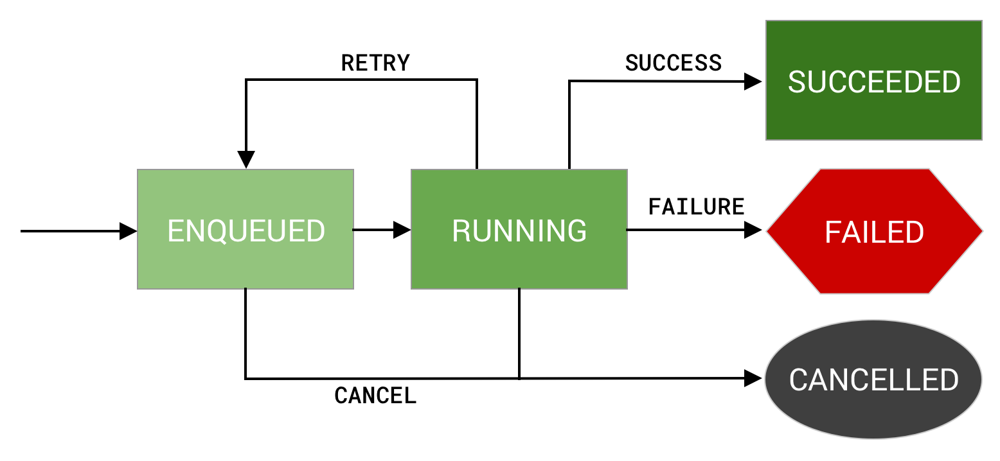

# WorkManager

## 1. 简介

`WorkManager` 是一种用于启动永久性工作的Jetpack的API。持久性工作是指能够在应用和系统重启后仍然保持工作调度状态的工作。

`WorkManager` 分为三种类型：
1. `立即执行`：必须立即开始并且很快就能完成的任务，可以加急。
2. `长时间运行的任务`：任务的运行时间可能较长。
3. `可延期的任务`：延期开始并且可以定期运行的预定任务。

| 类型   | 周期         | 查找方式                                                                 |
|--------|--------------|--------------------------------------------------------------------------|
| 即时   | 一次         | `OneTimeWorkRequest` 和 `Worker`。 如需加急工作，请对 `OneTimeWorkRequest` 调用 `setExpedited()`。 |
| 长跑   | 一次性或定期 | 任意 `WorkRequest` 或 `Worker`。 在 worker 中调用 `setForeground()` 来处理通知。 |
| 可延期 | 一次性或定期 | `PeriodicWorkRequest` 和 `Worker`。                                      |

## work的状态

### 1. 一次性工作的状态
对于 `One-time` 工作请求，工作的初始状态为 `ENQUEUED`。
在 `ENQUEUED` 状态下，work 会在满足 `Constraints` 和 `initialDelay` 计时要求后立即运行。接下来，work 会切换到 `RUNNING` 状态，
然后可能会根据工作的结果切换为`SUCCEED` 、`FAILED` 状态；或者，结果是 `retry`，它可能会回到 `ENQUEUED` 状态。
在这个过程中，随时都能取消工作，取消后work进入到 `CANCELLED` 状态。

`SUCCEED` 、`FAILED` 、`CANCELLED` 都是 `work` 的终止状态，此时 `WorkInfo.State.isFinished()` 都会返回 `true`

### 2. 定期工作的状态

成功和失败状态仅使用于 一次性工作 和 链式工作。定期工作只有一个终止状态 CANCELLED。这是因为定期工作永远不会结束。

