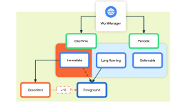

# WorkerManager

## 1. 简介

`WorkerManager` 是一种用于启动永久性工作的Jetpack的API。持久性工作是指能够在应用和系统重启后仍然保持工作调度状态的工作。

`WorkerManager` 分为三种类型：
1. 立即执行：必须立即开始并且很快就能完成的任务，可以加急。
2. 长时间运行的任务：任务的运行时间可能较长。
3. 可延期的任务：延期开始并且可以定期运行的预定任务。

类型	周期	查找方式
即时	一次	OneTimeWorkRequest 和 Worker。如需加急工作，请对 OneTimeWorkRequest 调用 setExpedited()。
长跑	一次性或定期	任意 WorkRequest 或 Worker。在 worker 中调用 setForeground() 来处理通知。
可延期	一次性或定期	PeriodicWorkRequest和Worker。

