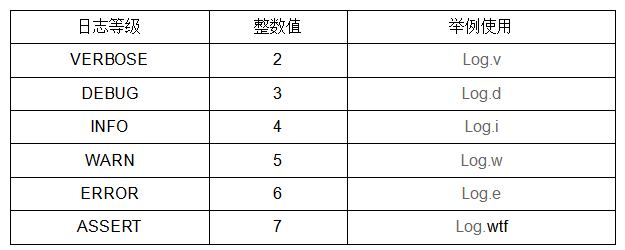
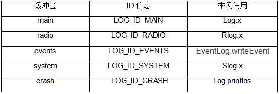

# 安卓典型日志分析

1. 日志接口

日志接口内容，共分为java层、native层、kernel层等。下面就对每个层级的内容分别进行介绍。

1.1 java层调用接口

日志级别分别为VERBOSE、DEBUG、INFO、WARN、ERROR、ASSERT，日志级别依次提升。默认定义了5个buffer缓冲区，分别是main、radio、events、system、crash，对应的ID信息分别为LOG_ID_MAIN、LOG_ID_RADIO、LOG_ID_EVENTS、LOG_ID_SYSTEM、 LOG_ID_CRASH。

1.1.1 日志缓冲区简介

Android日志记录系统守护进程logd维护的一组结构化环形缓冲区，这组可用的缓冲区是固定的，且由系统定义。也可以通过logcat 命令查看如下缓冲区。

radio：查看包含无线装置/电话相关消息的缓冲区，可以调用android.telephony.Rlog打印日志。

events：查看经过解译的二进制系统时间缓冲区信息，类型为events的日志是用来诊断系统问题的。在应用框架提供了android.util.EventLog接口通过liblog动态库往日志驱动程序中写入日志，运行时库提供了宏LOG_EVENT_INT、LOG_EVENT_LONG、LOG_EVENT_FLOAT、LOG_EVENT_STRING用来写入events类型日志。

main：查看主日志缓冲区信息，main日志缓冲区是应用程序唯一可用的日志缓冲区，在应用框架中提供了android.util.Log接口通过liblog动态库往日志驱动程序中写入日志，运行时库提供了LOGV、LOGD、LOGI、LOGW、LOGE等宏用来写入main类型的日志。

system：查看系统缓冲区类型为system的日志，在应用框架提供了android.util.SLog接口通过liblog动态库往日志驱动程序中写入日志，运行时库提供了SLOGV、SLOGD、SLOGI、SLOGW、SLOGE等宏用来写入system类型的日志。

crash：查看崩溃日志缓冲区的日志信息。

1.1.2 命令查看缓冲区日志信息

ogcat -b + 参数查看对应缓冲区内容，具体见如下内容。

all：查看所有缓冲区日志

default：查看main、system、crash三个缓冲区日志信息

比如：logcat -b main用来查看main缓冲区信息；logcat -b main，system用来查看main和system缓冲区信息；logcat -b all 查看所有缓冲区信息。

