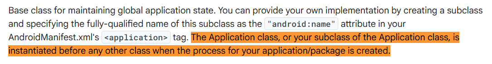

# 一个App会创建多少个Application对象

**默认情况下只有一个。**

Application 是跟着进程走的，不是跟着整个 App 走的。系统在创建进程时就会实例化它，并且在这个进程的整个生命周期内只存在这一份。
官方文档写得很清楚：Application（或你的子类）是在该应用/包对应的进程被创建时、在任何其他类之前就被实例化的。


所以单进程 App 里：

- Application 实例只有 1 个
- `onCreate()` 只走一次

这是绝大多数人的日常认知，也是正确的。

## 1. 一旦开启多进程，情况就变了

Android 允许通过 `android:process` 让组件跑在不同进程。每个进程都会各自创建一份 Application。

结论很直接：

- 单进程 → 1 个 Application，`onCreate()` 执行 1 次
- 多进程（N 个进程）→ N 个 Application，`onCreate()` 执行 N 次

验证方式很简单：在自定义 Application 的 `onCreate()` 里打印当前进程名 + 对象的 hashCode（或者用 Unsafe 拿真实物理地址）。启动带 `:remote` 或 `:push` 之类 process 的组件后，你会看到不同进程对应完全不同的实例。即使虚拟地址偶尔看起来一样，物理地址是分开的。

源码路径也支持这个结论。进程起来后会走到 `ActivityThread.handleBindApplication()`，里面通过 `LoadedApk.makeApplication()` 去创建 Application。每个进程都有自己独立的 ActivityThread 和 LoadedApk，所以必然各创建一份。

## 2. 为什么必须每个进程一份？

进程之间内存完全隔离，不能直接共享 Java 对象。Application 本质上是这个进程内的全局 Context 持有者和初始化入口，它只能跟着进程走。主进程有主进程的，子进程有子进程的，彼此互不相干，也不能互相访问对方的成员变量。

这也是很多 SDK 文档会特别提醒「如果你继承了 Application，必须保证它是多进程安全的」的原因。

## 3. 实际开发里要注意的点

初始化逻辑最好做进程判断，只在主进程做重活：

```kotlin
override fun onCreate() {
    super.onCreate()
    if (packageName == Application.getProcessName()) {
        // 只在主进程初始化
    }
}
```

`onCreate()` 里别塞太多耗时操作，多进程场景下启动成本会被放大。

ContentProvider 的 `onCreate()` 比 Application 还早，而且默认只在主进程创建（除非你指定了 process），所以不少框架会用它来做「只执行一次」的初始化。

ActivityThread 里确实有个 `mAllApplications` 列表，但正常 App 里通常就一个。出现多个的情况多半是插件化或特殊框架搞出来的，不属于常规行为。

**最终结论：**

Application 是进程级单例，不是应用级全局单例。单进程永远只有一个，多进程就有几个进程就有几个。这是由 Android 的进程隔离模型和 `ActivityThread` → `LoadedApk.makeApplication()` 的创建机制共同决定的。
