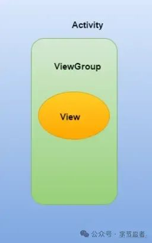
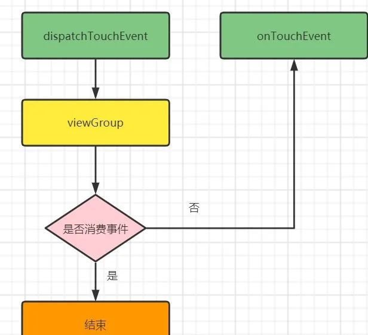
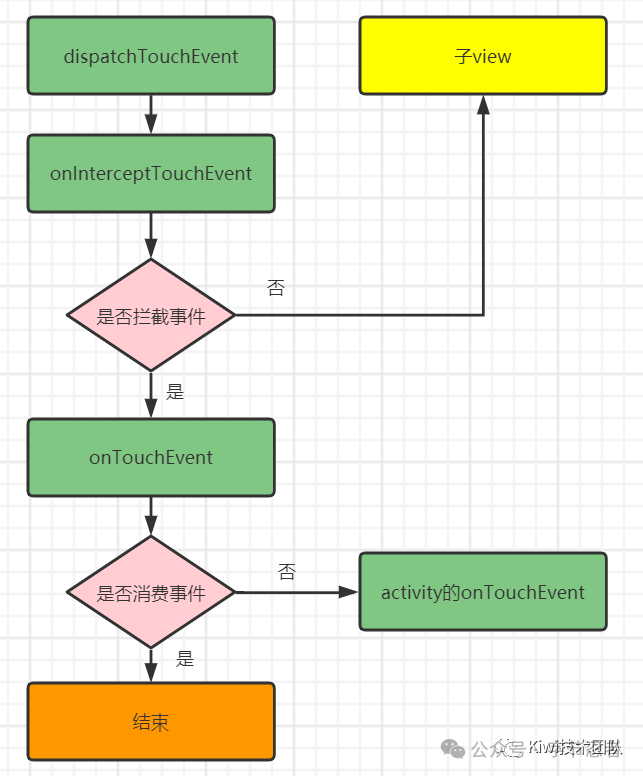
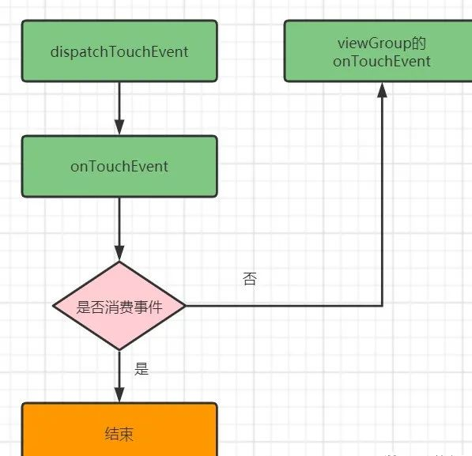

# 事件分发机制

## 1.什么是事件
要了解事件分发，那我们先说说什么是事件，其实这里的事件指的就是点击事件，当用户触摸屏幕的时候，将会产生点击事件（Touch事件）
`Touch事件`的相关细节（发生触摸的位置、时间等）被封装成`MotionEvent`对象

## 2.MotionEvent事件类型

事件类型	具体动作
MotionEvent.ACTION_DOWN	按下View（所有事件的开始）
MotionEvent.ACTION_UP	抬起View（与DOWN对应）
MotionEvent.ACTION_MOVE	滑动View
MotionEvent.ACTION_CANCEL	结束事件（非人为原因）

事件序列：其实就是从手指触摸屏幕到离开屏幕所发生的一系列事件

## 3. 什么是事件分发
我们要讲的事件分发其实就是将点击事件传递到某个具体的View，这个传递的过程就叫做事件分发

## 4. 事件在哪些对象间进行传递、顺序是什么
Activity的UI界面由Activity、ViewGroup、View及其派生类组成


事件分发在这三个对象之间进行传递。
当点击事件发生后，事件先传到Activity，再传到ViewGroup，最终传到View

## 5.事件分发有啥用？
默认情况下事件分发会按照由Activity到ViewGroup再到View的顺序进行分发，当我们不想View进行处理，让ViewGroup处理，那就可以进行拦截，这些知识可以用于解决滑动冲突。

## 6.事件分发涉及到的函数及相应的作用
方法	作用
dispatchTouchEvent	进行事件分发
onInterceptTouchEvent	事件拦截
onTouchEvent	事件消耗（就是交给当前View处理）

- dispatchTouchEvent： 用来进行事件分发，若事件能够传递到当前View，则此方法一定会被调用。
- onInterceptTouchEvent： 在dispatchTouchEvent方法内被调用，用来判断是否拦截某个事件。若当前View拦截了某个事件，则该方法不会再被调用，返回结果表示是否拦截当前事件，该方法只在ViewGroup中存在。
- onTouchEvent： 用来处理点击事件，返回结果表示是否消耗当前事件，若不消耗，则在同一事件序列中，当前View无法再次接收到事件。

这三个方法可用以下伪代码表示:
``` java
public boolean dispatchTouchEvent(MotionEvent ev){
    boolean consume = false;
    if(onInterceptTouchEvent(ev)){
        consume = onTouchEvent(ev);
    }else{
        consume = child.dispatchTouchEvent(ev);
    }
    return consume;
}
```
对应的根ViewGroup，当一个点击事件产生时，Activity会传递给它，这时它的dispatchTouchEvent就会被调用，若该ViewGroup的onInterceptTouchEvent返回true，代表拦截该事件，但是否消耗该事件，还要看它的onTouchEvent的返回值，如果不拦截，则代表将事件分发下去给子View，接着子View的dispatchTouchEvent方法会被调用，如此反复直到事件被最终处理。

## 7.Activity的事件分发流程
Activity的事件分发涉及三个主要方法：
dispatchTouchEvent(MotionEvent ev)；
onInterceptTouchEvent(MotionEvent ev)；
onTouchEvent(MotionEvent ev)；
以下是简化的事件分发流程：

1.用户触摸屏幕，触摸事件被Activity捕获。
2.Activity的dispatchTouchEvent(MotionEvent ev)方法被调用。
3.如果此方法返回true，事件会被消耗掉，流程结束。如果返回false，事件会向下传递。
4.如果ViewGroup（如LinearLayout）覆盖了onInterceptTouchEvent(MotionEvent ev)方法，并且返回true，则事件会被该ViewGroup拦截，并由其onTouchEvent(MotionEvent ev)方法处理。
5.如果ViewGroup不拦截或返回false，事件会继续传递给子View。
6.子View同样会调用dispatchTouchEvent(MotionEvent ev)，如果子View不处理事件，则会回传给父ViewGroup。
7.如果所有父ViewGroup都不处理事件，最终由Activity的onTouchEvent(MotionEvent ev)方法处理。

实际中，可以通过重写这些方法来控制事件的分发和处理。以下是一个简单的例子：
``` java

public class MyActivity extends AppCompatActivity {
    @Override
    public boolean dispatchTouchEvent(MotionEvent ev) {
        // 在这里可以进行全局的触摸事件处理
        return super.dispatchTouchEvent(ev);
    }

    @Override
    public void onUserInteraction() {
        // 用户触摸事件发生时调用
        super.onUserInteraction();
    }

    @Override
    public boolean onTouchEvent(MotionEvent event) {
        // 如果上面的方法没有处理事件，会回调到这里
        return super.onTouchEvent(event);
    }
}
```


## 8.ViewGroup 的事件分发流程

在Android中，ViewGroup的事件分发流程是通过一系列的方法调用实现的，包括`dispatchTouchEvent()`, `onInterceptTouchEvent()`, 和 `onTouchEvent()`。以下是这个流程的一个详细解释，并附有一个简单的Java代码示例。

- ViewGroup事件分发流程：
dispatchTouchEvent(MotionEvent ev)：
当一个触摸事件发生时，该方法首先被调用。
ViewGroup会首先询问其子View是否想要处理这个事件，这通过调用子View的dispatchTouchEvent()方法实现。
如果ViewGroup决定拦截事件（通过调用onInterceptTouchEvent()返回true），那么它会自己处理事件，不再传递给子View。
如果子View或ViewGroup自身消费了事件（即onTouchEvent()返回true），则事件传递结束。

- onInterceptTouchEvent(MotionEvent ev)：
在事件传递给子View之前，ViewGroup可以调用此方法来决定是否要拦截事件。
如果返回true，则事件被ViewGroup拦截，不再传递给子View，并且ViewGroup的onTouchEvent()会被调用。
如果返回false，则事件继续传递给子View。

- onTouchEvent(MotionEvent ev)：
如果事件没有被子View消费，或者ViewGroup拦截了事件，那么ViewGroup的onTouchEvent()方法会被调用。
ViewGroup可以在这里处理事件，例如通过移动或改变自身的状态。
如果onTouchEvent()返回true，则事件被消费，不再继续向上传递。

``` java

public class CustomViewGroup extends ViewGroup {  

    public CustomViewGroup(Context context) {  
        super(context);  
    }  

    @Override  
    protected void onLayout(boolean changed, int l, int t, int r, int b) {  
        // 在这里实现布局逻辑  
    }  

    @Override  
    public boolean dispatchTouchEvent(MotionEvent ev) {  
        // 检查是否需要拦截事件  
        boolean intercepted = onInterceptTouchEvent(ev);  
        if (intercepted) {  
            // 如果拦截了事件，则自己处理  
            return onTouchEvent(ev);  
        } else {  
            // 否则，传递给子View  
            return super.dispatchTouchEvent(ev);  
        }  
    }  

    @Override  
    public boolean onInterceptTouchEvent(MotionEvent ev) {  
        // 根据需要返回true或false来决定是否拦截事件  
        return false; // 默认不拦截，让事件传递给子View  
    }  

    @Override  
    public boolean onTouchEvent(MotionEvent ev) {  
        // 处理触摸事件  
        return true; // 假设我们消费了这个事件  
    }  
}
```

在这个示例中，CustomViewGroup 继承自 ViewGroup。我们重写了 dispatchTouchEvent(), onInterceptTouchEvent(), 和 onTouchEvent() 方法来演示事件分发的流程。默认情况下，onInterceptTouchEvent() 返回 false，意味着事件会传递给子View。如果我们在 onInterceptTouchEvent() 中返回 true，则事件会被 CustomViewGroup 拦截，并调用其 onTouchEvent() 方法来处理。

请注意，实际开发中，你可能需要根据具体的布局和交互需求来定制这些方法的行为。此外，确保布局和子View的添加逻辑（例如在 onLayout() 方法中）正确实现也是非常重要的。



## 9.View的事件分发流程

View的事件分发流程通常涉及三个关键方法：dispatchTouchEvent(), onInterceptTouchEvent(), 和 onTouchEvent()。然而，需要注意的是，onInterceptTouchEvent() 是在 ViewGroup 中特有的方法，用于决定是否拦截子View的事件。对于单独的 View 对象，事件分发流程不包括 onInterceptTouchEvent() 的调用。

以下是View的事件分发流程的概述以及一个Java代码示例：

View事件分发流程：

- dispatchTouchEvent(MotionEvent ev)：
当一个触摸事件发生时，首先会调用View的dispatchTouchEvent()方法。
在这个方法中，View有机会决定是否自己处理这个事件，或者将事件传递给其他对象（尽管对于普通的View来说，通常不会这么做）。
如果dispatchTouchEvent()返回true，表示事件已经被处理；如果返回false，则事件会继续向上传递给View的父级。
- onTouchEvent(MotionEvent ev)：
如果dispatchTouchEvent()没有处理事件，那么会调用View的onTouchEvent()方法。
在这个方法中，View可以处理事件，例如响应用户的点击或滑动。
如果onTouchEvent()返回true，表示事件已经被消费；如果返回false，则事件会继续向上传递。

``` java

public class CustomView extends View {  

    public CustomView(Context context) {  
        super(context);  
        // 初始化代码  
    }  

    public CustomView(Context context, @Nullable AttributeSet attrs) {  
        super(context, attrs);  
        // 从XML布局中创建时调用的构造函数  
    }  

    public CustomView(Context context, @Nullable AttributeSet attrs, int defStyleAttr) {  
        super(context, attrs, defStyleAttr);  
        // 有样式属性时调用的构造函数  
    }  

    @Override  
    protected void onDraw(Canvas canvas) {  
        super.onDraw(canvas);  
        // 绘制逻辑  
    }  

    @Override  
    public boolean dispatchTouchEvent(MotionEvent event) {  
        // 在这里可以决定是否自己处理事件或者传递给其他对象  
        // 通常情况下，对于普通View，我们不需要重写这个方法  
        return super.dispatchTouchEvent(event);  
    }  

    @Override  
    public boolean onTouchEvent(MotionEvent event) {  
        // 处理触摸事件，如点击、滑动等  
        switch (event.getAction()) {  
            case MotionEvent.ACTION_DOWN:  
                // 按下事件  
                break;  
            case MotionEvent.ACTION_MOVE:  
                // 移动事件  
                break;  
            case MotionEvent.ACTION_UP:  
                // 抬起事件  
                break;  
        }  
        // 如果View消费了事件，返回true  
        return true;  
    }  
}
```

在这个示例中，`CustomView` 是一个继承自 `View` 的自定义视图。我们重写了 `onTouchEvent()` 方法来处理触摸事件。在 `onTouchEvent()` 中，我们可以根据事件的类型（如 `ACTION_DOWN`, `ACTION_MOVE`, `ACTION_UP` 等）来执行相应的逻辑。如果View消费了事件（即处理了这个事件），我们应该返回 true。

请注意，对于普通的View，通常不需要重写 `dispatchTouchEvent()`，因为它会默认地将事件传递给 `onTouchEvent()`。但在自定义的 `ViewGroup` 中，我们可能需要重写 `dispatchTouchEvent()` 和 `onInterceptTouchEvent()` 来控制事件的传递和拦截。



## 10.总结

- Android事件分发流程：`Activity` -> `ViewGroup` -> `View`。即：1个点击事件发生后，事件先传到`Activity`、再传到`ViewGroup`、最终再传到`View`。从上往下依次调用`dispatchTouchEvent()`，进行事件分发。
- Android事件消费流程：`View` -> `ViewGroup` -> `Activity`。从下往上依次调用`onTouchEvent()`，进行事件响应处理。
事件如果在传递过程中被消费，整个分发流程则直接结束。


