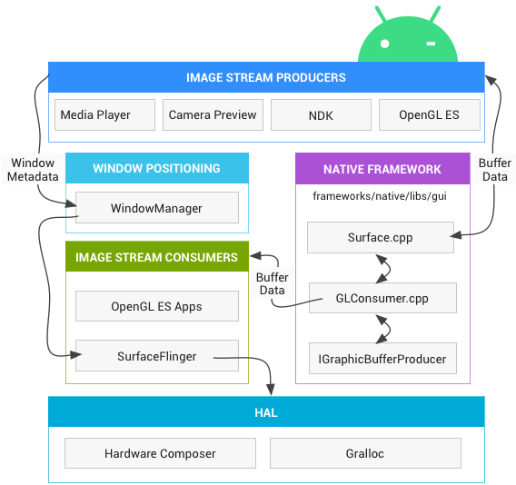
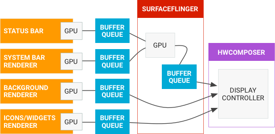
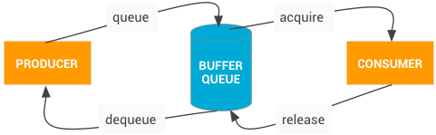

# 图形渲染

## 图形渲染知识点：

1. **Canvas（API 元素）**
画布是一种绘图 Surface，用于对照位图或 Surface 对象来处理实际位合成。Canvas 包含关于位图、线条、圆形、矩形、文字等的标准计算机绘制方法，并与位图或 Surface 相关联。画布是在屏幕上绘制 2D 对象的最简便方法。基类为 `Canvas`。

2. **OpenGL ES**
OpenGL ES 是一个用于渲染 2D 和 3D 图形的跨平台 API。Android 提供 OpenGL ES 库，该库可用于实现硬件加速的 3D 渲染。对于 2D 渲染，画布是更简单的选项。Android 原生开发套件 (NDK) 中提供 `OpenGL ES。android.opengl` 和 `javax.microedition.khronos.opengles` 软件包提供 OpenGL ES 功能。

3. **Surface（API 元素）**
`Surface` 表示要合成到界面的内存块。Surface 包含用于绘图的 Surface 对象，并提供各种辅助方法来绘制图层和调整界面大小。请使用 `SurfaceView` 类，而不是直接使用 Surface 类。

4. **SurfaceView（API 元素）**
`SurfaceView` 是一个 View 对象，它封装用于绘制的 Surface 对象，并提供相应的方法来动态指定其大小和格式。Surface 视图针对资源密集型操作（例如游戏或相机预览）提供了一种独立于界面线程进行绘制的方式，但也会因此占用额外的内存。Surface 视图同时支持画布和 OpenGL ES 图形。SurfaceView 对象的基类是 SurfaceView。

5. **Vulkan**
Vulkan 是一个适用于高性能 3D 图形的低开销、跨平台 API。

6. **widget**
widget 是一组完全实现的视图子类，这些子类用于渲染表单元素和其他界面组件，例如文本框或弹出式菜单。由于widget是完全实现的，因此它会自行处理测量和绘制，并且会响应屏幕事件。`widget` 位于 `android.widget` 包中。

7. **Window（API 元素）**
在 Android 应用中，窗口是派生自 Window 抽象类的对象，可指定常规窗口的元素，例如外观和风格、标题栏文字、菜单的位置和内容。对话框和 activity 使用 Window 类的实现来渲染 Window 对象。您无需在应用中实现 Window 类或使用窗口。

**可通过三种方式将图像绘制到屏幕上：使用画布、OpenGL ES 或 Vulkan。**

::: danger
无论使用什么渲染 API，一切内容都会渲染到 surface 上。Surface 表示缓冲区队列中的生产方，而缓冲区队列通常会被 SurfaceFlinger 消耗。在 Android 平台上创建的每个窗口都由 Surface 提供支持。所有被渲染的可见 Surface 都被 SurfaceFlinger 合成到屏幕。
:::

## surface 渲染流程

1. **图像流生产者**

图像流生产者可以是生成图形缓冲区以提供消费的任何内容。例如：OpenGL ES，Canvas 2D 和 mediaserver 视频解码器。

2. **图像流消费者**

图像流的最常见的消费者是SurfaceFlinger，这个系统服务会消费当前可见的Surface，SurfaceFlinger能使用OpenGL 和 HardwareComposer 来合成一组 Surface。

其他 OpenGL ES 应用也可以消费图像流，例如：相机应用会消费相机预览图像流。非GL应用也可以是消费者。例如，ImageReader类。

3. **硬件混合渲染器（Hardware Compose）**

显示子系统的硬件抽象实现是通过 `SurfaceFlinger` 和硬件混合渲染器（`HWC`）共同完成的。SurfaceFlinger 可以将部分合成工作委托给硬件混合渲染器，以减少 OpenGL ES 和 GPU 的功耗。SurfaceFlinger 本身只是另一个 OpenGL ES 的客户端。因此，当 SurfaceFlinger 将一个或两个缓冲区合成到第三个缓冲区时，它会使用 OpenGL ES。这种方式比全部通过 GPU 进行计算的能耗更低。

硬件混合渲染器（HWC）HAL 负责另一部分工作，是所有 Android 图形渲染的核心。Hardware Composer 必须支持一些事件，其中之一是 VSYNC（另一个是支持即插即用 HDMI 的热插拔）。

4. **Gralloc**

需要使用图形内存分配器 (Gralloc) 来分配图像生产者请求的内存。

5. **数据流**

流经 Android 的图形数据流：

左侧的对象是生成图形缓冲区的渲染器，如主屏幕、状态栏和系统界面。SurfaceFlinger 是合成器，而硬件混合渲染器是混合渲染器。

6. **BufferQueues**

BufferQueues 是 Android 图形组件之间的粘合剂。它们是一对队列，可以调解缓冲区从生产者到消费者的固定周期。一旦生产者移交其缓冲区，SurfaceFlinger 便会负责将所有内容合成到显示部分。

BufferQueue 通信过程：

BufferQueue 包含了将图像流生产者和图像流消费者联系在一起的逻辑。图像生产者的例子包括由相机 HAL 生成的相机预览或 OpenGL ES 游戏生成的图像。图像消费者的例子包括 SurfaceFlinger 或显示 OpenGL ES 流的另一个应用，例如显示相机取景器的相机应用。

BufferQueue 是一种将缓冲区池与队列结合的数据结构，并使用 Binder IPC 在进程间传递缓冲区。生产者接口，也就是传递给生成图形缓冲区的人或模块的接口，是 IGraphicBufferProducer（SurfaceTexture 的一部分）。BufferQueue 通常用于渲染到 Surface 并与 GL 消费者一起消耗内容，此外还用于其他任务。

BufferQueue 可以在三种不同的模式下运行：

1. **类同步模式**：默认情况下，BufferQueue 以类同步模式运行。在这种模式下，来自生产者的每个缓冲区都会传递到消费者，从不会丢弃任何缓冲区。如果生产者的速度太快，生成缓冲区的速度超过了消耗缓冲区的速度，它将阻塞并等待可用的缓冲区。

2. **非阻塞模式**：BufferQueue 还可以在非阻塞模式下运行。在这种情况下，它会生成错误而不是等待缓冲区。同样，在此模式下也不会丢弃缓冲区。这有助于避免应用软件中可能存在的潜在死锁问题，特别是那些不了解图形框架复杂依赖关系的应用软件。

3. **丢弃模式**：BufferQueue 也可以配置为丢弃旧缓冲区，而不是生成错误或等待缓冲区。例如，如果执行 GL 渲染到纹理视图并尽可能快地进行绘制，则必须丢弃缓冲区。

7. **SurfaceTexture**
SurfaceView 和 GLSurfaceView。SurfaceView 结合了 Surface 和 View。SurfaceView 的 View 组件由 SurfaceFlinger（而不是应用）合成，从而可以通过单独的线程/进程渲染，并与应用界面渲染隔离。GLSurfaceView 提供了用于管理 EGL 上下文、线程间通信以及与 activity 生命周期的交互的帮助程序类（但不是必须使用 GLES）。

SurfaceTexture。 SurfaceTexture 将 Surface 和 GLES 纹理相结合来创建 BufferQueue，上层应用是 BufferQueue 的消费者。当生产者将新的缓冲区排入队列时，它会通知应用。应用会依次释放先前占用的缓冲区，从队列中获取新缓冲区并执行 EGL 调用，从而使 GLES 可将此缓冲区作为外部纹理使用。Android 7.0 添加了对安全纹理视频播放的支持，以便对受保护的视频内容进行 GPU 后处理。

TextureView。 TextureView 结合了 View 和 SurfaceTexture。TextureView 对 SurfaceTexture 进行包装，并负责响应回调以及获取新的缓冲区。在绘图时，TextureView 使用最近收到的缓冲区的内容作为其数据源，根据 View 状态指示，在它应该渲染的任何位置和以它应该采用的任何渲染方式进行渲染。View 合成始终通过 GLES 来执行，这意味着内容更新可能会导致其他 View 元素重绘。

