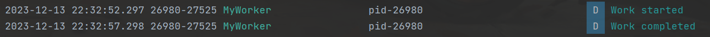

# 实践-WorkManager

WorkManager 是 Android 中用于处理后台任务的现代 API。它是 Jetpack 架构组件的一部分，提供了一个灵活、强大且易于使用的方式，用于执行可延迟、可靠和重复的异步任务。

## MyWorkManager
``` java
package com.example.jobservicetest;

import android.content.Context;
import android.util.Log;

import androidx.annotation.NonNull;
import androidx.work.Worker;
import androidx.work.WorkerParameters;

public class MyWorkManager extends Worker {
    private static final String TAG = "MyWorker";

    public MyWorkManager(@NonNull Context context, @NonNull WorkerParameters workerParams) {
        super(context, workerParams);
    }

    @NonNull
    @Override
    public Result doWork() {
        // 在这里执行后台任务的逻辑

        Log.d(TAG, "Work started");

        // 示例：模拟任务执行，这里休眠 5 秒钟
        try {
            Thread.sleep(5000);
        } catch (InterruptedException e) {
            e.printStackTrace();
        }

        Log.d(TAG, "Work completed");

        // 返回 Result.SUCCESS 表示任务执行成功
        return Result.success();
    }
}

```

## MainActivity

``` java
package com.example.jobservicetest;

import androidx.appcompat.app.AppCompatActivity;
import androidx.work.OneTimeWorkRequest;
import androidx.work.WorkManager;

import android.app.job.JobInfo;
import android.app.job.JobScheduler;
import android.content.ComponentName;
import android.content.Context;
import android.os.Bundle;
import android.util.Log;
import android.view.View;
import android.widget.Button;

public class MainActivity extends AppCompatActivity {

    @Override
    protected void onCreate(Bundle savedInstanceState) {
        super.onCreate(savedInstanceState);
        setContentView(R.layout.activity_main);

//        scheduleJob();
        startWorker();
    }

    private void scheduleJob() {
        JobScheduler jobScheduler = (JobScheduler) getSystemService(Context.JOB_SCHEDULER_SERVICE);

        ComponentName componentName = new ComponentName(this, MyJobService.class);
        JobInfo jobInfo = new JobInfo.Builder(1, componentName)
                .setPeriodic(60 * 1000) // 设置每隔一分钟执行一次
                .setPersisted(true)
                .build();

        jobScheduler.schedule(jobInfo);

    }

    private void startWorker(){
        // 获取按钮
        Button startWorkButton = findViewById(R.id.startWorkButton);

        // 设置按钮点击事件
        startWorkButton.setOnClickListener(v -> {
            // 创建 OneTimeWorkRequest 对象，指定要执行的 Worker 类
            OneTimeWorkRequest myWorkRequest = new OneTimeWorkRequest.Builder(MyWorkManager.class)
                    .build();

            // 获取 WorkManager
            WorkManager workManager = WorkManager.getInstance(MainActivity.this);

            // 调度任务
            workManager.enqueue(myWorkRequest);
        });
    }
}
```

## activity_main.xml
``` xml
<?xml version="1.0" encoding="utf-8"?>
<RelativeLayout xmlns:android="http://schemas.android.com/apk/res/android"
    xmlns:tools="http://schemas.android.com/tools"
    android:layout_width="match_parent"
    android:layout_height="match_parent"
    tools:context=".MainActivity">

    <Button
        android:id="@+id/startWorkButton"
        android:layout_width="wrap_content"
        android:layout_height="wrap_content"
        android:layout_centerInParent="true"
        android:text="Start Work"
        android:padding="16dp" />

</RelativeLayout>

```

