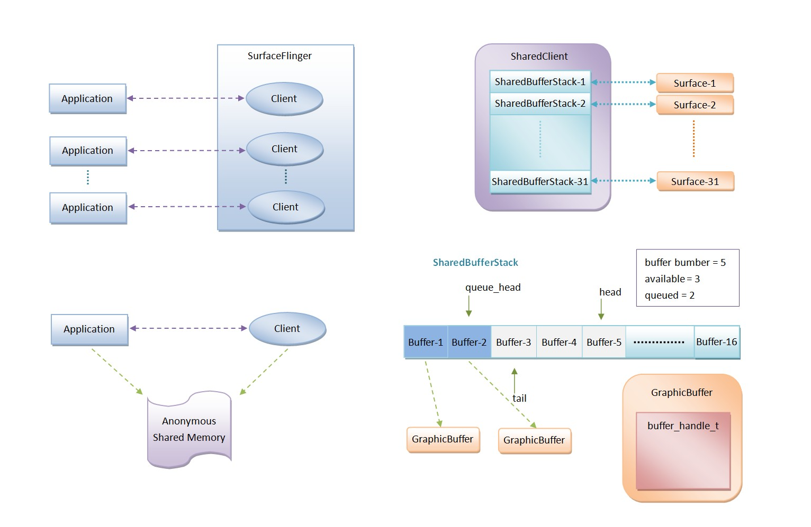

# 渲染机制

## 1. view发起绘制请求

在 View 涉及到 UI 更新的方法中，几乎都会在最后调用 `View#invalidate()` 或者 `View#requestLayout()`：

::: code-group
``` java

public class View {
    public void invalidate() {
        invalidate(true);
    }
    public void invalidate(boolean invalidateCache) {
        invalidateInternal(0, 0, mRight - mLeft, mBottom - mTop, invalidateCache, true);
    }
    void invalidateInternal(int l, int t, int r, int b, boolean invalidateCache,
            boolean fullInvalidate) {
        if (...) {
            // 调用 invalidate() 会给当前 View 添加 PFLAG_DIRTY 标志
            mPrivateFlags |= PFLAG_DIRTY;
            final AttachInfo ai = mAttachInfo;
            final ViewParent p = mParent;
            if (p != null && ai != null && l < r && t < b) {
                final Rect damage = ai.mTmpInvalRect;
                damage.set(l, t, r, b);
                // 调用父 View 的 ViewParent#invalidateCild(...)
                p.invalidateChild(this, damage);
            }
        }
    }

    public void requestLayout() {
        // 调用 requestLayout() 会给当前 View 添加 PFLAG_FORCE_LAYOUT 标志
        mPrivateFlags |= PFLAG_FORCE_LAYOUT;
        mPrivateFlags |= PFLAG_INVALIDATED;
        if (mParent != null && !mParent.isLayoutRequested()) {
            // 向上递归调用 mParent.requestLayout()，直到 mParent == null
            mParent.requestLayout();
        }
    }
}

public abstract class ViewGroup extends View implements ViewParent, ViewManager {
    public final void invalidateChild(View child, final Rect dirty) {
        ViewParent parent = this;
        if (attachInfo != null) {
            do {
                // 返回值是 parent 的 parent，一直向上递归直到 parent == null
                parent = parent.invalidateChildInParent(location, dirty);
            } while (parent != null);
        }
    }
    public ViewParent invalidateChildInParent(final int[] location, final Rect dirty) {
        ......
        if ((mPrivateFlags & (PFLAG_DRAWN | PFLAG_DRAWING_CACHE_VALID)) != 0) {
            return mParent;
        }
        return null;
    }
}

```
:::

- **解释说明**：

::: tip
`invalidate()` 会逐级递归调用 `ViewParent#invalidateChildInParent(...)`；
`requestLayout()` 会逐级递归调用 `mParent.requestLayout()`；
而一个 `ViewTree` 中，最顶层的 `ViewParent` 就是 `ViewRootImpl`，所以实际上 `View#invalidate()` 和 `View#requestLayout()` 最终都会调用到 `ViewRootImpl#invalidateChildInParent(...)` 和 `ViewRootImpl#requestLayout()`：
:::

::: code-group
``` java

public final class ViewRootImpl implements ViewParent {

    // ViewRootImpl 持有的成员变量 Handler，处于 ViewRootImpl 初始化线程。
    final ViewRootHandler mHandler = new ViewRootHandler();

    @Override
    public ViewParent invalidateChildInParent(int[] location, Rect dirty) {
        // 检查 UI 线程
        checkThread();
        if (dirty == null) {
            invalidate();
            return null;
        }
        ......
        invalidateRectOnScreen(dirty);
    }
    private void invalidateRectOnScreen(Rect dirty) {
        // 收集汇总需要重绘的区域
        localDirty.union(dirty.left, dirty.top, dirty.right, dirty.bottom);
        ......
        // 发起绘制事件
        scheduleTraversals();
    }

    @Override
    public void requestLayout() {
        if (!mHandlingLayoutInLayoutRequest) {
            // 检查 UI 线程
            checkThread();
            mLayoutRequested = true;
            // 发起绘制事件
            scheduleTraversals();
        }
    }
}

```
:::

- **解释说明**

::: tip
可以看到，不论是 `invalidate()` 还是 `requestLayout()`，最终在 `ViewRootImpl` 中都会通过 `checkThread()` 检查线程，并调用 `ViewRootImpl#scheduleTraversals()` 发起绘制。但是：

调用 `View#invalidate()` 会将 `View` 的 `Rect` 标记 `PFLAG_DIRTY`，然后在下一帧刷新 `ViewTree` 时，`ViewRootImpl` 会调用最顶层的 `View#draw(Canvas)`，然后逐层向下分发，但只会在具有 `PFLAG_DIRTY` 时回调 `onDraw(Canvas)`。
调用 `View#requestLayout()` 会将当前 `View` 标记 `PFLAG_FORCE_LAYOUT`，然后在下一帧刷新 `ViewTree` 时，`ViewRootImpl` 会调用最顶层的 `View#measure()` 和 `View#layout()`，然后逐层向下分发，但只会在具有 `PFLAG_FORCE_LAYOUT` 时回调 `onMeasure()` 和 `onLayout()`。
此外，`ViewRootImpl` 在构造方法中记录了自己的初始化线程，作为允许更新 UI 的线程，并且持有了一个 `Handler` 成员变量，同样也处于 `ViewRootImpl` 的初始化线程。`View#postInvalidate()` 和 `View#postInvalidateDelayed(delayTime)` 会向这个 `Handler` 发送一个事件，携带了调用的 `View` 本身，然后 `ViewRootImpl` 会在事件回调中直接调用这个 `View#invalidate()`，因此相当于把 `View#invalidate()` 抛到 `ViewRootImpl` 初始线程中执行，多用于跨线程请求刷新 UI。
:::

## 2. Android绘制渲染流程

上文提到，View 在更新 UI 时会通过 invalidate() 或者 requestLayout() 请求 ViewRootImpl 绘制，最终都会调用到 ViewRootImpl#scheduleTraversals() 中：

::: code-group
``` java
public final class ViewRootImpl implements ViewParent {

    Choreographer mChoreographer;
    final ViewRootHandler mHandler = new ViewRootHandler();
    final TraversalRunnable mTraversalRunnable = new TraversalRunnable();
    final class TraversalRunnable implements Runnable {
        @Override
        public void run() {
            doTraversal();
        }
    }

    void doTraversal() {
        if (mTraversalScheduled) {
            mTraversalScheduled = false;
            // 移除屏障消息
            mHandler.getLooper().getQueue().removeSyncBarrier(mTraversalBarrier);
            // 真正开始绘制
            performTraversals();
        }
    }

    public ViewRootImpl(Context context, Display display) {
        mChoreographer = Choreographer.getInstance();
    }

    void scheduleTraversals() {
        if (!mTraversalScheduled) {
            mTraversalScheduled = true;
            // 先向 ViewRootImpl 的初始线程发送一条屏障消息，阻塞后续的同步消息。
            mTraversalBarrier = mHandler.getLooper().getQueue().postSyncBarrier();
            mChoreographer.postCallback(
                    Choreographer.CALLBACK_TRAVERSAL, mTraversalRunnable, null);
            ......
        }
    }
}

```
:::

可以看到，scheduleTraversals() 先发送一条屏障消息阻塞了 ViewRootImpl 线程，然后 post 了一个 Runnable，这个 Runable 的目的是在回调时调用 performTraversals()，这也是绘制真正开始的入口。因此重点就在于 mChoreographer.postCallback(...) 内的逻辑。

### 2.1 注册绘制信号回调

Choreographer 中一共定义了 5 种帧同步信号回调类型，在 ViewRootImpl#scheduleTraversals() 中调用的 mChoreographer#postCallback(...) 指定了回调类型为 CALLBACK_TRAVERSAL，表示 绘制信号回调，并注册了一个回调 Runnable：

::: code-group
``` java
public final class Choreographer {
    public static final int CALLBACK_INPUT = 0;
    public static final int CALLBACK_ANIMATION = 1;
    public static final int CALLBACK_INSETS_ANIMATION = 2;
    public static final int CALLBACK_TRAVERSAL = 3;
    public static final int CALLBACK_COMMIT = 4;
    private static final int CALLBACK_LAST = CALLBACK_COMMIT;

    private final CallbackQueue[] mCallbackQueues;

    private Choreographer(Looper looper, int vsyncSource) {
        // Choreographer 在 ThreadLocal 中使用当前线程的 Looper 初始化，
        // 由于 ViewRootImpl 在构造方法中初始化 Choreographer，
        // 因此 Choreographer 与 ViewRootImpl 是同一线程。
        mLooper = looper;
        // 所以 Choreographer 的 mHandler 也是把消息发送到 ViewRootImpl 同一线程中。
        mHandler = new FrameHandler(looper);

        // 初始化 CallbackQueues，其中每一个 CallbackQueue 都是一个链表，
        // 每个 CallbackQueue 对应的下标就是常量中定义的 5 个 Callback 类型。
        mCallbackQueues = new CallbackQueue[CALLBACK_LAST + 1];
        for (int i = 0; i <= CALLBACK_LAST; i++) {
            mCallbackQueues[i] = new CallbackQueue();
        }
    }

    public void postCallback(int callbackType, Runnable action, Object token) {
        postCallbackDelayed(callbackType, action, token, 0);
    }
    public void postCallbackDelayed(int callbackType,
            Runnable action, Object token, long delayMillis) {
        ......
        postCallbackDelayedInternal(callbackType, action, token, delayMillis);
    }
    private void postCallbackDelayedInternal(int callbackType,
            Object action, Object token, long delayMillis) {
        synchronized (mLock) {
            final long now = SystemClock.uptimeMillis();
            final long dueTime = now + delayMillis;
            // 按照传入的 Callback 类型，向对应类型的 CallbackQueue 中添加一个 Callback 节点
            mCallbackQueues[callbackType].addCallbackLocked(dueTime, action, token);

            // 如果没有延迟则直接调用 scheduleFrameLocked(now)，
            // 否则会 post 一个延时消息，最终同样是调用 scheduleFrameLocked(now)
            if (dueTime <= now) {
                scheduleFrameLocked(now);
            } else {
                Message msg = mHandler.obtainMessage(MSG_DO_SCHEDULE_CALLBACK, action);
                msg.arg1 = callbackType;
                msg.setAsynchronous(true);
                mHandler.sendMessageAtTime(msg, dueTime);
            }
        }
    }

    private final class FrameHandler extends Handler {
        @Override
        public void handleMessage(Message msg) {
            switch (msg.what) {
                case MSG_DO_SCHEDULE_CALLBACK:
                    doScheduleCallback(msg.arg1);
                    break;
            }
        }
    }
    void doScheduleCallback(int callbackType) {
        synchronized (mLock) {
            if (!mFrameScheduled) {
                final long now = SystemClock.uptimeMillis();
                if (mCallbackQueues[callbackType].hasDueCallbacksLocked(now)) {
                    scheduleFrameLocked(now);
                }
            }
        }
    }
}

```
:::

Choreographer#postCallback(...) 主要是为了注册一个帧同步信号的回调，包含了两个步骤：

先根据传入的 callbackType 向对应类型的 CallbackQueue 中添加一个 Callback；
然后根据是否延时判断是直接调用 Choreographer#scheduleFrameLocked(now) 或是延时后调用。


### 2.2 发起帧同步信号

::: code-group
``` java
public final class Choreographer {
    private void postCallbackDelayedInternal(int callbackType,
            Object action, Object token, long delayMillis) {
        ......
        /*
         * Step 1: 创建 CallbackRecord，并按照时间顺序插入到对应类型的 CallbackQueue 中。
         *
         * mCallbackQueues[callbackType] 取出的就是 callbackType 对应的 CallbackQueue，
         * CallbackQueue 是 CallbackRecord 链表，CallbackRecord 用于记录注册的 Callback
         */
        mCallbackQueues[callbackType].addCallbackLocked(dueTime, action, token);
        ......
        /*
         * Step 2: 发起帧同步信号的请求，在收到信号后按顺序回调 5 种 CallbackQueue 中的所有回调。
         */
        scheduleFrameLocked(now);
    }
}
```
:::

Choreographer 注册绘制信号回调分为两步：

创建一个 CallbackRecord 对象用于存储 ViewRootImpl 注册的回调，然后把新创建的 CallbackRecord 按照时间戳的顺序添加到对应的 CALLBACK_TRAVERSAL 类型的 CallbackQueue 中。
向 FrameDisplayEventReceiver 发起一个帧同步信号的请求，并等待帧同步信号回调，然后再按顺序依次回调 5 种 CallbackQueue 中的所有回调。
（1）创建 CallbackRecord 并插入 CallbackQueue：

::: code-group
``` java
public final class Choreographer {
    private final class CallbackQueue {
        private CallbackRecord mHead;
        public void addCallbackLocked(long dueTime, Object action, Object token) {
            // 创建一个新的 CallbackRecord 节点，用于存储新增的 Callback，
            CallbackRecord callback = obtainCallbackLocked(dueTime, action, token);
            CallbackRecord entry = mHead;
            // 如果 entry == null，说明此时 mHead == null，说明 CallbackQueue 是一个空链表，
            // 因此将 mHead 指向新创建的 CallbackRecord
            if (entry == null) {
                mHead = callback;
                return;
            }
            // 此时 entry == mHead，
            // 则比较 mHead 的 dueTime 和新创建的 CallbackRecord 的 dueTime，
            // 如果新创建的 CallbackRecord 的 dueTime 更小，则插入到 mHead，
            // 把原来的 mHead 指向新创建的 CallbackRecord 的 next
            if (dueTime < entry.dueTime) {
                callback.next = entry;
                mHead = callback;
                return;
            }
            // 否则如果新创建的 CallbackRecord 的 dueTime 不是最小的，
            // 就从 mHead 开始顺序遍历 CallbackQueue 链表，
            // 把新创建的 CallbackRecord 按 dueTime 从小到大的顺序插入到 CallbackQueue 中。
            while (entry.next != null) {
                if (dueTime < entry.next.dueTime) {
                    callback.next = entry.next;
                    break;
                }
                entry = entry.next;
            }
            entry.next = callback;
        }
    }
}
```
:::

（2）向 FrameDisplayEventReceiver 发起帧同步信号：

::: code-group
``` java
public final class Choreographer {

    // 内部类 FrameDisplayEventReceiver 继承自抽象类 DisplayEventReceiver
    private final FrameDisplayEventReceiver mDisplayEventReceiver;

    private void scheduleFrameLocked(long now) {
        if (!mFrameScheduled) {
            mFrameScheduled = true;
            if (USE_VSYNC) {
                // Android 4.1 之后默认使用 VSync 信号。
                if (isRunningOnLooperThreadLocked()) {
                    // 如果当前处于初始线程则直接调用 scheduleVsyncLocked()
                    scheduleVsyncLocked();
                } else {
                    // 否则通过 mHandler 发送消息到初始线程，再调用 scheduleVsyncLocked()。
                    Message msg = mHandler.obtainMessage(MSG_DO_SCHEDULE_VSYNC);
                    // 由于 Choreographer 与 ViewRootImpl 处于同一线程，
                    // ViewRootImpl#scheduleTraversals() 时用屏障消息阻塞了同步消息，
                    // 所以需要把这条消息设置为异步消息。
                    msg.setAsynchronous(true);
                    mHandler.sendMessageAtFrontOfQueue(msg);
                }
            } else {
                // Android 4.1 之前不使用 VSync 信号，则直接发送消息，调用 doFrame(...)
                Message msg = mHandler.obtainMessage(MSG_DO_FRAME);
                // 同样需要设置为异步消息。
                msg.setAsynchronous(true);
                mHandler.sendMessageAtTime(msg, nextFrameTime);
            }
        }
    }
    private void scheduleVsyncLocked() {
        mDisplayEventReceiver.scheduleVsync();
    }

    private final class FrameHandler extends Handler {
        switch (msg.what) {
            case MSG_DO_FRAME:
                doFrame(System.nanoTime(), 0);
                break;
            case MSG_DO_SCHEDULE_VSYNC:
                doScheduleVsync();
                break;
        }
    }
    void doScheduleVsync() {
        synchronized (mLock) {
            if (mFrameScheduled) {
                scheduleVsyncLocked();
            }
        }
    }
}

```
:::

Choreographer 发起帧同步信号主要包括注册回调和发起信号两步：

创建一个 CallbackRecord 用于存储回调，然后根据 Choreographer#postCallback(...) 传入的 callbackType，将创建的 CallbackRecord 按 dueTime 时间顺序插入到对应类型的 CallbackQueue 中。
发起帧同步信号，并等待回调，根据 Android 版本分为两种方式：
Android 4.1 之前不使用 VSync 信号，则直接发送一条异步消息，调用 Choreographer#doFrame()。
Android 4.1 之后默认使用 VSync 信号，则会调用 FrameDisplayEventReceiver#scheduleVsync()


### 2.3 等待帧同步信号

上文提到，Android 4.1 之前和之后，发起帧同步信号请求的方式不同：

Android 4.1 之前直接调用了 doFrame(...)，内部根据当前时间、上一帧时间、帧率时间间隔判断是否需要回调。
Android 4.1 之后则是通过发起下一个 VSync 信号监听的方式，调用 FrameDisplayEventReceiver#scheduleVsync()，由 Native 层通知下一帧 VSync 信号后再回调。

::: code-group
``` java
public final class Choreographer {
    private final class FrameDisplayEventReceiver extends DisplayEventReceiver
            implements Runnable {
        @Override
        public void onVsync(long timestampNanos, long physicalDisplayId, int frame) {
            // scheduleVsync() 是父类 DisplayEventReceiver 中的方法，
            // 调用后会向 Native 层发起 VSync 信号请求，
            // 当收到来自 SurfaceFlinger 的下一帧 VSync 信号后，
            // 就会回调这个 onVsync(...) 方法。
            ......
            // FrameDisplayEventReceiver 实现了 Runnable 接口，
            // 所以这里创建的 Message 实际上是创建的 Runnable 类型的 Message，
            // 在 post 到 Choreographer 线程后就会回调 FrameDisplayEventReceiver#run()
            Message msg = Message.obtain(mHandler, this);
            // 此时 Choreographer / ViewRootImpl 的同步消息仍被屏障消息阻塞
            msg.setAsynchronous(true);
            mHandler.sendMessageAtTime(msg, timestampNanos / TimeUtils.NANOS_PER_MS);
        }

        @Override
        public void run() {
            mHavePendingVsync = false;
            // 实际上，即使 Android 4.1 之后用 VSync 信号，最终仍然是调用 doFrame(...)
            doFrame(mTimestampNanos, mFrame);
        }
    }
}

public abstract class DisplayEventReceiver {
    public void scheduleVsync() {
        ......
        // Native 方法，向底层发起 VSync 信号请求
        nativeScheduleVsync(mReceiverPtr);
    }
}
```
:::

实际上，是否使用 VSync 信号的区别主要在于下一帧帧同步信号的接收方式：

通过 doFrame(...) 中根据上一帧时间、当前时间、帧率间隔时间计算。
接收来自 SurfaceFlinger 的 VSync 信号。
这个区别只是体现在 Choreographer 如何知道需要下一帧帧同步，对于收到信号后回调到 ViewRootImpl，则最终都是通过 doFrame(...) 回调的。


### 2.4 回调帧同步信号


根据上文的分析，Choreographer 在接收到帧同步信号后，最终都会通过 doFrame(...) 回调给 ViewRootImpl：


::: code-group
``` java
public final class Choreographer {
    void doFrame(long frameTimeNanos, int frame) {
        ......
        try {
            // 按顺序第 1 个回调 Input 类型的 Callback
            mFrameInfo.markInputHandlingStart();
            doCallbacks(Choreographer.CALLBACK_INPUT, frameTimeNanos);
            // 按顺序第 2, 3 个回调 Animation 类型的 Callback
            mFrameInfo.markAnimationsStart();
            doCallbacks(Choreographer.CALLBACK_ANIMATION, frameTimeNanos);
            doCallbacks(Choreographer.CALLBACK_INSETS_ANIMATION, frameTimeNanos);
            // 按顺序第 4 个回调 Traversal 类型的 Callback
            mFrameInfo.markPerformTraversalsStart();
            doCallbacks(Choreographer.CALLBACK_TRAVERSAL, frameTimeNanos);
            // 按顺序第 5 个回调 Commit 类型的 Callback
            doCallbacks(Choreographer.CALLBACK_COMMIT, frameTimeNanos);
        }
    }
    void doCallbacks(int callbackType, long frameTimeNanos) {
        CallbackRecord callbacks;
        synchronized (mLock) {
            // 对当前 callbackType 类型的 CallbackQueue 循环遍历，
            // 找出 dueTime 大于当前时间的第一个 CallbackRecord，
            // 也即在当前时间之后的所有 CallbackRecord 中，dueTime 最小（最早）的。
            // 因为 CallbackQueue 是按照 dueTime「从小到大」（时间「从早到晚」）排序的，
            // 最早的 CallbackRecord 在 mHead 位置，
            // 因此从这个方法返回的 callback 开始，之后所有的 callback 都是比当前时间更早的。
            callbacks = mCallbackQueues[callbackType].extractDueCallbacksLocked(
                    now / TimeUtils.NANOS_PER_MS);
            if (callbacks == null) {
                return;
            }
            ......
            for (CallbackRecord c = callbacks; c != null; c = c.next) {
                // 遍历调用 dueTime 大于当前时间的所有 CallbackRecord#run()
                c.run(frameTimeNanos);
            }
        }
    }

    public void postFrameCallback(FrameCallback callback) {
        // 如果调用 Choreographer#postFrameCallback(FrameCallback)，
        // 则会注册一个 Animation 类型的 Callback，并且此时 token == FRAME_CALLBACK_TOKEN
        postFrameCallbackDelayed(callback, 0);
    }
    public void postFrameCallbackDelayed(FrameCallback callback, long delayMillis) {
        postCallbackDelayedInternal(CALLBACK_ANIMATION,
                callback, FRAME_CALLBACK_TOKEN, delayMillis);
    }

    private static final class CallbackRecord {
        public CallbackRecord next;
        public long dueTime;
        public Object action;
        public Object token;

        public void run(long frameTimeNanos) {
            // 根据 token 的值判断 action 是 Runnable 还是 FrameCallback
            if (token == FRAME_CALLBACK_TOKEN) {
                // 如果是通过 postFrameCallback(FrameCallback) 注册的 Callback，
                // 则 token == FRAME_CALLBACK_TOKEN，action 是 FrameCallback 类型。
                ((FrameCallback)action).doFrame(frameTimeNanos);
            } else {
                // 否则例如 ViewRootImpl 通过 postCallback(Runnable) 注册的 Callback，
                // 则 token == null，action 是 Runnable 类型。
                ((Runnable)action).run();
            }
        }
    }
}

```
:::

ViewRootImpl 在 scheduleTraversals() 中调用了：

::: code-group
``` java
// 在 CallbackQueue#addCallbackLocked(...) 时会创建一个新的 CallbackRecord，
// CallbackRecord#action == mTraversalRunnable
// CallbackRecord#token == null
mChoreographer.postCallback(Choreographer.CALLBACK_TRAVERSAL, mTraversalRunnable, null);

```
:::

所以在回调这个 CallbackRecord#run() 时 token == null，就会执行 ((Runnable)action).run() 的逻辑，也就是执行 ViewRootImpl#mTraversalRunnable#run()：

::: code-group
``` java
public final class ViewRootImpl implements ViewParent {
    final class TraversalRunnable implements Runnable {
        @Override
        public void run() {
            doTraversal();
        }
    }
    final TraversalRunnable mTraversalRunnable = new TraversalRunnable();

    void doTraversal() {
        if (mTraversalScheduled) {
            mTraversalScheduled = false;
            // 移除了屏障消息
            mHandler.getLooper().getQueue().removeSyncBarrier(mTraversalBarrier);
            // 调用 performTraversals()，真正开始绘制流程，包括 measure, layout, draw
            performTraversals();
        }
    }
}

```
:::


此时回调到 ViewRootImpl 之后，就会移除一开始在 scheduleTraversals() 中发送的屏障消息，然后调用 performTraversals() 正式开始绘制流程。

需要注意的是，移除屏障消息后，由于接下来的 performTraversals() 仍然在同一个线程的调用栈中，因此 ViewRootImpl 初始线程中原来被阻塞的同步消息，是在 performTraversals() 之后才执行的。

通过源码可知，Choreographer.getInstance().postFrameCallback(FrameCallback) 可以向 Choreographer 注册一个 Animation 类型的 VSync 回调，并在每一次收到来自 SurfaceFlinger 的 VSync 信号时回调。回调方法 doFrame(long frameTimeNanos) 携带的 frameTimeNanos 表示 Choreographer 收到本次 VSync 信号时的时间戳，因此可以通过比较两次 VSync 信号时间等方式获取帧率、绘制耗时等信息。


### 2.5 performTraversals开始绘制

当 ViewRootImpl 收到了帧同步信号的渲染回调后，就会调用 performTraversals() 开始绘制 ViewTree：

::: code-group
``` java

public final class ViewRootImpl implements ViewParent {
    private void performTraversals() {
        ......
        host.dispatchAttachedToWindow(mAttachInfo, 0);
        ......
        performMeasure(childWidthMeasureSpec, childHeightMeasureSpec);
        ......
        performLayout(lp, mWidth, mHeight);
        ......
        performDraw();
    }
}

```
:::


ViewRootImpl 会分别调用其顶层 View 的 measure(...)、layout(...)、draw(...) 方法，并逐层向下分发，每一层 View 都会判断：

如果自己具有 PFLAG_FORCE_LAYOUT 标志，则 measure(...) 会回调 onMeasure(...)，layout(...) 会回调 onLayout(...)。
如果自己具有 PFLAG_DIRTY 标志，则 draw(...) 会回调 onDraw(...)。

在 Measure 阶段，getMeasureWidth() 是 View 测量自己的宽度，getWidth() 是 View 的父布局测量 View 的宽度。当 View 需要的宽度大于屏幕宽度时，getMeasureWidth() 得到的仍然是 View 需要的宽高，而 getWidth() 得到的是屏幕实际显示的宽度。

其中，performDraw() 根据硬件绘制、软件绘制分为两种方式：

::: code-group
``` java
public final class ViewRootImpl implements ViewParent {
    private void performTraversals() {
        ......
        performDraw();
    }
    private void performDraw() {
        ......
        boolean canUseAsync = draw(fullRedrawNeeded);
    }
    private boolean draw(boolean fullRedrawNeeded) {
        if (mAttachInfo.mThreadedRenderer != null && mAttachInfo.mThreadedRenderer.isEnabled()) {
            // 硬件绘制
            mAttachInfo.mThreadedRenderer.draw(mView, mAttachInfo, this);
        } else {
            // 软件绘制
            if (!drawSoftware(...)) {
                return false;
            }
        }
    }
    /**
     * 软件绘制。
     */
    private boolean drawSoftware(Surface surface, AttachInfo attachInfo, int xoff, int yoff,
            boolean scalingRequired, Rect dirty, Rect surfaceInsets) {
        final Canvas canvas;
        ......
        canvas = mSurface.lockCanvas(dirty);
        ......
        surface.unlockCanvasAndPost(canvas);
    }
}

/**
 * 硬件绘制。
 */
public final class ThreadedRenderer extends HardwareRenderer {
    void draw(View view, AttachInfo attachInfo, DrawCallbacks callbacks) {
        updateRootDisplayList(view, callbacks);
        ......
    }
    private void updateRootDisplayList(View view, DrawCallbacks callbacks) {
        updateViewTreeDisplayList(view);
        ......
    }
    private void updateViewTreeDisplayList(View view) {
        ......
        view.updateDisplayListIfDirty();
    }
}

public class View {
    public RenderNode updateDisplayListIfDirty() {
        ......
        final RecordingCanvas canvas = renderNode.beginRecording(width, height);
        ......
        draw(canvas);
        ......
        renderNode.endRecording();
    }
}

```
:::

ViewTree 依次绘制自己的试图，完成整个绘制流程。

### 2.6 View准确测量宽高

当一个 View 被加载时如果想要正确获取 View 的宽高，通常会通过 View#post(Runnable) 的方式，在回调中获取，而这种方式之所以有效，正是因为 ViewRootImpl#scheduleTraversals() 中的屏障消息。


::: code-group
``` java
public class View {
    public boolean post(Runnable action) {
        final AttachInfo attachInfo = mAttachInfo;
        if (attachInfo != null) {
            return attachInfo.mHandler.post(action);
        }
        getRunQueue().post(action);
        return true;
    }
    private HandlerActionQueue getRunQueue() {
        if (mRunQueue == null) {
            mRunQueue = new HandlerActionQueue();
        }
        return mRunQueue;
    }
    void dispatchAttachedToWindow(AttachInfo info, int visibility) {
        if (mRunQueue != null) {
            mRunQueue.executeActions(info.mHandler);
            mRunQueue = null;
        }
    }
}

```
:::

调用 View#post(Runnable) 时会先判断 View 是否已经具有 AttachInfo：

如果有则说明该 View 已经被关联到 Window 上了，则直接通过 AttachInfo 获取 ViewRootImpl 的 Handler 并向 ViewRootImpl 线程发送一条同步消息，由该消息回调 post 的 Runnable。
否则说明 View 还没有被关联到 Window 上，也可以理解为 Window 还未创建完毕，则把 Runnable 添加到 View 持有的一个队列中，等待 View 被关联到 Window 之后（对应 ViewRootImpl 逐层分发 dispatchAttachedToWindow(...)），再一次性把队列中所有的 Runnable 都已同步消息发送到 ViewRootImpl 线程中。
View#post(Runnable) 通过这种方式，确保了 Runnable 始终在 Window 已经创建并与 View 关联后，才在 ViewRootImpl 线程中被回调。

当 Window 被创建初始化时，WindowManager#addView(...) 中调用了 ViewRootImpl#setView(...)，其内部调用了 ViewRootImpl#requestLayout()，并触发 ViewRootImpl#scheduleTraversals()。
当 Window 已经创建完毕并且已经与 View 关联后，每一次 View 发生 UI 的改变，都会调用 invalidate() 或 requestLayout()，并且最终都会触发 ViewRootImpl#scheduleTraversals()。
综上所述，不论 Window 处于哪种状态，只要 UI 有变更，View#post(Runnable) 的 Runnable 都会被 scheduleTraversals() 中发送的屏障消息阻塞，并在 ViewRootImpl 收到下一帧 VSync 信号、调用 performTraversals() 完成下一帧的绘制之后，才移除屏障消息并依次执行这些同步消息中的 Runnable，所以这些 Runnable 执行的时候，一定能保证当前帧已经绘制完毕，绘制完毕意味着 View 已经被 Measure，所以获取的宽高是正确的。

不过，View#post(Runnable) 在 Window 初次创建时的流程与 UI 发生变更时的流程有略微差别。

当 Window 是已经创建完毕并与 View 关联后，则 View 已经具有 AttachInfo，因此 post 的 Runnable 会直接发送到 ViewRootImpl 线程的同步消息中，如果 UI 有变更，则会被屏障消息阻塞，等到下一帧绘制完毕后回调。需要注意的是，同步消息被阻塞并不意味着线程被阻塞，即使同步消息被阻塞，依旧可以继续发送消息，只是 Looper 不会取出消息并回调。
当 Window 被首次创建和初始化，此时还未与 View 关联。在 ViewRootImpl#setView(...) 阶段，会调用一次 requestLayout()，并绘制第一帧，但此时 View 尚不具有 AttachInfo，Runnable 仍被存在 RunQueue 中。然后在 performTraversals() 绘制完首帧后，由于 mFirst == true 才会调用 host.dispatchAttachedToWindow(mAttachInfo, 0) 将 AttachInfo 分发给各个 View，此时 View 才将 RunQueue 中的 Runnable 再次发送到 ViewRootImpl 线程，因此需要在第二帧绘制后，才能回调 Runnable。


### 2.7 Activity首帧监控


通过上述分析结合 Activity 启动流程，即可知道 Activitiy 首帧的渲染时机以及对应的监控方式：

onCreate() 中使用 View#post(Runnable)，但回调时只代表调用的这个 View 开始绘制，并不是首帧渲染完成。
改进方案：给 DecorView 添加一个 1 像素的 View，使得该 View 称为 DecorView 中最后一个子 View，然后在该 View 的 onDraw() 中通过 Choreographer.getInstance().postFrameCallback(Runnable) 监听下一个 VSync 信号，因为 VSync 只在需要绘制的时候才会触发，绘制一帧回调一次，所以在 onDraw() 里面确保已经绘制完成，然后下一次 VSync 信号回调的时候表示即将开始下一次绘制，此时的时间就能近似认为是首帧绘制完成的时间。
给 DecorView 添加 addOnDrawListener(OnDrawListener)，DecorView 开始绘制时会回调，但是此时 DecorView 内的所有子 View 都还没有开始绘制，并不能代表整个 Activity 绘制完成，只是在 View 很少的时候时间比较接近。
改进方案：在 DecorView 的 OnDrawListener 回调中重新 post 一个新的回调，则会在当前帧绘制完成后、下一帧即将开始绘制之前回调。


## 3. Surface机制

Android 中的渲染和绘制，最终是通过 Surface 承载的，Surface 是一个真正用于渲染像素的区域，每个 Window 都有自己的 Surface，保存在 Window 的 ViewRootImpl 中，一个 App 可以有多个 Window，因此可以拥有多个 Surface，由 SurfaceFlinger 承担统一管理以及合成这些 Surface 的职责。

ViewRootImpl 在 performTraversals() 绘制流程的 draw() 阶段，通过 surface.lock() 获取当前 Window 的 Surface 的 Canvas，然后把 Canvas 分发到每个 View，每个 View 自己绘制完之后再分发到自己的子 View，所以实际上一个 Window 内 ViewTree 中所有 View 都会共同渲染到所在 Window 的 Surface 上。

Window、Surface、SurfaceFlinger 的关系大致如下图所示：




当 App 启动并创建一个 Window 后，ViewRootImpl 向 WMS 通知该 Window 的 Surface，WMS 判断 SurfaceFlinger 中是否已经存有该 Window 对应的 Layer，如果没有则在 SurfaceFlinger 中注册。注册的时候首先会创建一个与 App 一一对应的 Binder 代理对象 Client，用于 App 与 SurfaceFlinger 通信。
当 App 需要渲染的时候，就会通过 Client 请求 SurfaceFlinger，把需要绘制的区域、位置等元数据发送给 SurfaceFlinger。由于 App 可能存在很多个 Surface，所以为了增强数据通信的性能，SurfaceFlinger 为每一个 App 创建了一块共享内存 SurfaceClient，App 直接把需要渲染的 UI 元数据直接写入 SurfaceClient，SurfaceFlinger 直接从 SurfaceClient 读取，避免了内核多次拷贝数据。
每个 App 在 SurfaceFlinger 中都有自己对应的 SurfaceClient 共享内存区域，而 SerfaceClient 在每个 App 对应的 SurfaceClient 中各维护了一个 SharedBufferStack 的数组，长度为 31。
每一个 SharedBufferStack 对应一个实际的 Surface，SharedBufferStack 的意义就是用作渲染缓冲区。常见的 UI 刷新模型采用的是双缓冲，一个 BackBuffer 一个 FrontBuffer，显示屏在读取渲染 FrontBuffer 时，UI 元素可以同时向 BackBuffer 写入下一部分需要渲染的数据，然后在 BackBuffer 写入完成后，再交换两个缓冲区，使得原来的 BackBuffer 变为 FrontBuffer，显示屏读取新的 FrontBuffer 渲染显示。而 SharedBufferStack 就是扩展了这个缓冲模型，使得一个 Surface 可以具有 2 个以上的缓冲区，Android 2.3 中 SharedBufferStack 有 2 个缓冲区，Android 4.1 中 SharedBufferStack 有 3 个缓冲区。
一个 SharedBufferStack 中的结构包括：
多个缓冲区 Buffer：每一个 Buffer 保存的就是需要渲染的 UI 的元数据，但这些元数据并不包含具体需要渲染的 UI 数据，而是通过指向一个 GaphicBuffer，由 GaphicBuffer 保存了所有实际渲染的 UI 数据，当 SurfaceFlinger 真正绘制渲染的时候，就会通过 Buffer 找到指向的 GaphicBuffer，从 GaphicBuffer 中取出真实的 UI 数据来渲染。GraphicBuffer 中包含了一个 buffer_handle_t 对象用于描述实际渲染数据的缓冲区 ，而这个缓冲区是在 HAL 层的 Gralloc 模块在系统帧缓冲区 FrameBuffer 或者匿名共享内存 ASHMEM (Anonymous Shared Memory) 中分配的。
两个计数器：
available 表示有几个可供写入的空闲缓冲区。
queued 表示有几个已经写入等待被读取渲染的缓冲区。
三个指针：
head 和 tail 标记了可供写入的空闲 Buffer 的范围。
queue_head 标记了已准备好的可供读取渲染的 Buffer 的头部。
Linux 中所有的设备都通过 主设备名 和 从设备名 来唯一定位。Linux 在启动时会创建一个类别为 graphics、名叫 fb0 的设备，用来描述系统中的第一个 帧缓冲区，也就是第一个显示屏。其中 fb (Frame Buffer) 是主设备名，0 是从设备名，系统必须至少具有一个显示屏，所以 fb0 设备必定存在，Android 基于 Linux 从内核上是支持多显示屏的，但是 Android 在实现上只使用一个显示屏。

因此由于 buffer_handle_t 在 FrameBuffer 中分配，当 SurfaceFlinger 把实际的渲染数据写入 buffer_handle_t 后，也就相当于渲染到屏幕上。


## 4. SurfaceView原理

SurfaceView 与 普通 View 不同的地方在于：

一个 Window 下只有一个 ViewRootImpl，ViewRootImpl 持有 DecorView，DecorView 作为 ViewTree 的顶层 View，整个 ViewTree 中只有 ViewRootImpl 中持有一个 Surface 对象。
而 SurfaceView 拥有一个自己的 Surface。

::: code-group
``` java

public final class ViewRootImpl implements ViewParent {
    private void performTraversals() {
        if (mFirst) {
            // 首帧绘制时，从 DecorView 逐层向下分发 AttachInfo，
            // 并回调 View#onAttachedToWindow()
            host.dispatchAttachedToWindow(mAttachInfo, 0);
        }
        if (viewVisibilityChanged) {
            // 从 DecorView 开始逐层向下分发，
            // 并回调 View#onWindowVisibilityChanged(int)
            host.dispatchWindowVisibilityChanged(viewVisibility);
        }
        performMeasure(childWidthMeasureSpec, childHeightMeasureSpec);
        performLayout(lp, mWidth, mHeight);
        ......
        // 收集汇总所有子 View 调用 requestTransparentRegion(View) 记录的需要透明的区域。
        host.gatherTransparentRegion(mTransparentRegion);
        // 将需要透明的区域汇总后通知给 WMS，WMS 再发送给 SurfaceFlinger。
        mWindowSession.setTransparentRegion(mWindow, mTransparentRegion);
        ......
        performDraw();
    }
    @Override
    public void requestTransparentRegion(View child) {
        checkThread();
        if (mView == child) {
            mView.mPrivateFlags |= View.PFLAG_REQUEST_TRANSPARENT_REGIONS;
            requestLayout();
        }
    }
}

public class View {
    void dispatchAttachedToWindow(AttachInfo info, int visibility) {
        onAttachedToWindow();
    }
    public void dispatchWindowVisibilityChanged(@Visibility int visibility) {
        onWindowVisibilityChanged(visibility);
    }
}

public abstract class ViewGroup extends View implements ViewParent, ViewManager {
    @Override
    public void requestTransparentRegion(View child) {
        if (child != null) {
            child.mPrivateFlags |= View.PFLAG_REQUEST_TRANSPARENT_REGIONS;
            if (mParent != null) {
                mParent.requestTransparentRegion(this);
            }
        }
    }
}


```
:::


SurfaceView 重写了 View 中的部分方法，使其可以单独控制自己的 Surface 以及可见区域：


::: code-group
``` java
public class SurfaceView extends View {

    IWindowSession mSession;
    // SurfaceView 自己的 Surface
    final Surface mSurface = new Surface();
    // MyWindow 是一个 IWindow 类型的 Binder 对象
    MyWindow mWindow;

    @Override
    protected void onAttachedToWindow() {
        super.onAttachedToWindow();
        // 逐层向上递归，请求父类把 SurfaceView 所在区域设置为透明，
        // 直到递归到 ViewRootImpl
        mParent.requestTransparentRegion(this);
        // 持有 IWindowSession，就能与 WMS 通信
        mSession = getWindowSession();
    }
    @Override
    protected void onWindowVisibilityChanged(int visibility) {
        super.onWindowVisibilityChanged(visibility);
        ......
        updateWindow(false, false);
    }
    private void updateWindow(boolean force, boolean redrawNeeded) {
        ......
        mSurfaceLock.lock();
        try {
            // 通知 WMS 对 SurfaceView 的 Surface 重布局，
            // WMS 检查该 Surface 是否已经在 SurfaceFlinger 中注册了 Layer，
            // 如果还没有，则注册一个与该 Surface 对应的 Layer，
            // 注册了独立的 Layer 后，SurfaceView 及所属 Window 的 Surface 独立绘制，
            // 因此 SurfaceView 的绘制和更新不受其他 View 的影响，从而提高了性能。
            final int relayoutResult = mSession.relayout(
                mWindow, mLayout, mWidth, mHeight,
                    visible ? VISIBLE : GONE, false, mWinFrame, mContentInsets,
                    mVisibleInsets, mConfiguration, mSurface);
        } finally {
            mSurfaceLock.unlock();
        }
    }
}

```
:::


SurfaceView 在 SurfaceFlinger 中的 Layer 的 Z-Order 位于所属 Window 的 Layer 的下方，所以 SurfaceView 才需要在 onAttachedToWindow() 中调用 mParent.requestTransparentRegion(this) 让 Window 对应 Surface 的这些区域变为透明，否则会被遮盖。但是这个请求设置为透明，设置的是 Window 对应 Surface 的区域，而不是 ViewGroup 或 ViewGroup 包含的 View，它们是否透明依然是由 onDraw(Canvas) 决定的，mParent.requestTransparentRegion(this) 仅仅只是为了把 SurfaceView 所在的 Rect 一层层传递到 ViewRootImpl，并由 ViewRootImpl 收集汇总而已。