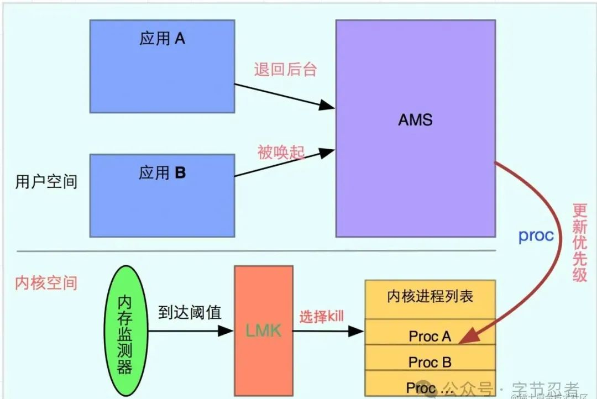

# 进程保活

## 1.进程分类

1. `前台进程` 是用户当前执行操作所必需的进程。因各种应用组件，导致其包含的进程被视作前台进程的方式也有所不同。如果以下任一条件成立，则进程会被视为前台进程：
它正在用户与之互动的屏幕顶部运行 Activity（其 onResume() 方法已被调用）。
它具有当前正在运行的 BroadcastReceiver（其 BroadcastReceiver.onReceive() 方法正在执行）。
它有一个 Service 目前正在执行其中一个回调（Service.onCreate()、Service.onStart() 或 Service.onDestroy()）中的代码。
系统中只有少数这样的进程，只有在内存不足以致这些进程无法继续运行时，才会在万不得已时终止这些进程。通常，如果发生这种情况，设备已达到内存分页状态，因此需要执行此操作才能使界面保持迅速响应。

2. `可见进程` 正在执行用户当前知晓的工作，因此终止该进程会对用户体验产生明显的负面影响。在以下条件下，进程被视为可见：
与前台进程相比，系统中运行的这些进程的数量没那么受限，但仍然相对受控。这些进程被视为极其重要，不会被终止，除非必须这样做以使所有前台进程保持运行状态。
它运行的 Activity 在屏幕上对用户可见，但不在前台（其 onPause() 方法已被调用）。例如，如果前景 Activity 显示为一个对话框，使上一个 Activity 可在其后显示，就可能会发生这种情况。
它具有一个 Service，它通过 Service.startForeground() 作为前台服务运行（这会要求系统将该服务视为用户知晓或实质上被视为可见）。
它托管着一项服务，系统正在使用该服务实现用户知晓的特定功能，例如动态壁纸或输入法服务。

3. `服务进程` 包含已使用 startService() 方法启动的 Service。虽然用户无法直接看到这些进程，但它们通常在执行用户关心的操作（例如后台网络数据上传或下载），因此，除非内存不足以保留所有前台和可见进程，否则系统会始终让此类进程保持运行状态。
已运行很长时间（例如 30 分钟或更长时间）的服务的重要性可能会降低，使其进程降至缓存列表中
可以使用 setForeground 创建需要长时间运行的进程。如果是需要严格执行时间的定期进程，可以通过 AlarmManager 进行调度。如需了解详情，请参阅对长时间运行的 worker 的支持。这有助于避免长时间运行的服务使用过多资源（例如，通过泄露内存）阻止系统提供良好的用户体验。

4. `缓存进程` 是当前不需要的进程，因此当其他位置需要诸如内存等资源时，系统会根据需要随意终止该进程。在正常运行的系统中，这些是资源管理中涉及的唯一进程。
运行良好的系统始终会有多个缓存进程可用，以便在应用之间高效切换，并可根据需要定期终止缓存的应用。只有在非常关键的情况下，系统才会达到所有缓存进程都会终止的程度，并且必须开始终止服务进程。
由于系统可能随时终止缓存的进程，因此应用在处于缓存状态时应停止所有工作。如果应用必须执行用户关键任务，则应使用上述 API 以活跃进程状态运行工作。
缓存的进程通常会保留一个或多个用户当前不可见的 Activity 实例（其 onStop() 方法已被调用并返回）。如果它们在系统终止此类进程时正确实现其 Activity 生命周期，不会影响用户在返回该应用时的体验。当关联的 activity 在新进程中重新创建时，它可以恢复之前保存的状态。请注意，如果进程被系统终止，则不能保证会调用 onDestroy()。

## 2.LowmemoryKiller

LowmemoryKiller（简称lmk）管理所有进程，根据一定策略来杀掉某个进程并释放占用的内存，保证系统的正常运行。


所有应用进程从 `Zygote` 孵化出来的进程都会记录在 `ActivityManagerService.mLruProcesses` 的列表中，由 `ActivityManagerService` 进行统一管理，时时更新进程的状态，根据状态计算出进程对应的 `OomAdj` 值，这个值会传递到 `kernel` `中去，kernel` 有个低内存回收机制，在内存达到一定阈值（不同手机不一样）时会触发清理 `OomAdj` 值高的进程，从而释放内存空间。

``` bash
adb shell dumpsys meminfo // 查看每个进程内存使用状况
adb shell su                                        // 启用su权限
cat /sys/module/lowmemorykiller/parameters/minfree  // 查看minfree
// 第一个值：18432（72MB）达到这个值时候，前台进程就会被杀死
// 第二个值：23040（90MB）达到这个值的时候，可见进程就会被杀死
// 第三个值：27648（108MB）达到这个值的时候，服务进程会被杀死
// 第四个值：32256（126MB）达到这个值的时候，后台进程会被杀死
// 第五个值：55296（216MB）达到这个值的时候，ContentProvider会被杀死
// 第六个值：80640（315MB）达到这个值的时候，空进程会被杀死
cat /sys/module/lowmemorykiller/parameters/adj     // 查看手机adj
cat /proc/<pid>/oom_adj                            // 查看进程adj
cat /proc/<pid>/oom_score_adj                      // 查看进程adj
```

oom_adj 划分为16级，从-17到16之间，越大优先级越低。

## 3.进程保活

监控手机锁屏解锁事件，在屏幕锁屏时启动1个像素透明的 Activity，在用户解锁时将 Activity 销毁，从而达到提高进程优先级的作用。

1. 创建Activity
创建一个1像素的 Activity，例如名称为 KeepActivity

``` java
Window window = getWindow();
window.setGravity(Gravity.START | Gravity.TOP);
WindowManager.LayoutParams attributes = window.getAttributes();
// 设置宽高为1像素
attributes.width = 1;
attributes.height = 1;
// 设置位置为屏幕左上角
attributes.x = 0;
attributes.y = 0;
window.setAttributes(attributes);
```

2. 设置主题并注册Activity
``` xml
// 为Activtiy设置一个透明背景主题
<style name="KeepTheme">
    <item name="android:windowBackground">@null</item>
    <item name="android:windowIsTranslucent">true</item>
    <item name="android:windowContentOverlay">@null</item>
    <item name="android:windowNoDisplay">false</item>
    <item name="android:windowDisablePreview">true</item>
</style>

// 注册清单文件
<activity android:name=".activity.KeepActivity"
    android:configChanges="keyboardHidden|orientation|screenSize|navigation|keyboard"
    // 设置为true，则这个Activity及后续启动的Activity不会出现在Recent Screens中
    android:excludeFromRecents="true"
    // 指明Task名，则会新开一个Task
    android:taskAffinity="com.renpeng.example.keep"
    android:exported="false"
    android:finishOnTaskLaunch="false"
    android:theme="@style/KeepTheme"
/>
```

3. 动态注册广播接收器

``` java
IntentFilter filter = new IntentFilter();
filter.addAction(Intent.ACTION_SCREEN_ON);
filter.addAction(Intent.ACTION_SCREEN_OFF);
registerReceiver(new BootCompleteReceiver(),filter);
```

4. 唤醒KeepActivity

``` java

public class BootCompleteReceiver extends BroadcastReceiver {
    @Override
    public void onReceive(Context context, Intent intent) {
        if(intent.getAction().equals(Intent.ACTION_SCREEN_OFF)) {
            // 唤醒KeepActivity
        } else if(intent.getAction().equals(Intent.ACTION_SCREEN_ON)){
            // 退出KeepActivity
        }
    }
}
```

## 4.Service提权

创建一个前台服务用于提高app的进程优先级。

1. Service限制

Android 8.0 之前，创建前台 Service 的方式通常是先创建一个后台 Service，然后将该 Service 推到前台。
Android 8.0 之后，系统不允许后台应用创建后台 Service。在系统创建 Service 后，应用有五秒的时间来调用该 Service 的 startForeground() 方法以显示新 Service 的用户可见通知。如果应用在此时间限制内未调用 startForeground()，则系统将停止此 Service 并声明此应用为 ANR。

## 5.Sticky Service拉活
将 Service 设置为 `START_STICKY`，利用系统机制在 Service 挂掉后自动拉活。

`START_STICKY`：“粘性”。如果 service 进程被 kill 掉，保留 service 的状态为开始状态，但不保留递送的 intent 对象。随后系统会尝试重新创建 service，由于服务状态为开始状态，所以创建服务后一定会调用 onStartCommand(Intent,int,int) 方法。如果在此期间没有任何启动命令被传递到 service，那么参数 Intent 将为 null。

`START_NOT_STICKY`：“非粘性的”。使用这个返回值时，如果在执行完 onStartCommand 后，服务被异常 kill 掉，系统不会自动重启该服务。

`START_REDELIVER_INTENT`：重传 Intent。使用这个返回值时，如果在执行完 onStartCommand 后，服务被异常 kill 掉，系统会自动重启该服务，并将 Intent 的值传入。

`START_STICKY_COMPATIBILITY`：START_STICKY 的兼容版本，但不保证服务被 kill 后一定能重启。

只要 `targetSdkVersion` 不小于5，就默认是 START_STICKY。

但是某些ROM系统不会拉活。并且经过测试，Service 第一次被异常杀死后很快被重启，第二次会比第一次慢，第三次又会比前一次慢，一旦在短时间内 Service 被杀死4-5次，则系统不再拉起。

## 6.JobScheduler 拉活
JobScheduler 允许在特定状态与特定时间间隔周期执行任务。可以利用它的这个特点完成保活的功能，效果即开启一个定时器，与普通定时器不同的是其调度由系统完成。也比较可靠稳定，但是会受到白名单等模式的影响，在某些ROM中甚至无法拉活。

1. 创建JobService

``` java
public class MyJobService extends JobService {
    private static final String TAG = "MyJobService";

    public static void startJob(Context context) {
        JobScheduler jobScheduler = (JobScheduler) context.getSystemService(
                Context.JOB_SCHEDULER_SERVICE);
        JobInfo.Builder builder = new JobInfo.Builder(10,
                new ComponentName(context.getPackageName(),
                MyJobService.class.getName())).setPersisted(true);
        if (Build.VERSION.SDK_INT >= Build.VERSION_CODES.N) {
            // 7.0以上如果设置小于15min不起作用
            // 可以使用setMinimumLatency设置延时启动，并且轮询
            builder.setMinimumLatency(1000);
        } else {
            //每隔1s执行一次job
            builder.setPeriodic(1000);
        }
        jobScheduler.schedule(builder.build());
    }

    @Override
    public boolean onStartJob(JobParameters jobParameters) {
        Log.e(TAG, "开启job");
        if (Build.VERSION.SDK_INT >= Build.VERSION_CODES.N) {
            startJob(this);
        }
        return false;
    }

    @Override
    public boolean onStopJob(JobParameters jobParameters) { return false; }
}
```

2. 注册JobService

``` xml
<service
    android:name=".MyJobService"
    android:permission="android.permission.BIND_JOB_SERVICE" />
```

3. 启动JobSchedule

``` java
@Override
protected void onCreate(Bundle savedInstanceState) {
    super.onCreate(savedInstanceState);
    MyJobService.startJob(this);
}
```

## 7.双进程守护
利用了系统 Binder 机制并结合前台服务提权，两个进程共同运行，如果有其中一个进程被杀，那么另外一个进程就会将被杀的进程重新拉起。目前此种方式也是成功率很高的一种方式.