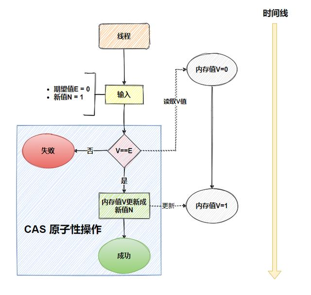

# CAS

## 1. CAS

`CAS` (Compare And Swap，比较和交换)，是非阻塞同步的实现原理，它是CPU硬件的指令，从CPU层面保证比较与交换两个操作的原子性。 `CAS` 指令操作包括三个参数：

1. **内存位置V**（memory location）：需要操作的内存位置，通常是一个共享变量。
2. **预期值E**（expected value）：期望该内存位置的值与之相等。
3. **新值N**（new value）：如果内存位置的当前值与预期值相等，将其更新为新值。

`CAS` 的基本概念是：**在一个内存位置上，比较当前值与预期值是否相等，如果相等，则将该位置的值更新为新值；如果不相等，则表示有其他线程已经修改了该位置的值，操作失败。**

## 2. 具体步骤

1. 线程读取共享内存位置的当前值
2. 将当前值与预期值进行比较
3. 如果当前值与预期值相等，则将该内存位置的值更新为新值，并返回成功
4. 如果当前值与预期值不相等，则操作失败，不更新内存位置。

## 3. 应用场景

`CAS` 操作在许多并发数据结构和算法中应用较多，比如：
- **乐观锁**：`CAS`常用于实现乐观锁机制，如 `java.util.concurrent.atomic` 包中的类（`AtomicInteger`、`AtomicReference`等）。
- **无锁数据结构**：如无锁队列、无锁栈等，使用CAS操作来保证线程安全。

**优点**：
1. 原子操作，可以在不阻塞线程的情况下完成，效率极高。
2. 不需要加锁，避免了锁带来的性能开销和死锁问题。

**缺点**：
1. ABA问题：`CAS`只能比较当前值和预期值，无法判断一个值是否被修改过多次，导致可能出现ABA问题。可以通过引入版本号或时间戳等机制来解决。
2. 循环重试：当多个线程竞争同一个变量时，`CAS`操作可能会失败，并需要多次重试，导致性能下降。