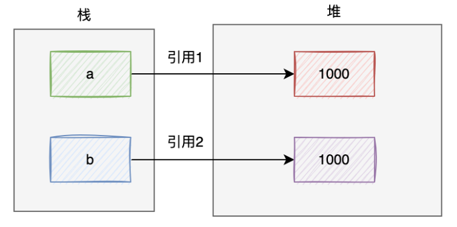

# Integer1000与100的比较

## 1. 先说结论：

``` java
    Integer a = 100;
    Integer b = 100;
    System.out.println(a==b); // true

    Integer a = 1000;
    Integer b = 1000;
    System.out.println(a==b); // false
```
## 2. 浅层原因：
    Integer是int的包装类型。有人可能认为下面两种声明方式是一样的，但是实际上是错误的。
``` java 
    Integer a = 1000;
    Integer b = 1000;

    Integet a = new Integer(1000);
    Integet b = new Integer(1000);
```

在JVM中的内存分布情况是这样的：


在栈中创建了两个局部变量a和b，同时在堆上new了两块内存区域，他们存放的值都是1000；
变量a的引用指向第一个1000的地址，变量b的引用指向第二个1000的地址。很显然变量a和b的引用不相等。
但是上面100比较的例子为什么是true？

## 3. 深层原因

其实上面代码的正确简写关系应该是：
```java
Integer a = 1000;
Integer a = Integer.valueOf(1000)
```
在定义对象a时，Java自动调用了**Integer.valueOf**将数字封装成对象


而如果数字在low和high之间的话，是直接从**IntegerCache**缓存中获取的数据。

在Integer内部，将-128~127之间的数字缓存起来了。也就是说，如果数字在-128~127之间，直接从缓存中获取Integer对象，如果数字超过了这个范围就是，就是**new**出来的新对象。

所以，100在-128~127之间，对象a和对象b的引用指向了同一个地址，判断的结果是true，1000不在这个范围内，所以，a和b指向的是两个地址，判断的结果是false。

**Integer类的内部为什么要做一个缓存**：
::: tip
因为-128~127是使用最频繁的数字，如果不做缓存，会在内存中产生大量指向相同数据的对象，有点浪费内存空间。
:::

## 4.正确的判断方法

**使用equals方法判断**

``` java
Integer a = Integer.valueOf(1000);
Integer b = Integer.valueOf(1000);
System.out.println(a.equals(b));
```
它的底层会先调用Integer类的intValue方法获取int类型的数据，然后再通过==号进行比较。此时，比较的不是两个对象的引用是否相等，而且比较的具体的数据是否相等。
使用equals方法，可以判断两个Integer对象的值是否相等，而不是判断引用是否相等。
