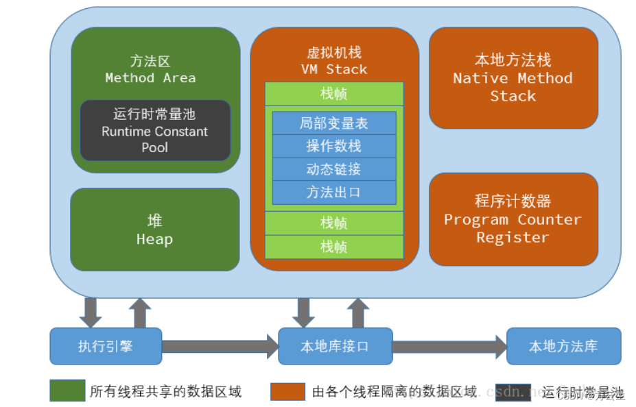

# JVM分区

## 1. 前言

JVM内存的管理与分区对于理解Java应用程序的性能、垃圾回收（GC）机制以及内存调优非常关键。JVM内存主要分为以下几个区域，每个区域都有特定的用途和管理机制。

## 2. **方法区（Method Area）**
   - **用途**：
     - 存储类的元数据信息、常量池、静态变量、方法字节码等。每个被加载的类都需要在方法区中保存相应的信息。
   - **特点**：
     - 在Java 8之前，方法区由永久代（Permanent Generation, PermGen）实现。在Java 8之后，永久代被移除了，方法区的实现改为元空间（Metaspace）。
     - 元空间使用的是直接内存，不在JVM堆内存中，而是使用本地内存，因此不容易发生`OutOfMemoryError`，除非本地内存不足。
   - **GC影响**：
     - 方法区中的数据相对稳定，垃圾回收不会频繁发生，但类卸载时会清理元空间中的无用类元数据。

## 3. **堆（Heap）**
   - **用途**：
     - 堆是JVM中最大的一块内存区域，用于存储所有Java对象实例和数组。Java的自动内存管理（GC）主要是针对堆的管理。
   - **分区**：
     - 堆通常分为**新生代（Young Generation）**和**老年代（Old Generation）**。
     - **新生代（Young Generation）**：
       - **Eden区**：绝大多数新对象在Eden区创建。每次GC后，Eden区的存活对象会被移动到Survivor区。
       - **Survivor区**：分为两个部分：`S0`和`S1`（或称From区和To区），用于在新生代中对象的存活和复制。对象在这两个区之间来回移动，直到晋升到老年代。
     - **老年代（Old Generation）**：
       - 存放生命周期较长的对象。当对象在Survivor区中经过多次GC后仍然存活，或当新生代空间不足时，会晋升到老年代。

   - **GC影响**：
     - 新生代采用**Minor GC**（次要垃圾回收）进行内存清理，通常使用**复制算法**。
     - 老年代采用**Major GC**或**Full GC**（主要垃圾回收），通常使用**标记-清除**或**标记-整理**算法。
     - 老年代的GC比新生代的GC更加耗时，因为对象数量更多且分布更广。

## 4. **栈（Stack）**
   - **用途**：
     - 栈为每个线程独立分配，用于存储线程的局部变量、操作数栈、方法返回地址等。每个方法调用时都会创建一个栈帧，方法执行完毕后，栈帧将被销毁。
   - **特点**：
     - 栈内存中的数据随着方法的调用和返回自动管理，分配和释放内存非常快。
     - 局部变量表中存储的是方法中的所有局部变量，包括参数和函数内的局部变量。
   - **GC影响**：
     - 栈内存中的数据不受垃圾回收器的管理，随着方法的结束自动释放。
     - 若栈深度太深（如递归调用过多），可能导致`StackOverflowError`。

## 5. **程序计数器（Program Counter Register）**
   - **用途**：
     - 这是每个线程私有的一块小内存，存储当前线程所执行的字节码的行号指示器。线程切换时，通过程序计数器恢复正确的执行位置。
   - **特点**：
     - 是唯一不会发生`OutOfMemoryError`的区域。
     - 在执行本地方法（native methods）时，程序计数器中的值为空。

## 6. **本地方法栈（Native Method Stack）**
   - **用途**：
     - 为Java中调用的本地方法（通常是用C/C++编写的代码）服务。它的作用类似于Java栈，但用于本地方法调用。
   - **特点**：
     - 本地方法栈也是线程私有的，每个线程在调用本地方法时，会使用这个栈存储数据。
     - 当本地方法栈溢出时，会抛出`StackOverflowError`。
   - **GC影响**：
     - 本地方法栈的内存管理不受JVM的GC管理，由操作系统进行分配和回收。

## 7. **直接内存（Direct Memory）**
   - **用途**：
     - 直接内存不属于JVM的管理范围，而是由操作系统直接分配。主要用于NIO（New I/O）操作，能够加快数据的I/O传输速度。
   - **特点**：
     - 直接内存的大小可以通过`-XX:MaxDirectMemorySize`参数进行调节，如果没有指定，默认与堆内存的大小相同。
   - **GC影响**：
     - 直接内存不受JVM的GC管理，但在使用直接内存时需要谨慎管理，以避免内存泄漏。

## 8. **元空间（Metaspace）**
   - **用途**：
     - Java 8引入的替代永久代的区域，存储类的元数据。与永久代不同，元空间使用的是本地内存，而非JVM堆内存。
   - **特点**：
     - 元空间大小可以动态调整，并通过参数`-XX:MaxMetaspaceSize`来设置最大值。
   - **GC影响**：
     - 当元空间的大小达到设定的最大值时，可能会触发垃圾回收以清理无用的类元数据，释放元空间。

### 总结
JVM内存区域的分区管理确保了Java程序的高效运行和内存使用的合理性。不同的内存区域有不同的用途和管理方式，从而为Java程序的运行提供了强大的支持。同时，理解这些分区的特点和GC机制，有助于Java开发者在实际应用中进行有效的内存调优。