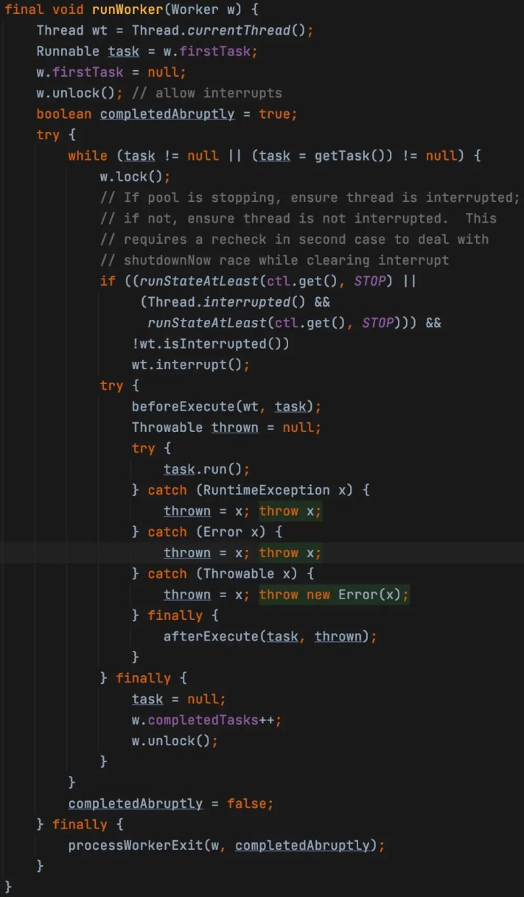
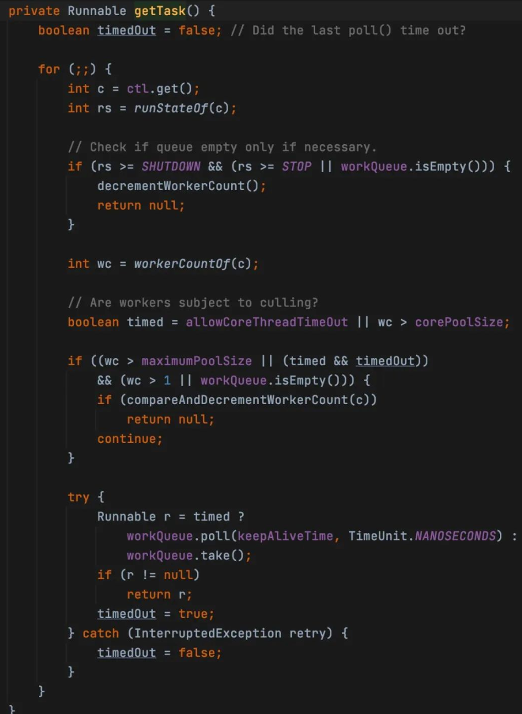
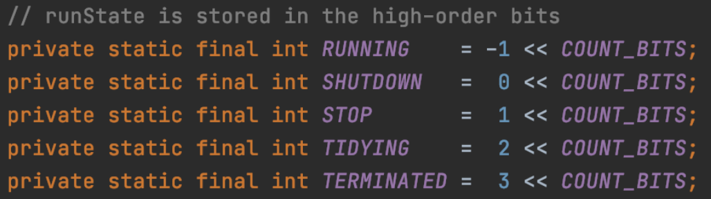
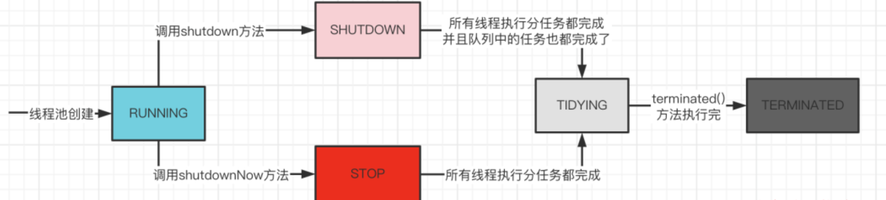
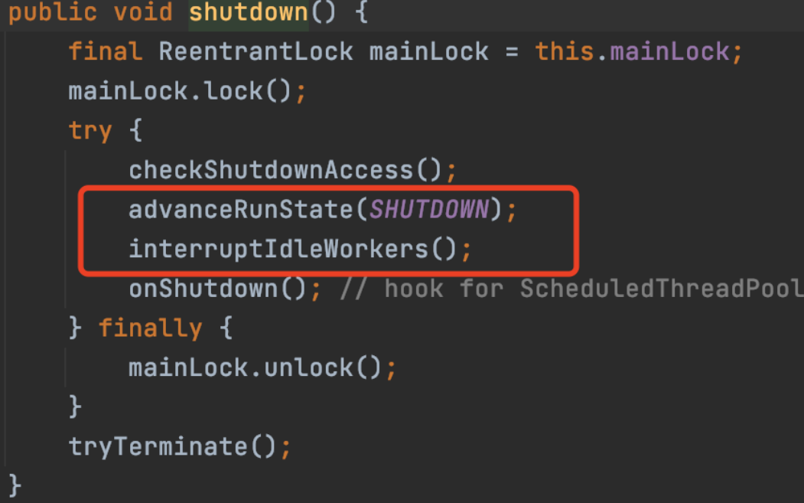
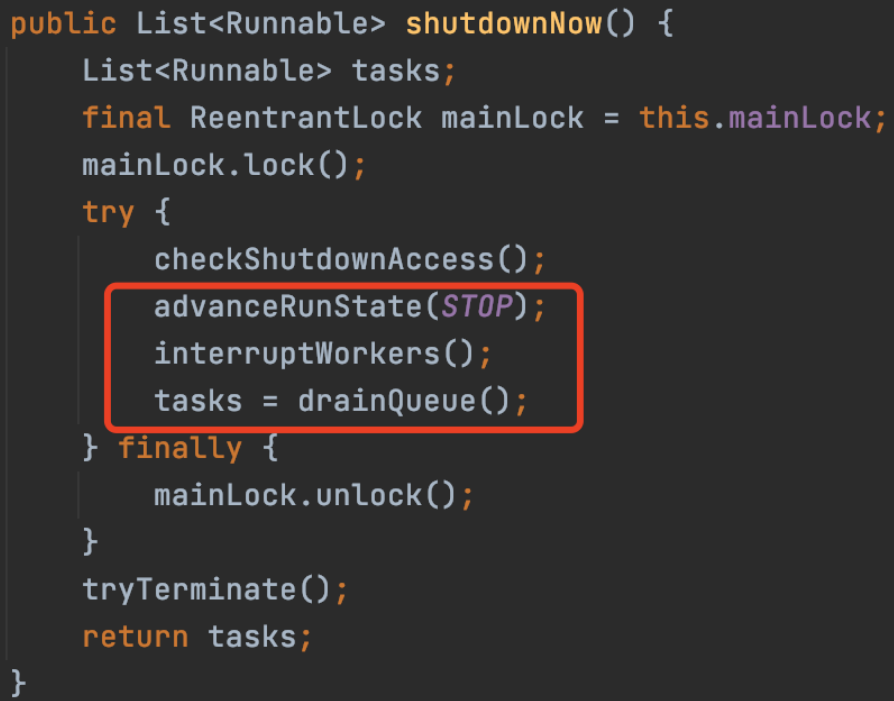

# 线程池

线程池其实是一种池化技术的实现，池化技术的核心思想其实就是实现资源的可重复利用，让线程在执行完任务不会销毁去继续处理其他的任务，避免资源重复创建和销毁带来的性能开销。还可以提高响应速度。当任务到达时，任务可以不需要等到线程创建就能立即执行。。另外，线程池还能起到对线程的管理。

## 1. 线程池的构造

Java 中主要通过构建 `ThreadPoolExecutor` 来创建线程池的。 
`ThreadPoolExecutor` 的主要构造参数有：
1. **corePoolSize**: 核心线程池大小，表示线程池中始终保持运行的线程数量，即使是空闲的，这些线程也会在任务到来时立即响应。
2. **maximumPoolSize**：线程池的最大线程数，表示线程池中能够容纳的最大线程数。当任务较多且所有核心线程都在执行时，线程池会创建新的线程直到达到此值。
3. **keepAliveTime**: 线程的存活时间。当线程池中的线程数量超过 `corePoolSize` 时，多余的空闲线程在等待新任务时的最大等待时间。超过这个时间后会被立即终止。
4. unit：keepAliveTime 的时间单位，如 `TimeUnit.SECONDS` 、`TimeUnit.MILLSECONDS` 等。
5. **workQueue**：任务队列，用于存放等待执行的任务。常见的有 `LinkedBlockingQueue`、`SynchronousQueue` 等，不同的队列类型会影响线程池的行为。
6. **threadFactory**：线程工厂，用于创建线程。可以通过自定义 `ThreadFactory` 来为线程设置名字、优先级等。
7. **handler**：饱和策略（拒绝策略），用于在任务无法执行时采取的策略。当线程池中的线程数达到 `maxiumPoolSize` 且 `workQueue` 已满时，线程池就会拒绝新的任务。

## 2. 线程池的运行原理

刚创建出来的线程池中只有一个构造时传入的阻塞队列，此时里面并没有任何的线程，如果想要在执行之前就创建好核心线程数，可以调用 `prestartAllCoreThreads` 方法来实现，默认是没有任何线程的。

当有线程通过 `execute` 方法提交了一个任务，线程池会首先判断当前线程数是否小于核心线程数，也就是 `corePoolSize`。如果符合小于核心线程数的条件，就会通过 `ThreadFactory` 创建一个线程来执行任务。

当任务执行完之后，线程不会退出，而是会去从阻塞队列中获取任务。

接下来如果又提交了一个任务，会重复上面的步骤。有一点需要注意的是：提交任务的时候，就算有线程池里的线程从阻塞队列中获取不到任务，如果线程池里的线程数还是小于核心线程数，那么依然会继续创建线程，而不是复用现有的线程。

如果线程池中的线程数不再小于核心线程数，此时就会尝试将任务放入阻塞队列中。如果随着任务的增多，队列已经满了，任务放入队列失败就会判断当前线程池中的线程数是否小于最大线程数，也就是 `maximumPoolSize` 参数。如果小于最大线程数，也会创建非核心线程来执行提交的任务。

所以，可以发现，就算队列中有任务，新创建的线程还是优先级处理这个提交的任务，而不是从队列中获取已有的任务执行，所以先提交的任务不一定先执行。

如果线程已经达到了最大线程数量，就会执行拒绝策略，就是构造线程池的时候传入的 ReejectedExecutionHandler 对象，来处理这个任务。

`RejectedExecutionHandler` 的实现JDK默认有四种：
1. `AbortPolicy`: 丢弃任务，抛弃运行时异常。
2. `CallerRunsPolicy`: 由提交任务的线程来执行任务。
3. `DiscardPolicy`: 丢弃这个任务，但是不抛异常。
4. `DiscardOldestPolicy`：从队列中剔除最先进入队列的任务，然后再提交任务。

线程池创建的时候，如果不指定拒绝策略，默认就是 AbortPolicy 策略。当然，也可以自己实现 RejectExecutionHandler 接口，比如，将任务存储在数据库或者缓存中，这样数据库或者缓存中就能获取到被拒绝的任务了。

在execute方法的具体实现：

``` java
int c = ctl.get(); // 获取控制状态（ctl）线程池的运行状态和当前的工作线程数量
if(workerCountOf(c) < corePoolSize){
  if(addWorker(command, true)) return;
  c = ctl.get();
} 
// 如果当前的工作线程数量小于corePoolSize，线程池尝试添加一个新的工作线程来处理command，
// 如果addworker方法调用成功，立即返回，如果失败则刷新状态（可能其他线程操作引起状态变更）

if(isRunning(c) && workQueue.offer(command)){
  // 如果线程池处于运行状态，它会尝试将任务放入workQueue队列中。如果放入成功，则进入下一步状态检查。
  int recheck = ctl.get();
  if(!isRunning(recheck) && remove(command)){
    // 如果线程池不再处于运行状态，将command移除并拒绝处理该任务
    reject(command)
  } else if(workerCountOf(recheck) == 0){
    // 如果当前没有活跃的工作线程，添加一个新的工作线程
    addworker(null, false);
  }
} 
else if (!addworker(command, false)) {
  reject(command)
  // 如果还是添加非核心线程失败了，那么就会调用reject(command)来拒绝这个任务。
}
```

## 3. 线程池中线程实现复用的原理

线程在线程池内部其实是被封装成一个Worker对象。

``` java
private final class Worker extends AbstractQueuedSynchoronizer implement Runnable{

}
```

`Worker` 继承了 `AQS` ，也就是具有一定锁的特性。
创建线程来执行任务是通过addWorker方法创建的。在创建Worker对象的时候，会把线程和任务一起封装到Worker内部，然后调用 `runWorker` 方法来让线程执行任务。



从源码中可以看出线程执行完任务不会退出的原因，`runWorker` 内部使用了 `while死循环` ，只要能获取到任务，就会调用run方法，继续执行任务，这就是线程能够复用的主要原因。

但是如果 `getTask` 获取不到方法的时候，最后就会调用finally中的 `processWorkerExit` 方法，将线程退出。

`Worker` 继承了 `AQS`，每次在执行任务之前都会调用 `Worker` 的 `lock` 方法，执行完任务之后，会调用 `unlock` 方法，这样做的目的是可以通过 Worker 的加锁状态就能判断当前线程是否正在运行任务。如果想知道线程是否正在运行任务，只需要调用 `Worker` 的 `tryLock` 方法，根据是否加锁成功就能判断，加锁成功说明当前线程没有加锁，就没有执行任务了。在调用 `shutdown` 方法关闭线程池的时候，就用这种方法来判断线程有没有在执行任务，如果没有的话，就尝试打断没有执行任务的线程。

## 4. 线程是如何获取任务的以及如何实现超时

线程在执行完任务之后，会继续调用 getTask 方法获取任务，获取不到就会退出。

**getTask的实现：**


``` java
boolean timed = allowCoreThreadTimeOut || wc > corePoolSize;
```
这行代码判断当前过来获取任务的线程是否可以超时退出。如果 `allowCoreThreadTimeOut` 设置为true或者线程池当前的线程数大于核心线程数，也就是 corePoolSize，那么该获取任务的线程就可以超时退出。

超时退出的核心就是下面这行代码:

``` java
Runnable r = timed ? workQueue.poll(keepAliveTime, TimeUnit.NANOSECONDS) : workQueue.take();
```

这行代码会根据是否允许超时来选择调用阻塞队列 workQueue 的 poll 方法或者 take 方法。如果允许超时，则会调用 poll 方法，传入 keepAliveTime 时间参数来获取任务。从队列中阻塞这段时间来获取任务，获取不到就会返回null，如果不允许超时，就会调用take方法，直到从队列中获取到任务的位置。

最主要的是利用了阻塞队列的poll方法的实现，这个方法可以指定超时时间，一旦线程达到了keepAliveTime还没有获取到任务，那么就会返回null，getTask方法返回null，线程就会退出。

这里也有一个细节，就是判断当前获取任务的线程是否可以超时退出的时候，如果将allowCoreThreadTimeOut设置为true，那么所有线程走到这个timed都是true，那么所有的线程，包括核心线程都可以做到超时退出。如果你的线程池需要将核心线程超时退出，那么可以通过allowCoreThreadTimeOut方法将allowCoreThreadTimeOut变量设置为true。

## 5. 线程池的5种状态

线程池内部有5个常量来代表线程池的五种状态


1. **RUNNING**：线程池创建时就是这个状态，能够接收新任务，以及对已添加的任务进行处理。
2. **SHUTDOWN**：调用shutdown方法线程池就会转换成SHUTDOWN状态，此时线程池不再接收新任务，但能继续处理已添加的任务到队列中任务。
3. **STOP**：调用shutdownNow方法线程池就会转换成STOP状态，不接收新任务，也不能继续处理已添加的任务到队列中任务，并且会尝试中断正在处理的任务的线程。
4. **TIDYING**：SHUTDOWN 状态下，任务数为 0， 其他所有任务已终止，线程池会变为 TIDYING 状态。线程池在 SHUTDOWN 状态，任务队列为空且执行中任务为空，线程池会变为 TIDYING 状态。线程池在 STOP 状态，线程池中执行中任务为空时，线程池会变为 TIDYING 状态。
5. **TERMINATED**：线程池彻底终止。线程池在 TIDYING 状态执行完 terminated() 方法就会转变为 TERMINATED 状态。

线程池状态具体是存在`ctl`成员变量中，ctl中不仅存储了线程池的状态还存储了当前线程池中线程数的大小



在线程池运行过程中，绝大多数操作执行前都得判断当前线程池处于哪种状态，再来决定是否继续执行该操作。

## 6. 线程池的关闭

线程池提供了 `shutdown` 和 `shutdownNow` 两个方法来关闭线程池。


shutdown方法就是将线程池的状态修改为SHUTDOWN，然后尝试打断空闲的线程，也就是在阻塞等待任务的线程。



shutdownNow方法就是将线程池的状态修改为STOP，然后尝试打断所有的线程，从阻塞队列中移除剩余的任务，这也是为什么shutdownNow不能执行剩余任务的原因。所以也可以看出shutdown方法和shutdownNow方法的主要区别就是，shutdown之后还能处理在队列中的任务，shutdownNow直接就将任务从队列中移除，线程池里的线程就不再处理了。

## 7. 线程池的监控

在项目中使用线程池的时候，一般需要对线程池进行监控，方便出问题的时候进行查看。线程池本身提供了一些方法来获取线程池的运行状态。
1. **getCompletedTaskCount**：已经执行完成的任务数量
2. **getLargestPoolSize**：线程池里曾经创建过的最大的线程数量。这个主要是用来判断线程是否满过。
3. **getActiveCount**：获取正在执行任务的线程数据
4. **getPoolSize**：获取当前线程池中线程数量的大小

除了线程池提供的上述已经实现的方法，同时线程池也预留了很多扩展方法。比如在runWorker方法里面，在执行任务之前会回调beforeExecute方法，执行任务之后会回调afterExecute方法，而这些方法默认都是空实现，你可以自己继承ThreadPoolExecutor来扩展重写这些方法，来实现自己想要的功能。

## 8. Executors构建线程池以及问题解析

JDK内部提供了Executors这个工具类，来快速的创建线程池。

在Java中，`Executors`类提供了多种便捷的线程池创建方法，下面是各类线程池的详细说明和示例：

1. **固定线程数量的线程池**（核心线程数与最大线程数相等）：
   - 使用`Executors.newFixedThreadPool(int nThreads)`创建固定大小的线程池，线程池中始终保持`nThreads`数量的线程。
   - 如果所有线程都在执行任务，新的任务将会被放入队列中等待空闲线程执行。

   ```java
   ExecutorService fixedThreadPool = Executors.newFixedThreadPool(4); // 固定4个线程
   ```

2. **单个线程数量的线程池**：
   - 使用`Executors.newSingleThreadExecutor()`创建一个单线程线程池，确保所有任务在同一线程中按顺序执行。
   - 在任务执行过程中，如线程异常终止，将自动创建新的线程继续执行后续任务。

   ```java
   ExecutorService singleThreadPool = Executors.newSingleThreadExecutor();
   ```

3. **接近无限大线程数量的线程池**：
   - 使用`Executors.newCachedThreadPool()`创建缓存线程池。此线程池可以根据需要创建新线程，并在先前的线程空闲后重用它们。
   - 当线程空闲超过60秒时，将被回收，因此适合处理大量短期任务的场景。

   ```java
   ExecutorService cachedThreadPool = Executors.newCachedThreadPool();
   ```

4. **带定时调度功能的线程池**：
   - 使用`Executors.newScheduledThreadPool(int corePoolSize)`创建定时任务线程池，用于执行延迟任务或周期性任务。
   - 常用于定时执行任务的场景，如定期数据备份或清理任务。

   ```java
   ScheduledExecutorService scheduledThreadPool = Executors.newScheduledThreadPool(2);
   scheduledThreadPool.scheduleAtFixedRate(() -> {
       System.out.println("定时任务执行");
   }, 0, 10, TimeUnit.SECONDS); // 每10秒执行一次
   ```

这些线程池适用于不同的场景，根据任务需求选择合适的线程池能够有效提高应用程序性能和资源利用率。

虽然JDK提供了快速创建线程池的方法，**但是其实不推荐使用Executors来创建线程池**，因为从上面构造线程池可以看出，newFixedThreadPool线程池，由于使用了LinkedBlockingQueue，队列的容量默认是无限大，实际使用中出现任务过多时会导致内存溢出；newCachedThreadPool线程池由于核心线程数无限大，当任务过多的时候，会导致创建大量的线程，可能机器负载过高，可能会导致服务宕机。

## 9. 实际项目中如何合理的自定义线程池

1. 线程数线程数的设置主要取决于业务是IO密集型还是CPU密集型。CPU密集型指的是任务主要使用来进行大量的计算，没有什么导致线程阻塞。一般这种场景的线程数设置为CPU核心数+1。IO密集型：当执行任务需要大量的io，比如磁盘io，网络io，可能会存在大量的阻塞，所以在IO密集型任务中使用多线程可以大大地加速任务的处理。一般线程数设置为 2*CPU核心数java中用来获取CPU核心数的方法是：`Runtime.getRuntime().availableProcessors()`;
2. 线程工厂一般建议自定义线程工厂，构建线程的时候设置线程的名称，这样就在查日志的时候就方便知道是哪个线程执行的代码。
3. 有界队列一般需要设置有界队列的大小，比如 `LinkedBlockingQueue` 在构造的时候就可以传入参数，来限制队列中任务数据的大小，这样就不会因为无限往队列中扔任务导致系统的oom。