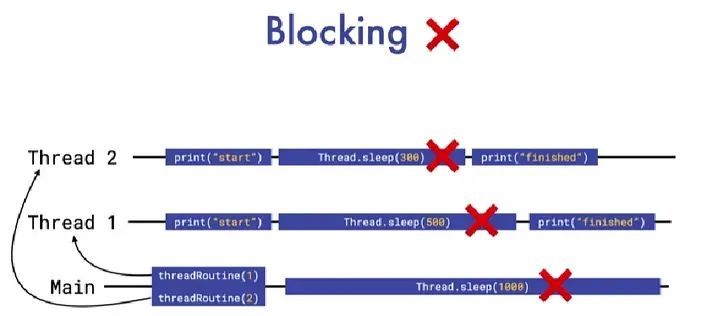
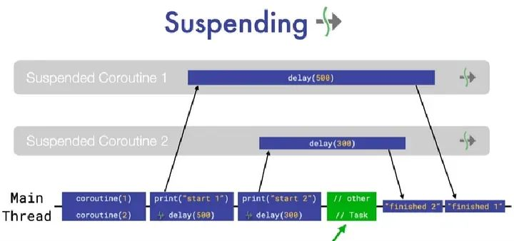

# kotlin中的挂起函数

## 1.简介

在Kotlin中，可以使用suspend关键字标记函数，以指示它们可以被暂停和恢复。这些函数是长时间运行的函数，可以在协程中使用，是协程生态系统的核心部分。
许多库（如retrofit、room）在其API中使用这些挂起函数从网络或数据库加载数据。

``` kotlin
import kotlinx.coroutines.Dispatchers
import kotlinx.coroutines.withContext
import retrofit2.Retrofit
import retrofit2.create

class WorkRepository {
    private val retrofit = Retrofit.Builder()
        .baseUrl("https://api.example.com")
        .build()
    private val apiService = retrofit.create(ApiService::class.java)

    suspend fun fetchData(): ResultType {
        return withContext(Dispatchers.IO) {
            try {
                val result = apiService.getData()
                // 处理结果
                result
            } catch (e: Exception) {
                // 处理错误或抛出自定义异常
                throw CustomException("获取数据失败", e)
            }
        }
    }
}
```

在上面的代码片段中，fetchData函数被标记为挂起函数，允许从协程中调用它而不会阻塞调用线程。withContext(Dispatchers.IO)用于切换协程上下文到I/O调度器，表示网络请求应在后台线程上执行。如果在网络请求过程中出现异常，我们会捕获异常，处理错误并可选择抛出自定义异常。

使用挂起函数与协程一起简化了异步编程。协程提供了一种更高级的并发模型，相比线程，协程更简单易用，能够以更顺序化的方式编写异步代码，并且提供了取消支持，更方便地处理异步任务的生命周期。

## 2.线程与协程的对比

线程的特点：

1. 并发模型：线程提供了较低级别的并发模型，允许同时运行多个任务。线程是Java语言的一部分，并可在Android中用于并行执行任务。
2. 复杂性：使用线程可能会比较复杂，因为需要处理同步、处理竞态条件和管理线程池等。不正确的使用可能导致死锁和数据损坏等问题。
3. 阻塞操作：线程适用于阻塞操作，例如网络请求或磁盘I/O，而不会冻结用户界面。

线程示例：
``` kotlin
fun main() {
    println("主函数开始")
    threadRoutine(1, 500)
    threadRoutine(2, 300)
    Thread.sleep(1000)
    println("主函数结束")
}

fun threadRoutine(number: Int, delay: Long) {
    thread {
        println("Routine $number 开始工作")
        Thread.sleep(delay)
        println("Routine $number 完成工作")
    }
}
```

在上面的代码片段中，主函数调用了threadRoutine函数两次。每次调用都会启动一个新的线程，在该线程中执行工作。工作通过Thread.sleep表示。主函数会睡眠1000毫秒以等待线程完成。

下面是线程工作的图示：



协程的特点：

1. 并发模型：协程提供了较高级别的并发模型，是Kotlin的一部分。它们旨在简化异步编程，使代码更易读和可维护。
2. 简单性：与线程相比，协程的使用和管理更简单。它们允许以更顺序化的方式编写异步代码。
3. 取消支持：协程内置了对取消继续协程的特点，更容易处理异步任务的生命周期。
4. 协程是非阻塞的，可以编写异步代码而无需使用回调或复杂的线程构造。

协程的示例代码：
``` kotlin

import kotlinx.coroutines.CoroutineScope
import kotlinx.coroutines.Dispatchers
import kotlinx.coroutines.async
import kotlinx.coroutines.delay
import kotlinx.coroutines.joinAll
import kotlinx.coroutines.runBlocking

fun main() = runBlocking {
    println("主函数开始")
    joinAll {
        async { suspendingCoroutine(1, 500) }
        async { suspendingCoroutine(2, 300) }
        async {
            repeat(5) {
                println("其他任务正在执行于 ${Thread.currentThread().name}")
                delay(100)
            }
        }
    }
    println("主函数结束")
}

suspend fun suspendingCoroutine(number: Int, delay: Long) {
    println("协程 $number 开始工作")
    delay(delay)
    println("协程 $number 完成工作")
}
```

在上面的代码片段中，使用runBlocking创建了一个顶层协程作用域。主函数通过joinAll并行启动了两个协程，并且还启动了一个重复执行的协程。每个协程都执行一些工作，并使用delay函数模拟耗时操作。主函数会等待所有协程完成后才结束。


协程的工作原理如下图所示：


通过使用协程，我们可以以更结构化和顺序化的方式处理并发编程。协程可以在不阻塞线程的情况下暂停，从而让出底层线程执行其他任务，提高资源利用率和并发性。

## 3.总结

Kotlin中的挂起函数和协程为异步编程提供了强大的工具。通过使用suspend关键字标记函数，我们可以创建可暂停和恢复的长时间运行函数。协程提供了更高级别、更简单和更顺序化的并发模型，使我们能够以更清晰和可读的方式处理异步任务。与线程相比，协程具有更好的可取消性和非阻塞特性，使得异步编程更加高效和易于管理。
