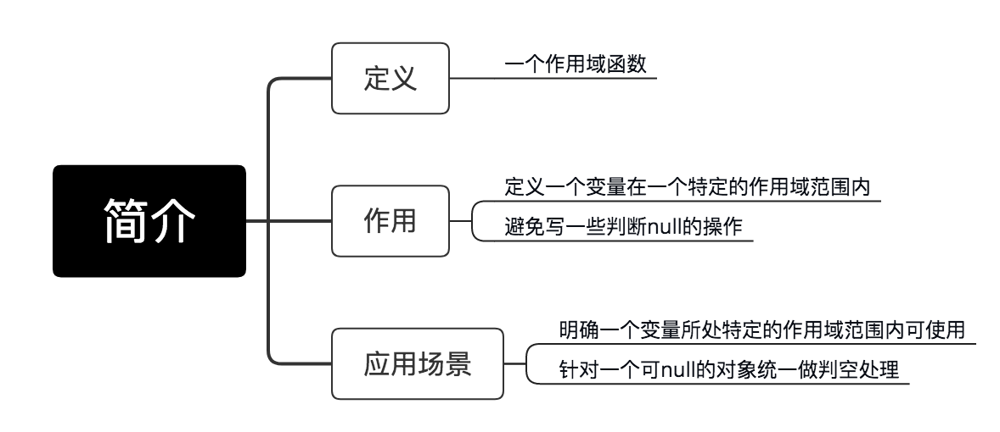
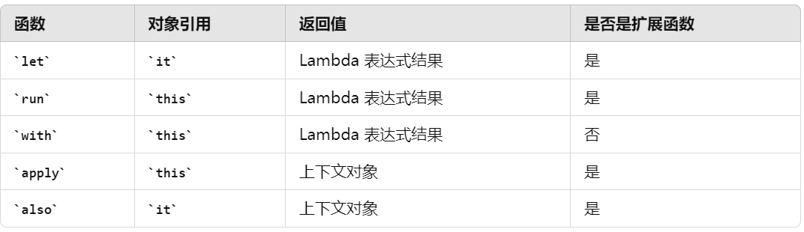

# 作用域函数

## 一、简介



Kotlin中，有一些用于扩展 & 方便开发者编码的内置函数，能大大提高开发者的开发效率, 主要有以下几种：




## 1. let函数

**描述**：let 函数对给定的对象执行指定的代码块，并返回该代码块的结果。如果对象为null，则不执行代码块，除非有提供null作为接收者的重载版本。

::: code-group
``` kotlin
val name = "Alice"
val length = name.let { it.length } // 使用it引用name
```
:::

## 2. run函数

**描述**：可以在任何上下文中使用，既可以作为对象的方法也可以作为顶层函数。如果作为对象方法使用，它类似于let，但允许直接访问对象的属性和方法而无需it。作为顶层函数时，它提供一个局部作用域来执行代码。

::: code-group
``` kotlin
val result = run {
    val x = 10
    val y = 20
    x + y
}
```
:::

## 3. with函数

**描述**：提供一个接收者对象，在其上下文中执行代码块，不需要显式引用该对象。常用于避免多次重复对象名。

::: code-group
``` kotlin
with(Person()) {
    name = "Charlie"
    age = 25
    this // 返回Person实例
}
```
:::

## 4. apply函数

apply 在对象实例上执行代码块，并返回该对象本身。常用于初始化对象时设置一系列属性。

::: code-group
``` kotlin
val user = User().apply {
    name = "Bob"
    age = 30
}
```
:::

## 5. also函数

类似于let，但总是执行代码块并返回原始对象，而不是代码块的结果。

::: code-group
``` kotlin
val number = 5
val message = number.also { println("The number is $it") } // 打印信息并返回number
```
:::

## 6. takeIf 和 takeUnless:
这两个函数用于条件性地返回或忽略对象。takeIf 当条件为真时返回对象自身，否则返回null；takeUnless 则逻辑相反。

::: code-group
``` kotlin
val number = 10
val positive = number.takeIf { it > 0 } // number为正数时返回number
val nonPositive = number.takeUnless { it > 0 } // number非正数时返回number
```
:::


