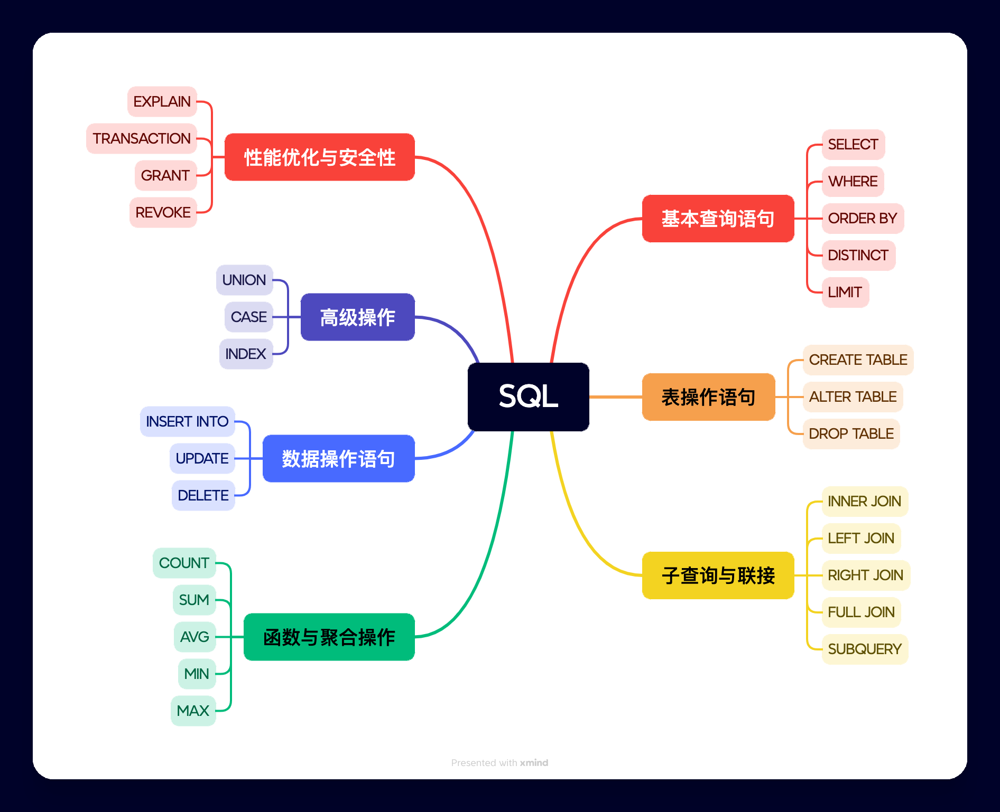

# SQL简介

## 1. 什么是SQL

SQL（Structured Query Language）是一种用于管理和操作关系数据库的标准语言，包括数据查询、数据插入、数据更新、数据删除、数据库结构创建和修改等功能。

## 2. SQL主要内容

## 3. 常见的数据库

数据库分为:
1. **关系型数据库 :** 关系型数据库是最常见的类型之一，它们基于关系模型，使用表格形式来组织数据。关系型数据库支持 SQL 语言，并且通常遵循 ACID（原子性、一致性、隔离性、持久性）特性。
2. **非关系型数据库:** NoSQL 数据库是非关系型数据库，它们的设计目的是为了处理大量分布式数据，通常不使用传统的表格形式。

## 3. 数据库表

## 4. 非常重要的SQL语句

| SQL 语句          | 描述                 |
| ----------------- | -------------------- |
| `SELECT`          | 从数据库中提取数据   |
| `UPDATE`          | 更新数据库中的数据   |
| `DELETE`          | 从数据库中删除数据   |
| `INSERT INTO`     | 向数据库中插入新数据 |
| `CREATE DATABASE` | 创建新数据库         |
| `ALTER DATABASE`  | 修改数据库           |
| `CREATE TABLE`    | 创建新表             |
| `ALTER TABLE`     | 变更（改变）数据库表 |
| `DROP TABLE`      | 删除表               |
| `CREATE INDEX`    | 创建索引（搜索键）   |
| `DROP INDEX`      | 删除索引             |

