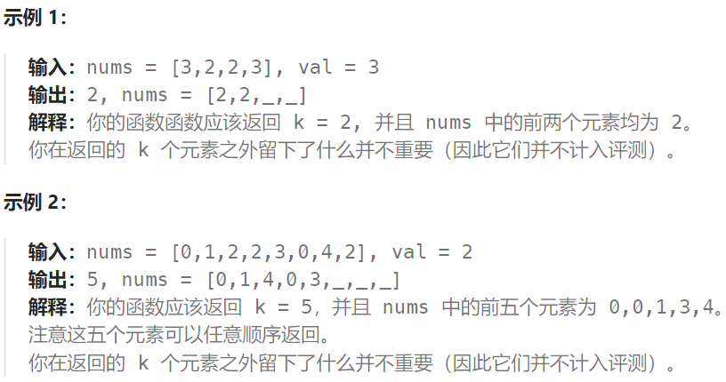

# 移除元素

## 题目

给你一个数组 nums 和一个值 val，你需要 原地 移除所有数值等于 val 的元素。元素的顺序可能发生改变。然后返回 nums 中与 val 不同的元素的数量。

假设 nums 中不等于 val 的元素数量为 k，要通过此题，您需要执行以下操作：

更改 nums 数组，使 nums 的前 k 个元素包含不等于 val 的元素。nums 的其余元素和 nums 的大小并不重要。
返回 k。

## 示例



## 题解一：双指针

::: code-group
``` java
class Solution {
    public int removeElement(int[] nums, int val) {
        int n = nums.length;
        int left = 0;
        for(int right = 0; right < n; right++){
            if(nums[right] != val){
                nums[left] = nums[right];
                left++;
            }
        }

        return left;
    }
}
```
:::

解释：将不同于val的数组元素挑选出来放在left所在的数组内，这样一来最终的结果就是left所在的位置，也就是结果数组的长度。但是这样有一个问题就是当数组中一直不存在等于val的元素，那么数组就要遍历两次。
时间复杂度：O(n)，其中 n 为序列的长度。我们只需要遍历该序列至多两次。

## 题解二：优化双指针

